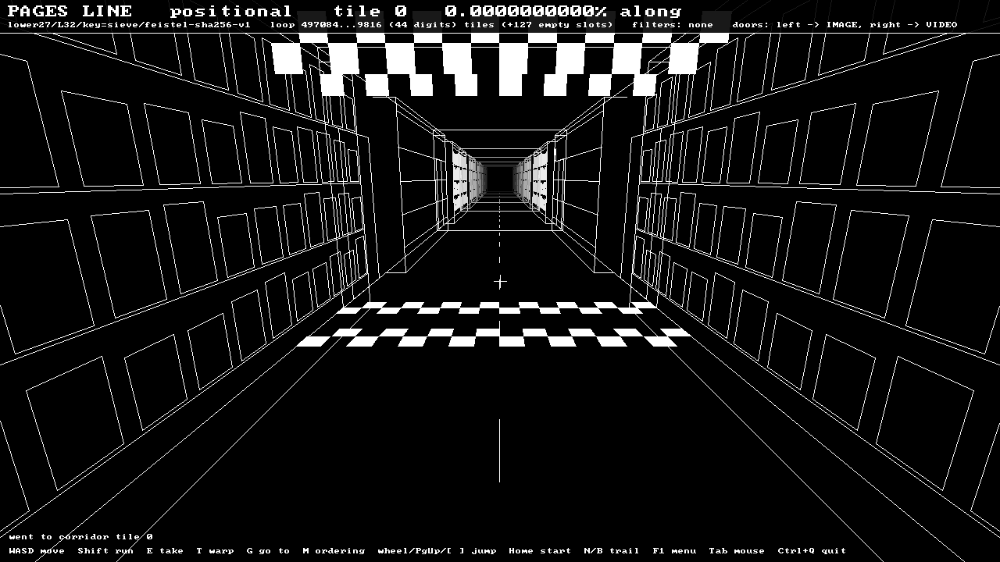
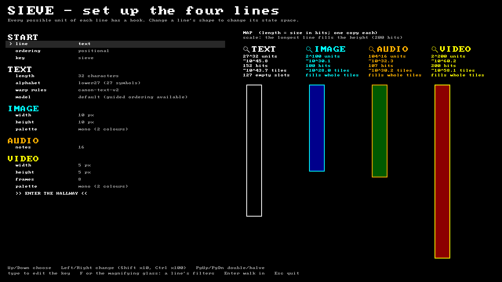
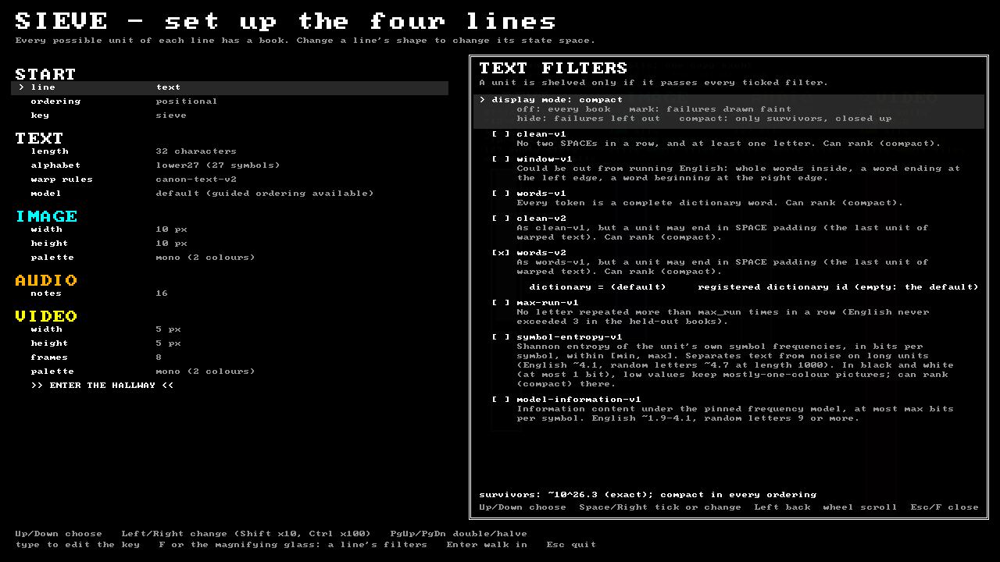
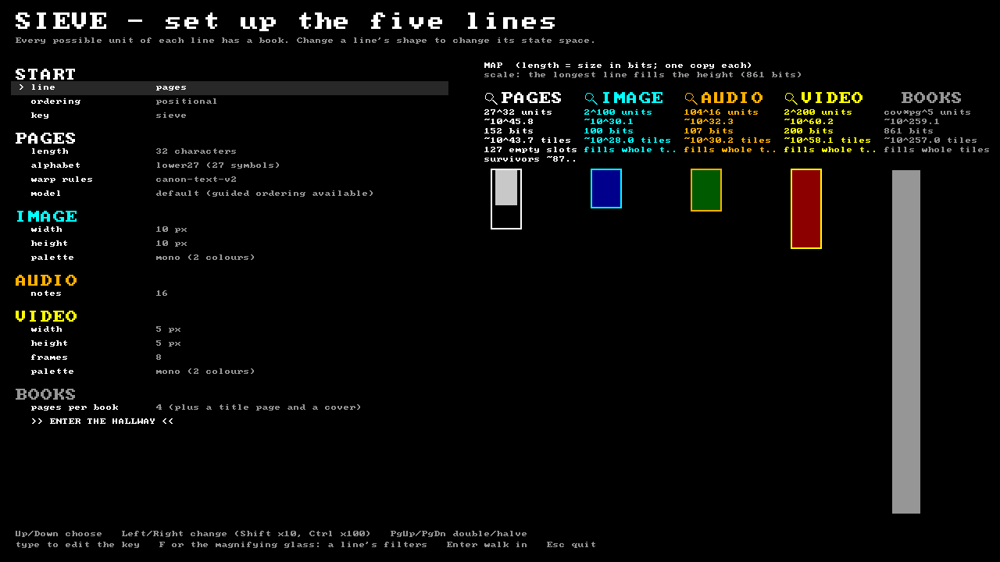
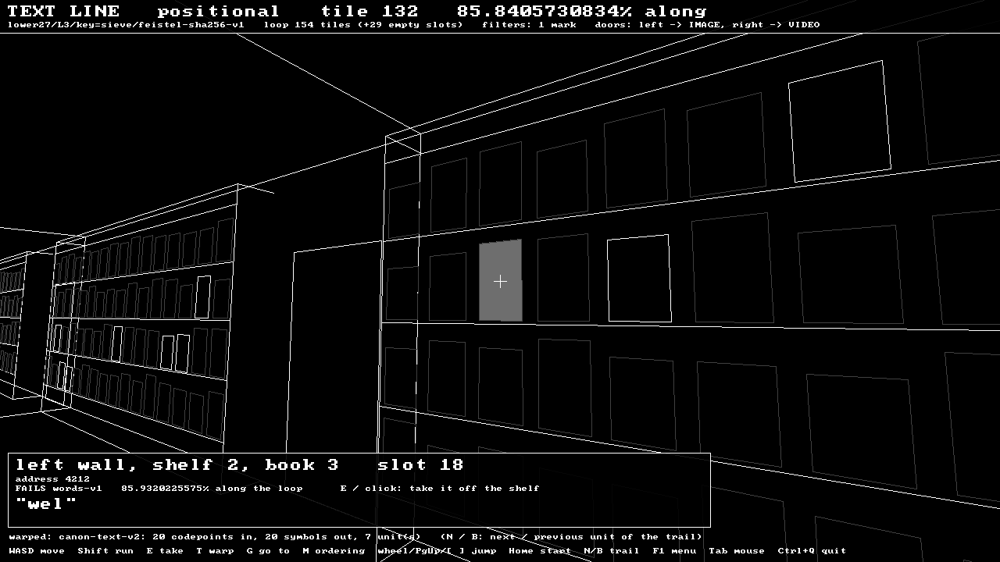
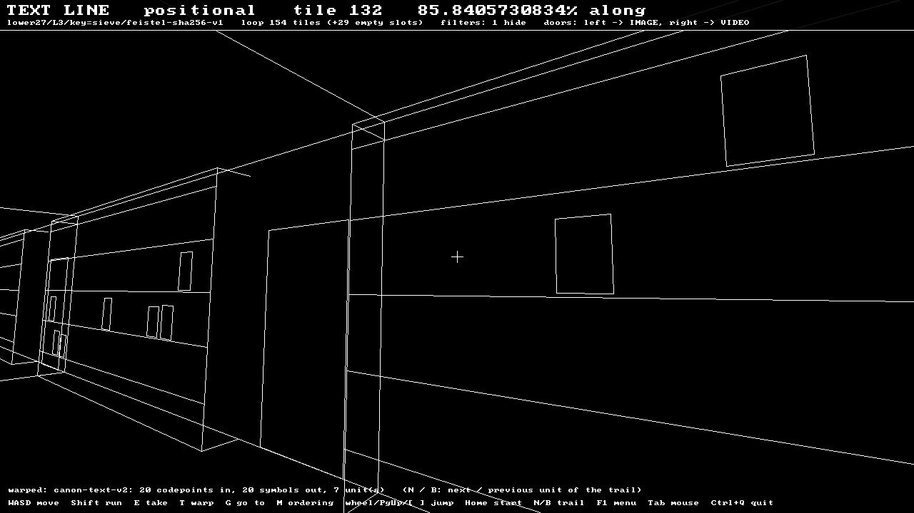
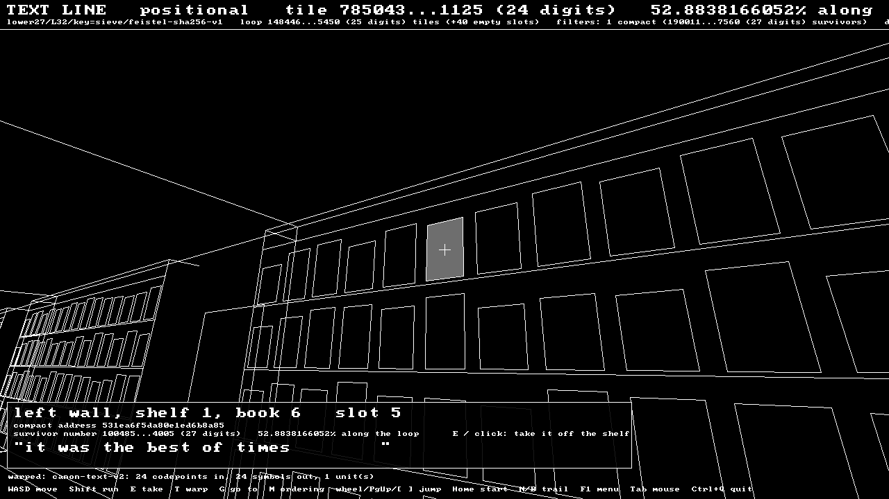
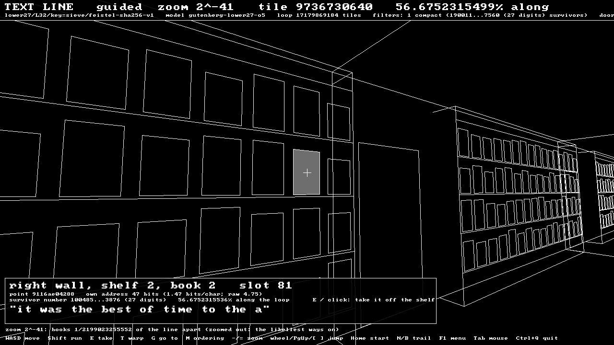
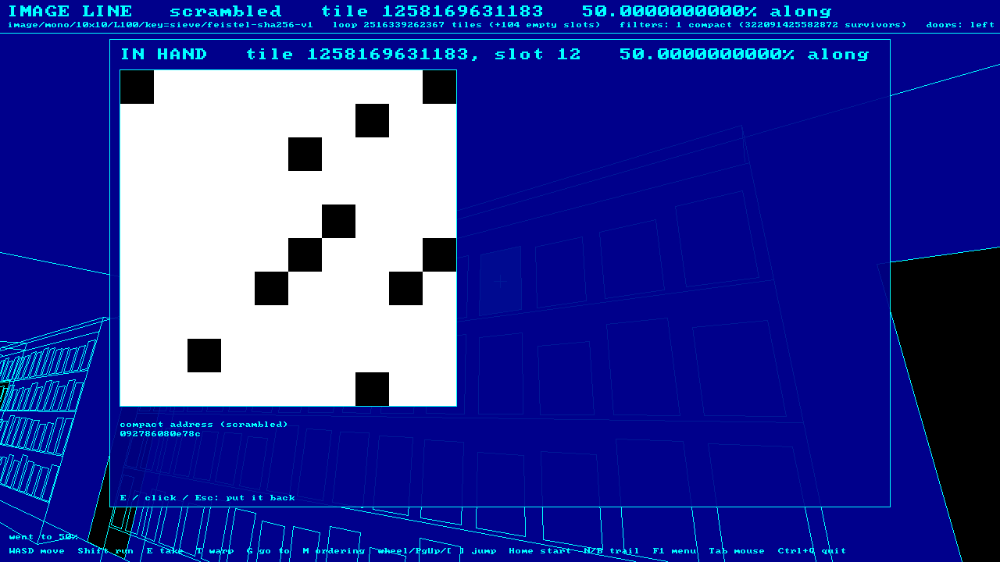
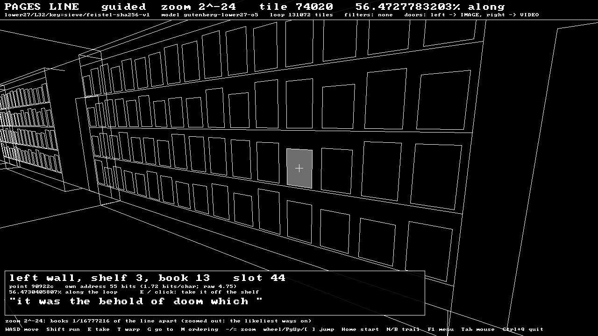

# Sieve

*The Gallery of Babel: every possible text, picture, melody and animation of a fixed size, each at exactly one address, sifted so that meaning can be found.*

Sieve grew out of the Gallery of Babel in **Potentia**. Potentia itself, the alignment thesis and the preservation of AI models, lives in the parent repository. Sieve is the search-space engine and its hallway.

Implementation of [SPECIFICATIONS.md](docs/SPECIFICATIONS.md) (v2.0). This covers **M1** (the exhaustive sieve), **M2** (raw addressing and warp), **M3** for text (entropy-ordered "guided" addresses from a pinned model), and the first version of all four lines: **text, image, audio and video**.

**Concept and architecture by Edward James Gordon.**

## Layout

| Path | Contents |
| :--- | :--- |
| `core/` | Dependency-free C++20 library: alphabets, palettes, notes, exact big integers, SHA-256, address map, canonicalisation, sieve, guided coder, the filtration stack (`core/src/filters/`) |
| `tools/sieve_cli.cpp`, `tools/cli/` | The `sieve` command-line tool |
| `client/` | The `hallway`: a 3D wireframe walk along the four lines (SDL3) |
| `tools/plot_sieve.py` | Plots sieve results (needs matplotlib) |
| `tools/build_dictionary.py` | Rebuilds the English dictionaries from SCOWL |
| `data/dictionaries/` | The dictionary registry (`dictionaries.tsv`) and pinned English word lists (SCOWL 2020.12.07) |
| `data/models/` | The model registry (`models.tsv`), the pinned text model, and the training corpus manifest (`corpus/gutenberg-nltk.tsv`) |
| `tools/fetch_corpus.py` | Downloads the training corpus into `corpus/` (not stored in the repository) and checks every file's hash |
| `reference/sieve_ref.py` | Independent Python oracle; generates every conformance vector file |
| `tests/` | Core tests and the conformance vectors |
| `results/` | M1 sieve output (CSV and chart) |
| `third_party/stb/` | stb_image and stb_image_write (public domain), used only by the tool to read and write image files |
| `.github/workflows/build.yml` | Builds and tests on Windows, Linux and macOS on every push |
| `docs/SPECIFICATIONS.md` | The specification |
| `docs/images/` | Hallway screenshots |

## Build

The toolchain matches ALTEngine: CMake, with a vcpkg manifest. The core and the `sieve` tool have **no dependencies**. The `hallway` needs SDL3:
- If an SDL3 install is found (vcpkg with the `client` feature, or a system install), CMake uses it.
- Otherwise the **first** configure downloads and builds SDL 3.2.30 as a static library, which takes a few minutes. Later builds reuse it.
- To build without the hallway, configure with `-DSIEVE_BUILD_CLIENT=OFF`.

**Visual Studio (Open Folder):** `CMakePresets.json` provides three configurations in the toolbar dropdown:

| Preset | Use for |
| :--- | :--- |
| **x64 Debug** | Full debugging. Slow for long `sieve` checks. |
| **x64 Release with debug info** | Optimised but debuggable: breakpoints still work, and `sieve` runs at near-release speed. Recommended for everyday work. |
| **x64 Release** | Fastest. |

**Command line:**

```sh
cmake --preset linux-release          # or x64-Release on Windows (from a VS Developer prompt)
cmake --build --preset linux-release
ctest --preset linux-release
```

Or without presets: `cmake -S . -B build`, then `cmake --build build --config Release`, then `ctest --test-dir build -C Release`.

The build is warning-free at `/W4` and `-Wall -Wextra -Wpedantic`, and it copies the bundled dictionaries next to the executable, so every command works from any folder.

**Continuous integration:** `.github/workflows/build.yml` builds and tests on Windows, Linux and macOS. It checks that every platform produces the same addresses, and that the Python oracle reproduces the committed vectors. GitHub only reads workflows from the repository root: if this folder is a subfolder of your repository (as in `Potentia/Sieve`), move `.github` up to the repository root. `PROJECT_DIR` in the file is already set to `Sieve`.

## Key terms

- **Line:** a kind of content. There are four: `text`, `image`, `audio` and `video`.
- **Unit:** one "book" on a line's shelf. Its shape is fixed: exactly `--length` characters, or a WxH picture, or N notes.
- **Space:** every possible unit of one line with one set of options.
- **Address:** a unit's position in the space, written in hex. Every unit has exactly one address, and every address in range holds exactly one unit.
- **Positional ordering:** the address *is* the content, read as a number. Units with the same beginning sit side by side.
- **Scrambled ordering:** the content passes through a fixed, reversible shuffle first, so neighbouring addresses hold unrelated units, as in Borges' library.
- **Guided ordering** (text): each unit gets a stretch of the line as long as a pinned model thinks it likely. Meaningful text gets short addresses (about 2 bits per character instead of 4.75) and noise gets long ones. See *Guided addresses* below.

Getting help from the tool itself:

```sh
sieve                     # commands and a quick start
sieve help warp        # full explanation and examples for one command (or: sieve warp --help)
sieve help lines       # the four lines and all of their options
```

## Lines

Choose a line with `--line`; the default is `text`. Each line has its own options, and they must match between `warp` and `read`.

| Line | A unit is... | Options (defaults) | Input for `warp` |
| :--- | :--- | :--- | :--- |
| `text` | `--length` characters | `--length L` (required), `--alphabet lower27\|babel29\|ascii95` (lower27), `--canon v2\|v1` (v2) | text in quotes, or `--file` |
| `image` | a WxH picture | `--width` (10), `--height` (10), `--palette mono\|ega16\|rgb332\|rgb24` (mono) | `--file` PNG, JPEG, BMP, GIF, TGA |
| `audio` | a melody of N notes | `--length N` (16) | notes such as `"C4q E4q G4h Rq"`, or `--file` |
| `video` | F pictures of WxH | `--width` (5), `--height` (5), `--frames` (8), `--palette` (mono) | `--file`, usually an animated GIF |

Every line also takes `--key K` (default `sieve`), which seeds the scrambled ordering.

**Palettes:**
- `mono`: black and white
- `ega16`: the 16-colour EGA palette
- `rgb332`: 256 colours
- `rgb24`: every 24-bit colour

**Audio notation:** each note is written as letter, optional `#` or `b`, octave, then duration: `e` eighth, `q` quarter, `h` half, `w` whole. Examples: `C4q`, `F#5e`, `Bb4h`. A rest is `R` plus a duration, e.g. `Rq`.
- The range is C4 to C6; notes outside it move by whole octaves into range.
- A missing duration means a quarter note.
- Short melodies are padded with eighth rests.
- `|` bar lines and commas are ignored.

Size of each space with the default options:

| Line | Units | Address length |
| :--- | ---: | ---: |
| text, 32 characters | ~10^45.8 | 39 hex digits |
| text, 1,000 characters | ~10^1,431 | 1,189 hex digits |
| image, 10×10 mono | ~10^30.1 | 25 hex digits |
| image, 10×10 rgb24 | ~10^722.5 | 600 hex digits |
| audio, 16 notes | ~10^32.3 | 27 hex digits |
| video, 8 frames of 5×5 mono | ~10^60.2 | 50 hex digits |

## The hallway

```
hallway [options]          (hallway --help for the full list)
```

All four lines share **one endless corridor** lined with bookcases. **Every book is one unit**, and the address increases as you walk forward:
- Each tile of corridor holds **128 book slots** (4 shelves of 16 on each wall): the left wall first, then the right wall.
- 128 is a power of two, and the code refuses to build if it isn't (`sieve/corridor.hpp`).
- On each wall the books run shelf by shelf from the top, and along each shelf in the direction you are walking.
- One tile of geometry is built once and repeated forever.

**Loops and the start line.** Each line **repeats** along the corridor. One copy of a line of N units spans ⌈N / 128⌉ tiles, and slot *i* of a copy holds the unit whose address is *i*.
- **Padding:** if N isn't a multiple of 128, the last tile of each copy ends in bare shelf, so every copy starts on a fresh tile.
- **Power-of-two sizes:** a line whose size is a power of two (at least 128) fills its tiles exactly. When every line's size is a power of two, the loops nest.
- **Checking the fit:** `sieve info` tells you how a line fits.
- **The start line:** where each copy begins, a **checkered start line** crosses the floor and hangs overhead.
- **The double flag:** where all four lines start together, the start line is doubled. That is always so at corridor tile 0, where **Home** takes you.

The lines are astronomically long, so to see a whole loop, try a 2-character text line: `hallway --length 2` gives 729 units, which is 6 tiles with 39 empty slots.



**The setup menu.** The hallway opens with a menu where you can set every line's shape: text length, alphabet, warp rules and model; image size and palette; audio notes; video size, frames and palette; plus the key, the starting line and the ordering. Enter walks in, and **F1** in the hallway brings the menu back.

Beside the settings, a **map** draws the four lines side by side, one copy each:
- Each bar's length is the line's size in bits (log2 of its number of units). The real sizes differ by factors far too large to draw literally.
- The **longest line always fills the height**, so no bar can leave the screen however large the settings grow.
- Every bar has a minimum length, so even a tiny line stays visible next to a huge one.
- Each line also shows its units, bits, tiles per copy, and padding.

**No limits.** The state spaces are meant to scale without end. Each setting goes up to the largest value it can store (over 4 billion). Left/Right change a setting (Shift ×10, Ctrl ×100), and PgUp/PgDn double or halve it, which is quick for reaching powers of two.

What limits a line in practice is the machine. An address is one number held in memory, and the arithmetic on it grows with the square of its length. The menu marks a line "large: slow to open" beyond 4 million bits per address (about 840,000 lower27 characters). It refuses to open one beyond 8 billion bits, where a single address would need a gigabyte. Both thresholds are single constants in `client/menu.cpp`, there to be raised as machines grow. `--no-menu` skips the menu.



**Filters.** The magnifying glass beside each line's title (or **F** on that line's settings) opens the line's **filter list** over the map: a black box with a white outline, scrolled with the wheel or the arrow keys. It has three kinds of row:
- **Display mode**, one of four:
  - **off:** every book on the shelves.
  - **mark:** books that fail are drawn faint. Good for record keeping and tests: you see exactly what the stack rejects.
  - **hide:** books that fail are left out and the rest keep their places. Good for walking along and browsing.
  - **compact:** only survivors stand on the shelves, packed together, in **every ordering**, and the loop is exactly as long as the survivor count:
    - **Positional:** slot *k* holds survivor number *k*.
    - **Scrambled:** the survivor numbers are shuffled with the key, so neighbours are unrelated survivors.
    - **Guided:** the guided line is restricted to survivors. Every symbol that could not lead to a survivor is removed from the model's tables as the coder goes, so every point on the line is a survivor, and likely survivors own the long stretches.
- **Filters**, each with a tickbox and a description.
- **Parameters**, shown under a filter when it is ticked. Numbers step with Left/Right; a dictionary or model cycles through the registered ones.

Space/Right ticks or changes a row and Left steps back; with the mouse, click to tick or change and right-click to step back. Esc, F or a click outside closes the list and saves it to `sieve-filters.ini` next to the executable (or wherever `--filters PATH` points). The file is plain text and may be edited by hand:

```ini
[text]
mode = compact
filters = words-v2
[text.words-v2]
dictionary = scowl-en-35
```

The footer says what the stack can do. Where it can count its survivors exactly, the map fills that part of the line's bar and labels it with the survivors' size in bits.





Every filter is a separate, versioned module compiled into the core. Every decision is exact integer arithmetic, so every machine agrees, and the Python oracle checks each one:

| Filter | Lines | Passes when | Compact |
| :--- | :--- | :--- | :--- |
| `clean-v1` | text | no double SPACE, at least one letter | yes |
| `window-v1` | text | could be cut from running English (see `sift` below) | |
| `words-v1` | text | every token is a dictionary word | yes |
| `clean-v2`, `words-v2` | text | as v1, but the unit may end in SPACE padding, as the last unit of warped text does | yes |
| `max-run-v1` | text | no letter repeated more than `max_run` times in a row (3) | |
| `symbol-entropy-v1` | all | the unit's own Shannon entropy per symbol lies within [min, max] | in black and white |
| `model-information-v1` | text | information under the pinned frequency model is at most `max` bits per symbol (5) | |
| `neighbour-agreement-v1` | image, video | enough neighbouring pixels (and frames) share a colour | |
| `key-v1` | audio | every note is in one key (tonic C…B; major, minor, harmonic minor, major or minor pentatonic, blues); rests always pass | yes |

**Compact** needs a filter that can count and rank its survivors (the Compact column), so it works on every line: words on text, low entropy on black-and-white pictures (mostly one colour), a key on melodies. Any other ticked filter must be one that filter *implies*: `words` implies `clean`, so the two together still compact, but `words` with `max-run` does not. When compact is not possible the hallway falls back to hide, and the top bar says why. Warp to text that fails the stack and it opens in hand marked **NOT ON THE SHELVES**, with the filter that rejected it.

A changed filter never replaces the old one. It is registered as the next version (`words-v2` beside `words-v1`), so a result recorded with a stack's id can always be reproduced. To add a filter, write it in `core/src/filters/` and add one line to `core/src/filters/builtin.cpp`. The oracle and the vectors in `tests/vectors_filters_v1.tsv` should grow with it.

| Mode | The text line at length 3, filtered by `words-v1` |
| :--- | :--- |
| mark |  |
| hide |  |








**Colours.** Each line has two colours: a solid background and the colour of every edge. Doors are solid black.

| Line | Background | Edges |
| :--- | :--- | :--- |
| text | black | white |
| image | blue | cyan |
| audio | green | amber |
| video | red | yellow |

**Doors.** The walls repeat shelf, door, shelf. A black door in the **left** wall leads to the **next** line (text → image → audio → video → text). A door in the **right** wall leads to the **previous** line. You come in through the opposite door, in the new line's colours.

A door **keeps your corridor position** and only changes which line reads it:
- Every door lines up with a door in every other line.
- Go through a door, walk *k* tiles, go back through the door there, and you are *k* tiles along from where you left.
- Step straight back through the same door and you are exactly where you were.
- Lines of different sizes simply repeat at different rates. Many places on a big line share one unit of a smaller line, and the reverse.


**Books.** Look at a book and a panel shows its position on the shelf, its address, how far along the line it is, and a preview. Press **E** or click to take it off the shelf:
- **Text:** the full text.
- **Image:** the picture, in its palette colours.
- **Video:** the frames, animated.
- **Audio:** the notes; **P** plays them.


| Key | Action |
| :--- | :--- |
| W A S D / arrows | Walk and turn. **Shift** runs. |
| Mouse | Look around. **Tab** frees or captures the mouse. |
| E / left click | Take the book you are looking at off the shelf, or put it back |
| T | **Warp:** type text, notes, or a picture file path (for image and video), then Enter. You land facing it, in the first copy of the line (where your position equals its address), and it opens in hand. Ctrl+V pastes. |
| G | **Go to** a hex address or a percentage such as `50%` or `36.25%` (these open the book too), or `@T` for corridor tile T |
| N / B | Next or previous unit of a warp that made a trail of several units |
| M | Switch ordering: positional → scrambled → guided (text) → positional |
| - / = | Guided ordering: zoom out / in by one bit (**Shift**: 8 bits) |
| Mouse wheel · PgUp/PgDn · [ ] | Jump 1 · 1,000 · 1,000,000 tiles along the line |
| Home | Corridor tile 0: the start line of every line (the double flag) |
| F1 | Back to the setup menu (filters are set there) |
| P | Play an audio book you are holding |
| Esc | Close a panel or input, or free the mouse |
| Ctrl+Q | Quit |

**Options.** The hallway takes the same line options as `sieve`, renamed per line because all four lines are open at once:

| Line | Options |
| :--- | :--- |
| text | `--length` (32), `--alphabet`, `--canon`, `--model` |
| image | `--image-width`, `--image-height`, `--image-palette` |
| audio | `--notes` (16) |
| video | `--video-width`, `--video-height`, `--video-frames`, `--video-palette` |

It also takes:
- `--key`, `--mode positional|scrambled|guided` and `--line` for the starting line.
- `--warp INPUT` or `--goto ADDRESS|P%|@T` to set where you start, `--zoom D` for the guided zoom, and `--tile N` to move N tiles along from there.
- `--filters PATH` for the filter settings file.

**Screenshots and scripted walks** (used by the automatic tests too):

```sh
hallway --screenshot shot.png --size 1280x720 --pose X,Z,YAW,PITCH
hallway --line image --warp sprite.png --take --screenshot in-hand.png
hallway --pose 0,7,-90,0 --walk "-2.3,0;2.5,0" --screenshot door.png   # through a door and back
hallway --pose 0,7,-90,0 --walk "-2.3,0;-0.8,0;0,8;1.5,0" --screenshot loop.png   # through, one tile along, back
hallway --length 2 --goto @0 --pose 0,5,180,-14 --screenshot start.png   # the double start line
hallway --menu --screenshot menu.png                                      # the setup menu (--press keys go to the menu)
hallway --warp "it was the best of times" --press "M,M,-,-" --screenshot g.png   # keys, as if typed
```

On a machine without a display, set `SDL_VIDEO_DRIVER=offscreen` and `SDL_RENDER_DRIVER=software`.

**The guided view.** Press **M** until the top bar says `guided` (or start with `--mode guided`). Now each book is a *point* on the entropy-ordered line, and the books are `2^-zoom` of the line apart. Each book holds the unit whose stretch of the line contains its point. Likely text owns long stretches, so the shelves are readable almost everywhere. Noise is still on the line, but it occupies hairline stretches that the books rarely land on.

- Warping puts the unit on a book and sets the zoom to the length of its address. Neighbouring books then differ only near the end.
- **-** zooms out. At `2^-24`, every book is the likeliest line in its slice, so the wall reads as a list of plausible continuations of where you are.
- **=** zooms back in.
- The panel shows the book's point, and the length of the unit's own address in bits: its information content, to within two bits.



Doors work the same in guided order. At zoom *d* the guided loop is 2^*d* books long, and the lines without a model (image, audio, video) keep their raw ordering.

## Commands

### `info`: how big is a space?

```
sieve info [--line LINE] [line options] [--key K]
```

```sh
sieve info --length 1000                              # paragraph-scale text
sieve info --line image --palette rgb24               # every 10x10 full-colour image
sieve info --line video                               # every 8-frame 5x5 animation
```

### `warp`: give some content, get its address

```
sieve warp [--line LINE] [line options] [--key K] [--mode MODE] [--short] (TEXT... | --file PATH)
```

Fits the input to the line with fixed, versioned rules (see *Canonicalisation* below) and reports every change it made. It then prints each unit's address, how far along the line it sits, and a preview. Images and video are drawn as ASCII art.

| Option | Meaning |
| :--- | :--- |
| `--mode MODE` | `positional`, `scrambled`, `guided` or `all` (default: every ordering the line has; `both` also works). |
| `--model ID\|PATH\|none` | Text: the model for guided addresses. Default: the alphabet's default model (see `models`). |
| `--short` | Abbreviate long addresses as `start...end (N digits)`. |
| `--file PATH` | Read the input from a file. |

```sh
sieve warp --length 32 "It was the best of times"
sieve warp --length 1000 --file chapter1.txt
sieve warp --line image --file sprite.png
sieve warp --line image --palette ega16 --width 16 --height 16 --file sprite.png
sieve warp --line audio "E4q D4q C4q D4q E4q E4q E4h"
sieve warp --line video --file walk.gif --short
```

Example output:

```
line         text
space        lower27/L32/key=sieve/feistel-sha256-v1
canon        canon-text-v2: 24 codepoints in, 24 symbols out, 1 unit(s)
  case folded           1
  padding               8 (spaces on the last unit)

unit 1/1  "it was the best of times        "
  positional  066f1b1b557137f7d30eb550279691c9d306f86
              at 36.0811572947% along the line
  scrambled   007b30165818bf0311497600aa52996f9395e27
              at 2.6985270978% along the line
  guided      90922c700685e28
              58 bits: 1.81 bits/symbol (raw 4.75), at 56.4730431890% along the guided line
```

### `read`: give an address, get the content

```
sieve read [--line LINE] [line options] [--key K] --mode MODE [--out PATH] [--scale S] ADDRESS
```

This is the reverse of `warp`. Every option that shaped the address must match; otherwise you'll read a different unit, because every address in range holds *something*.

| Option | Meaning |
| :--- | :--- |
| `--mode MODE` | **Required.** `positional`, `scrambled` or `guided`. A guided address is any hex fraction (`8` is halfway): it reads the unit whose stretch of the line contains that point. |
| `--out PATH` | Also save the unit: `.png` for images and video (frames side by side), `.mid` for audio, a text file for text. |
| `--scale S` | Enlarge each pixel to S×S in the saved PNG. Default 16. |
| `--around N` | Also show the N units on either side: what the hallway shows around this shelf. The line loops, so the last address is followed by the first. |
| `--zoom D` | Guided `--around` and `--at`: the books are `2^-D` of the line apart. Default (for `--around`): the length of the unit's own address. |
| `--at TILE:SLOT` | Instead of an address: the book at that place on the hallway's shared corridor (the tile number the hallway shows, and slot 0–127). |

```sh
sieve read --length 32 --mode scrambled 007b30165818bf0311497600aa52996f9395e27   # "it was the best of times"
sieve read --line image --mode scrambled <address> --out found.png
sieve read --line audio --mode scrambled <address> --out tune.mid
sieve read --length 12 --mode positional --around 3 <address>
sieve read --length 32 --mode guided 90922c700685e28                    # "it was the best of times"
sieve read --length 32 --mode guided --around 4 --zoom 20 90922         # a zoomed-out guided shelf
sieve read --line image --mode positional --at 4627:0                    # what the hallway shows at tile 4627, slot 0
```

With `--around`, positional order shows that neighbours differ only at the end. Scrambled order shows that they are unrelated:

```
      -1  "hello worlcz"  0a1fe3967f0accb
>     +0  "hello world "  0a1fe3967f0accc
      +1  "hello worlda"  0a1fe3967f0accd
```

### `browse`: pull random units off the shelves

```
sieve browse [--line LINE] [line options] [--key K] [--mode scrambled|guided] [--count N] [--seed S] [--short]
```

```sh
sieve browse --length 32
sieve browse --length 64 --mode guided        # random points on the guided line
sieve browse --line image --count 3
sieve browse --line audio
```

A random scrambled address is a uniformly random unit, so it is noise. A random *guided* point is a sample from the model, so it reads like text: `"great piedro had lifted on that in had made no come are and the "`. That is what the guided line is built to do, and it is why fluency is never evidence that a text is real.

### `sift`: how much of the text space survives each noise filter (M1)

(`sieve sieve` still works as an alias.)

```
sieve sift [--dict ID|PATH] [--lengths SPEC] [--brute-max N] [--pruned-max N] [--threads T] [--csv PATH]
```

For each unit length, counts **exactly** how many `lower27` units pass three filters, each stricter than the last:

| Filter | A unit passes if... |
| :--- | :--- |
| `clean` | it has no double spaces and at least one letter |
| `window` | it could be a snippet cut from English text: whole words inside, a word *ending* at the left edge, a word *beginning* at the right edge |
| `words` | every token is a complete dictionary word |

| Option | Meaning |
| :--- | :--- |
| `--dict ID\|PATH` | A registered dictionary (see `dicts` below): `scowl-en-35`, `scowl-en-60` (default) or `scowl-en-80`; `35`, `60` and `80` also work. Its SHA-256 is checked before use. A value containing `/` or `\` or ending in `.txt` is read as a file path instead, unchecked. |
| `--lengths SPEC` | Numbers and ranges, e.g. `1-32,64,100,1000`. Default `1-12`. |
| `--brute-max N` | Also check up to length N by visiting every unit. Default 5. On 2 cores, N=6 takes ~30 s and N=7 ~10–15 min. |
| `--pruned-max N` | Also check up to length N by pruned tree walk. Default 6. On 2 cores, N=7 takes ~15 s and N=8 ~2 min. |
| `--threads T` | Worker threads. Default: all cores. |
| `--csv PATH` | Write results to a file instead of the screen. |

```sh
sieve sift
sieve sift --lengths 1-64,100,1000 --csv results/sieve.csv
sieve sift --dict scowl-en-35 --lengths 1-20
python3 tools/plot_sieve.py results/sieve.csv results/sieve.png "SCOWL size 60"
```

CSV columns:

| Column | Meaning |
| :--- | :--- |
| `length` | Unit length |
| `log10_units` | log10 of 27^L |
| `clean`, `window`, `words` | Exact survivor counts |
| `log10_frac_*` | log10 of the fraction of the space that survives |
| `verified_by` | Which methods agreed |
| `pruned_window_states` | Prefix-tree nodes visited by the pruned walk |
| `log10_frac_prefix_tree_explored` | The fraction of the prefix tree that represents |

### `filters`, `check`: the filtration stack

```
sieve filters [--line LINE] [line options] [--filters PATH]
sieve check   [--line LINE] [line options] [--filters PATH] (TEXT... | --file PATH)
```

`filters` lists every filter a line offers: which are ticked, their descriptions and parameters, and what each implies. It ends with the stack's provenance and id, and either the exact survivor count or why compact is unavailable. `check` fits content to the line as `warp` does. For each unit it shows every filter's verdict, whether the unit passes the ticked stack, and, if the stack can rank, its **survivor number**: its place on compact shelves. `read --survivor K` goes the other way. `--compact` on `warp`, `read` and `browse` works in the compact orderings: `warp --compact` adds a survivor's compact addresses, `read --compact` reads one, and `browse --compact` picks uniformly random survivors, or with `--mode guided` samples the model restricted to survivors:

```sh
sieve filters --filters words2.ini
#   survivors    190011992984255955985337560 (exact; compact mode available)
sieve check --length 32 --filters words2.ini "It was the best of times"
#   [ ] words-v1                FAIL
#   [x] words-v2                pass
#   stack: passes, survivor number 100485593897630338697104005 of 190011992984255955985337560
sieve read --length 32 --mode positional --filters words2.ini --survivor 100485593897630338697104005
#   it was the best of times
sieve warp --length 32 --filters words2.ini --compact "It was the best of times"
#   compact     survivor number 100485593897630338697104005 of 190011992984255955985337560
#     positional  531ea6f5da80e1ed6b8a85
#     scrambled   1db41d1685abd564b15405
#     guided      9116ae0428ea154  (58 bits: 1.81 bits/symbol)
sieve browse --length 32 --filters words2.ini --compact --count 1 --seed 1
#   "red oi spore swiz pot is auk fin"
```

### `dicts`: the dictionary registry

```
sieve dicts [--hash FILE]
```

Dictionaries are registered in `data/dictionaries/dictionaries.tsv`, one per line, with these fields: id, file, language, default, SHA-256 and description. Every command that takes `--dict ID` looks the id up there. If a file's hash no longer matches, the command refuses to use it, so a result recorded with a dictionary id can always be reproduced with exactly the same words. `sieve dicts` lists every entry, marks the default and checks each file.

To add a dictionary:

1. Put the word list (one word per line) in `data/dictionaries/`.
2. Run `sieve dicts --hash data/dictionaries/FILE`. It prints the word count, the SHA-256 and a ready-made registry line.
3. Paste that line into `dictionaries.tsv` with your own id and description. To make it the default, set its `default` column to `yes` and the old default's to `no`.
4. Rebuild, so the copy next to the executable is updated.

Never edit an existing entry's file or hash. A changed list gets a new id, so older results stay reproducible.

```
registry  data/dictionaries/dictionaries.tsv

  scowl-en-35   en  40201 words, hash ok
    SCOWL 2020.12.07 size 35: common English words, British and American spellings
* scowl-en-60   en  79645 words, hash ok
    SCOWL 2020.12.07 size 60: SCOWL's recommended spell-check size
  scowl-en-80   en  251174 words, hash ok
    SCOWL 2020.12.07 size 80: large, includes rare words
```

### `models`, `train`, `measure`: the models behind guided addresses (M3)

```
sieve models
sieve train   --out FILE [--corpus MANIFEST] [--texts DIR] [--alphabet A] [--order K] [--min-count M]
sieve measure [--model ID|PATH] [--length L] [FILE... | --corpus MANIFEST --texts DIR [--role test|train|all]]
```

Models are registered in `data/models/models.tsv` and pinned by SHA-256, like dictionaries. Every guided address depends on every count in the model, so a changed file is refused. `sieve models` lists and checks them.

`sieve train` rebuilds a model from a corpus manifest, which lists each file with its encoding, role (`train` or `test`) and SHA-256. The same corpus and options always give the same file, byte for byte:

```sh
python3 tools/fetch_corpus.py                                   # the 18 Project Gutenberg books
sieve train --out /tmp/check.model                              # sha256 dff72d8a... = the pinned model
sieve measure                                                   # bits per character on the held-out books
```

`sieve measure` reports two figures in bits per character:
- `stream`: the model's information content, coding the text as one long history.
- `guided`: the real cost of guided addresses when the text is cut into units.

With no files, it measures the three books held out of training:

```
text                            symbols   stream   guided    vs raw
carroll-alice.txt                134371    1.929    1.932     2.46x
chesterton-thursday.txt          307403    1.944    1.948     2.44x
shakespeare-macbeth.txt           93070    2.478    2.480     1.92x
all                              534844    2.033    2.037     2.33x
```

### `version`: what produced a result

```
sieve version        (or: sieve --version)
```

Prints the tool version, the scramble construction, every canonicalisation rule version, the alphabets and palettes, the guided coder and model format, and the default dictionary and model with their SHA-256. Record this alongside any result you publish, so it can be reproduced exactly.

## Canonicalisation

These rules are versioned, because they decide which unit a pasted input lands on. Changing a rule means a new version, never a silent edit.

**`canon-text-v2`** (the default) applies these steps in order:
1. Whitespace becomes a space.
2. Typographic punctuation becomes ASCII: curly quotes, dashes, ellipsis.
3. Accented Latin letters fold to plain ones: `é`→`e`, `ß`→`ss`, `æ`→`ae`, `ł`→`l`.
4. Capitals are lower-cased if the alphabet has no capitals.
5. Any character still not in the alphabet is handled as follows: an apostrophe is **removed** (`didn't`→`didnt`), and anything else **becomes a space** (`well-known`→`well known`, `author/editor`→`author editor`).
6. Runs of spaces collapse to one, and the text is trimmed.
7. The text is split into units and the last unit is padded.

**`canon-text-v1`** (select with `--canon v1`) removes every out-of-alphabet character, which glues words together (`wellknown`). It is kept so that earlier results stay reproducible.

**`canon-image-v1`**:
1. Composite onto black.
2. Stretch to W×H by exact integer area-averaging, rounded half up.
3. Set each pixel to the nearest palette colour by squared RGB distance; ties go to the lowest index.

A video takes up to `--frames` frames, adding black frames if the source is short.

**`canon-notes-v1`**:
1. Flats are written as sharps.
2. Notes move by whole octaves into C4–C6.
3. A missing duration means a quarter note.
4. The last unit is padded with eighth rests.

## Conformance

The Python oracle shares no code with the C++ core. It uses native big integers, `hashlib`, `unicodedata`, and exact fractions for image resampling. The core must reproduce every vector bit for bit:

| File | Checks |
| :--- | :--- |
| `vectors_v1.tsv` | Text addresses, both orderings, three alphabets |
| `vectors_digits_v1.tsv` | Addresses over 2, 16, 104, 256 and 16,777,216 symbols (the image, audio and video lines) |
| `vectors_canon.tsv` | Text canonicalisation v1 and v2, including every accented letter in the fold table |
| `vectors_image_v1.tsv` | Image resampling and palette quantisation, all four palettes |
| `vectors_guided_v1.tsv` | Guided addresses and point decoding under the pinned model. The oracle derives every frequency table from the model file itself. |
| `vectors_filters_v1.tsv` | Filter verdicts, fixed-point logarithms, and survivor counts and ranks for `clean` and `words` (v1 and v2) |
| `vectors_compact_v1.tsv` | The survivor shuffle, rankers for black-and-white entropy and `key-v1`, and survivors' addresses and point decoding on the sieved guided line |

The oracle also rebuilds the default model from the raw corpus (`sieve_ref.py model-build`) and must produce the same SHA-256 as `sieve train`. The core tests check every tiny space exhaustively: at L = 1–3 the arcs of all 27^L units tile the line exactly, every address is the shortest block that fits, and every address decodes back. The same holds for the sieved guided line over the survivors of `clean` and `words`: no non-survivor has an arc. Every ranker is checked against its filter over every unit of small lengths, and the shuffle is checked as a permutation of every size up to 300.

`sieve_tests` runs every check twice: once on the portable SHA-256 and once on the CPU's SHA instructions (SHA-NI, on x86-64 CPUs that have them), so both paths are held to the same vectors. The fast path is picked automatically at start-up; `sieve version` shows which one this machine uses.

### Performance

Measured on a 2-core x86-64 container with SHA-NI (Release build):

| Task | Before | After |
| :--- | ---: | ---: |
| `sieve dicts` (hash and count three dictionaries) | 1.21 s | 0.08 s |
| `warp` a 1.9 MB book at L = 1000, scrambled | 1.99 s | 0.32 s |
| `warp` the same book at L = 32, scrambled | 1.38 s | 0.35 s |
| `read --around 100` at L = 1000, scrambled | 0.30 s | 0.03 s |
| Load and index `scowl-en-80` | 1.10 s | 0.69 s |

Where it came from: hardware SHA-256; hashing the round function's fixed prefix once per round instead of once per output block; computing each address once and deriving its hex and position from it; stepping neighbours on the address digits so each shelf costs one unscramble instead of three; converting big numbers several digits at a time; and deduplicating dictionary suffixes without a hash set. The hallway caches each book's address, hex and position, and skips tiles that are out of view. None of this changes a single address: every conformance vector is identical.

After an intentional, versioned change, regenerate them:

```sh
cd reference
python3 sieve_ref.py vectors       > ../tests/vectors_v1.tsv
python3 sieve_ref.py digit-vectors > ../tests/vectors_digits_v1.tsv
python3 sieve_ref.py canon-vectors > ../tests/vectors_canon.tsv
python3 sieve_ref.py image-vectors > ../tests/vectors_image_v1.tsv
python3 sieve_ref.py guided-vectors > ../tests/vectors_guided_v1.tsv
```

## M1 results

These use the default dictionary (SCOWL size 60, 79,645 words). Survivor counts are exact and agree with brute force up to L = 6 and with the pruned walk up to L = 7.


| Length | Units | Survive `words` | Surviving fraction |
| ---: | ---: | ---: | ---: |
| 8 | 10^11.5 | 6.9 × 10^6 | 10^-4.6 |
| 32 | 10^45.8 | 10^26.3 | 10^-19.5 |
| 100 | 10^143.1 | 10^81.4 | 10^-61.7 |
| 1,000 | 10^1,431.4 | 10^811.1 | 10^-620.3 |

Dictionary size changes the numbers but not the picture. At L = 1,000:

| Dictionary | Surviving fraction (`words`) | Bits per character left |
| :--- | ---: | ---: |
| SCOWL 35 (40,201 words) | 10^-659.8 | 2.56 |
| SCOWL 60 (79,645 words) | 10^-620.3 | 2.69 |
| SCOWL 80 (251,174 words) | 10^-556.9 | 2.90 |

What the results show:

- **Dictionary filtering removes about 0.62 orders of magnitude per character**, about 620 orders at paragraph length. The decline is a straight line.
- **What survives is word salad, not English.** It carries about 2.7 bits per character, where English carries about 1. Closing that gap at paragraph scale is roughly another 510 orders of magnitude, which is the job of the language-model stage (M3).
- **Pruning blocks off noise without visiting it.** At L = 7 the pruned walk explores 10^-2.8 (0.17%) of the prefix tree to find every surviving unit exactly, and that fraction falls as L grows.

## M3 results

Guided addresses under the default model (`gutenberg-lower27-o5`: order 5, 101,294 contexts, 10.5 million training characters).

| | Bits per character | 1,000-character paragraph |
| :--- | ---: | ---: |
| Raw (every unit equally likely) | 4.75 | 4,755 bits, one of 10^1,431 |
| After the M1 dictionary sieve (`words`, SCOWL 60) | 2.69 | one of 10^811 |
| Guided, held-out Alice in Wonderland | 1.93 | ~1,930 bits, one of ~10^581 |
| Shannon's estimate for English | 0.6–1.3 | one of 10^181–10^391 |

What the results show:

- **The model does the job the dictionary could not.** Word salad that passes the M1 sieve still carries 2.69 bits per character. The model gets real English to 1.93, which removes another ~230 orders of magnitude at paragraph scale.
- **Address length is information.** A guided address is never shorter than the unit's information content and never more than 2 bits longer, so short addresses always mean probable text.
- **Most of the rest is model quality, not addressing.** The coder is exact, and a better model plugs into the same format. The remaining gap to Shannon's estimate is what a larger (for example neural) model would close.

## Next

- **Models for the other lines:** a melody model for the audio line, and small-image statistics for the image line. The model format already takes any alphabet size.
- **Rankers for more filters,** so more stacks can compact: neighbour agreement for pictures (a transfer-matrix count over rows), and products of two ranking filters.
- **More filters:** bigram and trigram checks, rhythm and melody checks for audio, and S2 coherence tests, each as a new versioned module.
- **M1 (images):** noise filters for tiny images, counted over every 5×5 and 6×6 1-bit picture.
- **A larger text model** (for example ascii95 with case and punctuation, or a longer context), measured with `sieve measure` against the same held-out books.
