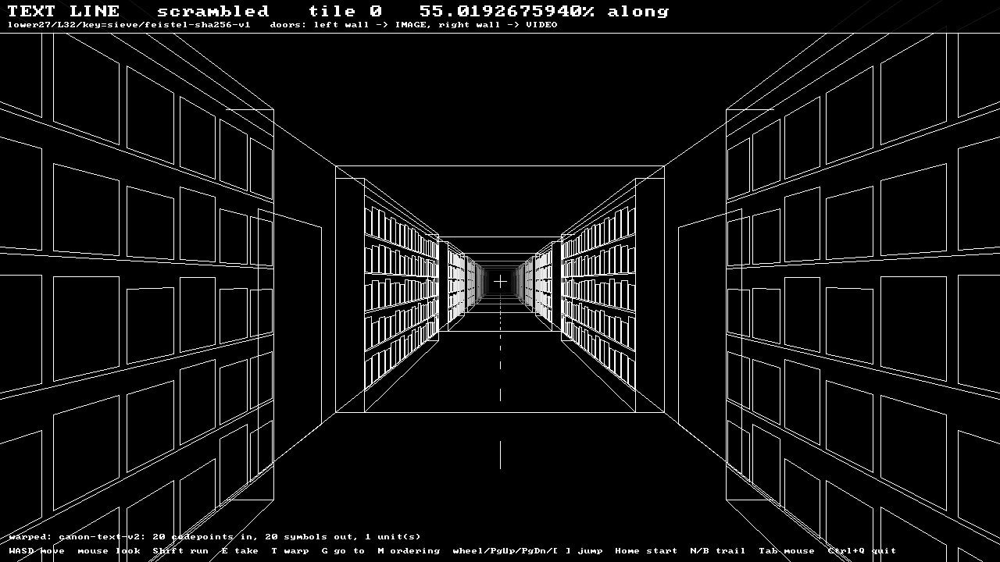
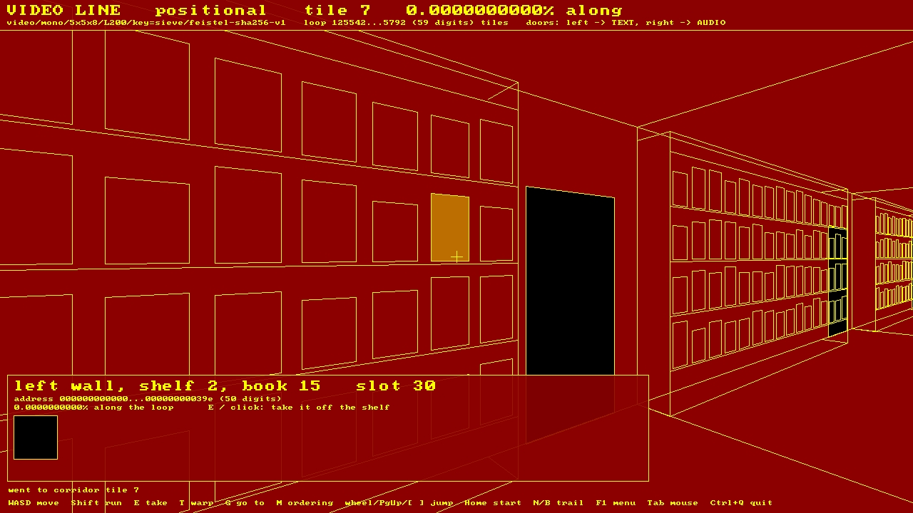
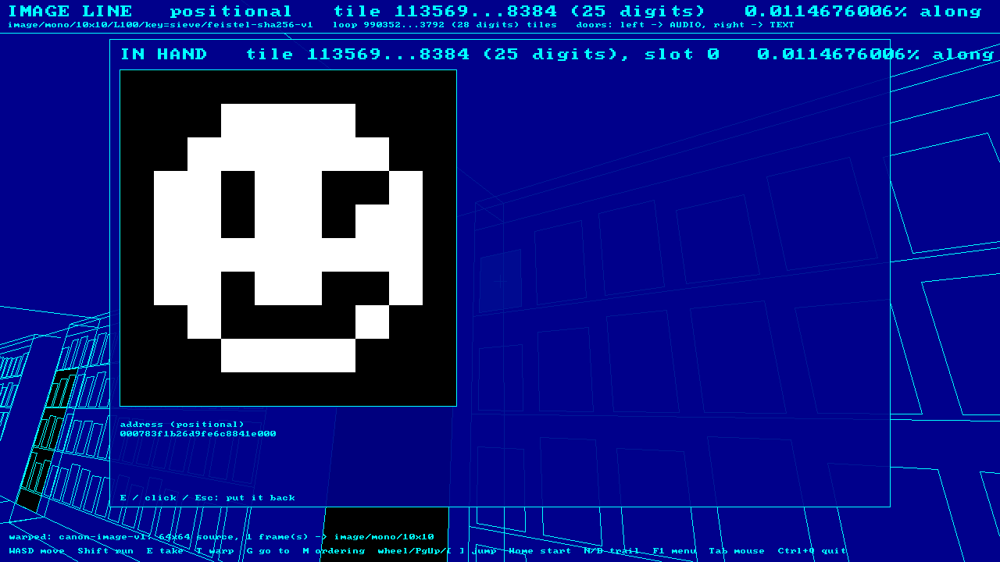
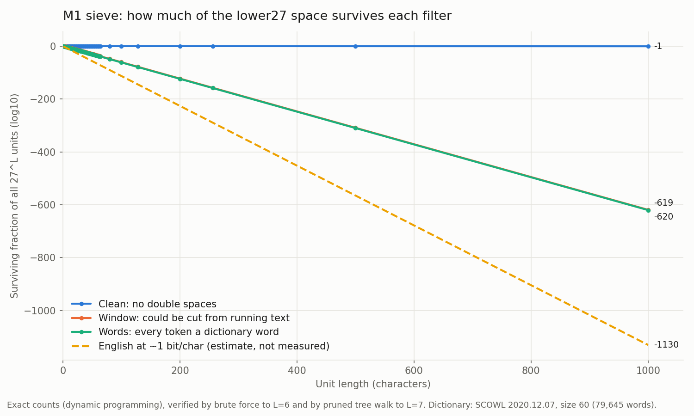

# Sieve

*The Gallery of Babel: every possible text, picture, melody and animation of a fixed size, each at exactly one address, sifted so that meaning can be found.*

Sieve grew out of the Gallery of Babel in **Potentia**. Potentia itself, the alignment thesis and the preservation of AI models, lives in the parent repository. Sieve is the search-space engine and its hallway.

Implementation of [SPECIFICATIONS.md](docs/SPECIFICATIONS.md) (v2.0). This covers **M1** (the exhaustive sieve), **M2** (raw addressing and warp), and the first version of all four lines: **text, image, audio and video**.

**Concept and architecture by Edward James Gordon.**

## Layout

| Path | Contents |
| :--- | :--- |
| `core/` | Dependency-free C++20 library: alphabets, palettes, notes, exact big integers, SHA-256, address map, canonicalisation, sieve |
| `tools/sieve_cli.cpp`, `tools/cli/` | The `sieve` command-line tool |
| `client/` | The `hallway`: a 3D wireframe walk along the four lines (SDL3) |
| `tools/plot_sieve.py` | Plots sieve results (needs matplotlib) |
| `tools/build_dictionary.py` | Rebuilds the English dictionaries from SCOWL |
| `data/dictionaries/` | The dictionary registry (`dictionaries.tsv`) and pinned English word lists (SCOWL 2020.12.07) |
| `reference/sieve_ref.py` | Independent Python oracle; generates every conformance vector file |
| `tests/` | Core tests and the conformance vectors |
| `results/` | M1 sieve output (CSV and chart) |
| `third_party/stb/` | stb_image and stb_image_write (public domain), used only by the tool to read and write image files |
| `.github/workflows/build.yml` | Builds and tests on Windows, Linux and macOS on every push |
| `docs/SPECIFICATIONS.md` | The specification |
| `docs/images/` | Hallway screenshots |

## Build

The toolchain matches ALTEngine: CMake, with a vcpkg manifest. The core and the `sieve` tool have **no dependencies**. The `hallway` needs SDL3:
- If an SDL3 install is found (vcpkg with the `client` feature, or a system install), CMake uses it.
- Otherwise the **first** configure downloads and builds SDL 3.2.30 as a static library, which takes a few minutes. Later builds reuse it.
- To build without the hallway, configure with `-DSIEVE_BUILD_CLIENT=OFF`.

**Visual Studio (Open Folder):** `CMakePresets.json` provides three configurations in the toolbar dropdown:

| Preset | Use for |
| :--- | :--- |
| **x64 Debug** | Full debugging. Slow for long `sieve` checks. |
| **x64 Release with debug info** | Optimised but debuggable: breakpoints still work, and `sieve` runs at near-release speed. Recommended for everyday work. |
| **x64 Release** | Fastest. |

**Command line:**

```sh
cmake --preset linux-release          # or x64-Release on Windows (from a VS Developer prompt)
cmake --build --preset linux-release
ctest --preset linux-release
```

Or without presets: `cmake -S . -B build`, then `cmake --build build --config Release`, then `ctest --test-dir build -C Release`.

The build is warning-free at `/W4` and `-Wall -Wextra -Wpedantic`, and it copies the bundled dictionaries next to the executable, so every command works from any folder.

**Continuous integration:** `.github/workflows/build.yml` builds and tests on Windows, Linux and macOS. It checks that every platform produces the same addresses, and that the Python oracle reproduces the committed vectors. GitHub only reads workflows from the repository root: if this folder is a subfolder of your repository (as in `Potentia/Sieve`), move `.github` up to the repository root. `PROJECT_DIR` in the file is already set to `Sieve`.

## Key terms

- **Line:** a kind of content. There are four: `text`, `image`, `audio` and `video`.
- **Unit:** one "book" on a line's shelf. Its shape is fixed: exactly `--length` characters, or a WxH picture, or N notes.
- **Space:** every possible unit of one line with one set of options.
- **Address:** a unit's position in the space, written in hex. Every unit has exactly one address, and every address in range holds exactly one unit.
- **Positional ordering:** the address *is* the content, read as a number. Units with the same beginning sit side by side.
- **Scrambled ordering:** the content passes through a fixed, reversible shuffle first, so neighbouring addresses hold unrelated units, as in Borges' library.

Getting help from the tool itself:

```sh
sieve                     # commands and a quick start
sieve help warp        # full explanation and examples for one command (or: sieve warp --help)
sieve help lines       # the four lines and all of their options
```

## Lines

Choose a line with `--line`; the default is `text`. Each line has its own options, and they must match between `warp` and `read`.

| Line | A unit is... | Options (defaults) | Input for `warp` |
| :--- | :--- | :--- | :--- |
| `text` | `--length` characters | `--length L` (required), `--alphabet lower27\|babel29\|ascii95` (lower27), `--canon v2\|v1` (v2) | text in quotes, or `--file` |
| `image` | a WxH picture | `--width` (10), `--height` (10), `--palette mono\|ega16\|rgb332\|rgb24` (mono) | `--file` PNG, JPEG, BMP, GIF, TGA |
| `audio` | a melody of N notes | `--length N` (16) | notes such as `"C4q E4q G4h Rq"`, or `--file` |
| `video` | F pictures of WxH | `--width` (5), `--height` (5), `--frames` (8), `--palette` (mono) | `--file`, usually an animated GIF |

Every line also takes `--key K` (default `sieve`), which seeds the scrambled ordering.

**Palettes:**
- `mono`: black and white
- `ega16`: the 16-colour EGA palette
- `rgb332`: 256 colours
- `rgb24`: every 24-bit colour

**Audio notation:** each note is written as letter, optional `#` or `b`, octave, then duration: `e` eighth, `q` quarter, `h` half, `w` whole. Examples: `C4q`, `F#5e`, `Bb4h`. A rest is `R` plus a duration, e.g. `Rq`.
- The range is C4 to C6; notes outside it move by whole octaves into range.
- A missing duration means a quarter note.
- Short melodies are padded with eighth rests.
- `|` bar lines and commas are ignored.

Size of each space with the default options:

| Line | Units | Address length |
| :--- | ---: | ---: |
| text, 32 characters | ~10^45.8 | 39 hex digits |
| text, 1,000 characters | ~10^1,431 | 1,189 hex digits |
| image, 10×10 mono | ~10^30.1 | 25 hex digits |
| image, 10×10 rgb24 | ~10^722.5 | 600 hex digits |
| audio, 16 notes | ~10^32.3 | 27 hex digits |
| video, 8 frames of 5×5 mono | ~10^60.2 | 50 hex digits |

## The hallway

```
hallway [options]          (hallway --help for the full list)
```

Each line is an endless corridor lined with bookcases. **Every book is one unit**, and the address increases as you walk forward:
- Each tile of corridor holds 200 consecutive units: the left wall first, then the right wall.
- On each wall the books run shelf by shelf from the top, and along each shelf in the direction you are walking.
- One tile of geometry is built once and repeated forever.



**Colours.** Each line has two colours: a solid background and the colour of every edge. Doors are solid black.

| Line | Background | Edges |
| :--- | :--- | :--- |
| text | black | white |
| image | blue | cyan |
| audio | green | amber |
| video | red | yellow |

**Doors.** The walls repeat shelf, door, shelf. A black door in the **left** wall leads to the **next** line (text → image → audio → video → text). A door in the **right** wall leads to the **previous** line. You arrive at the same fractional position along the new line, and come in through the opposite door, in the new line's colours.

Walk back through the door you came in by and you return to *exactly* where you were. Every door you pass is remembered, so a whole chain of doors can be retraced exactly.



**Books.** Look at a book and a panel shows its position on the shelf, its address, how far along the line it is, and a preview. Press **E** or click to take it off the shelf:
- **Text:** the full text.
- **Image:** the picture, in its palette colours.
- **Video:** the frames, animated.
- **Audio:** the notes; **P** plays them.



| Key | Action |
| :--- | :--- |
| W A S D / arrows | Walk and turn. **Shift** runs. |
| Mouse | Look around. **Tab** frees or captures the mouse. |
| E / left click | Take the book you are looking at off the shelf, or put it back |
| T | **Warp:** type text, notes, or a picture file path (for image and video), then Enter. You land in front of it; it is the first book on the left wall. Ctrl+V pastes. |
| G | **Go to** a hex address, or a percentage such as `50%` or `36.25%` |
| N / B | Next or previous unit of a warp that made a trail of several units |
| M | Switch between positional and scrambled ordering |
| Mouse wheel · PgUp/PgDn · [ ] | Jump 1 · 1,000 · 1,000,000 tiles along the line |
| Home | Back to the start of this walk |
| P | Play an audio book you are holding |
| Esc | Close a panel or input, or free the mouse |
| Ctrl+Q | Quit |

**Options.** The hallway takes the same line options as `sieve`, renamed per line because all four lines are open at once:

| Line | Options |
| :--- | :--- |
| text | `--length` (32), `--alphabet`, `--canon` |
| image | `--image-width`, `--image-height`, `--image-palette` |
| audio | `--notes` (16) |
| video | `--video-width`, `--video-height`, `--video-frames`, `--video-palette` |

It also takes:
- `--key`, `--mode positional|scrambled` and `--line` for the starting line.
- `--warp INPUT` or `--goto ADDRESS|P%` to set where you start.

**Screenshots and scripted walks** (used by the automatic tests too):

```sh
hallway --screenshot shot.png --size 1280x720 --pose X,Z,YAW,PITCH
hallway --line image --warp sprite.png --take --screenshot in-hand.png
hallway --pose 0,7,-90,0 --walk "-2.3,0;2.5,0" --screenshot door.png   # through a door and back
```

On a machine without a display, set `SDL_VIDEO_DRIVER=offscreen` and `SDL_RENDER_DRIVER=software`.

**What it shows so far.** This is the raw view: every unit has a book, and noise fills the shelves, as in Borges' library. The guided view, where shelf length follows probability so that meaning fills the corridor, needs the entropy-ordered addresses of M3.

## Commands

### `info`: how big is a space?

```
sieve info [--line LINE] [line options] [--key K]
```

```sh
sieve info --length 1000                              # paragraph-scale text
sieve info --line image --palette rgb24               # every 10x10 full-colour image
sieve info --line video                               # every 8-frame 5x5 animation
```

### `warp`: give some content, get its address

```
sieve warp [--line LINE] [line options] [--key K] [--mode MODE] [--short] (TEXT... | --file PATH)
```

Fits the input to the line with fixed, versioned rules (see *Canonicalisation* below) and reports every change it made. It then prints each unit's address, how far along the line it sits, and a preview. Images and video are drawn as ASCII art.

| Option | Meaning |
| :--- | :--- |
| `--mode MODE` | `positional`, `scrambled` or `both` (default). |
| `--short` | Abbreviate long addresses as `start...end (N digits)`. |
| `--file PATH` | Read the input from a file. |

```sh
sieve warp --length 32 "It was the best of times"
sieve warp --length 1000 --file chapter1.txt
sieve warp --line image --file sprite.png
sieve warp --line image --palette ega16 --width 16 --height 16 --file sprite.png
sieve warp --line audio "E4q D4q C4q D4q E4q E4q E4h"
sieve warp --line video --file walk.gif --short
```

Example output:

```
line         text
space        lower27/L32/key=sieve/feistel-sha256-v1
canon        canon-text-v2: 24 codepoints in, 24 symbols out, 1 unit(s)
  case folded           1
  padding               8 (spaces on the last unit)

unit 1/1  "it was the best of times        "
  positional  066f1b1b557137f7d30eb550279691c9d306f86
              at 36.0811572947% along the line
  scrambled   007b30165818bf0311497600aa52996f9395e27
              at 2.6985270978% along the line
```

### `read`: give an address, get the content

```
sieve read [--line LINE] [line options] [--key K] --mode MODE [--out PATH] [--scale S] ADDRESS
```

This is the reverse of `warp`. Every option that shaped the address must match; otherwise you'll read a different unit, because every address in range holds *something*.

| Option | Meaning |
| :--- | :--- |
| `--mode MODE` | **Required.** `positional` or `scrambled`. |
| `--out PATH` | Also save the unit: `.png` for images and video (frames side by side), `.mid` for audio, a text file for text. |
| `--scale S` | Enlarge each pixel to S×S in the saved PNG. Default 16. |
| `--around N` | Also show the N units on either side: what the hallway shows around this shelf. The line loops, so the last address is followed by the first. |

```sh
sieve read --length 32 --mode scrambled 007b30165818bf0311497600aa52996f9395e27   # "it was the best of times"
sieve read --line image --mode scrambled <address> --out found.png
sieve read --line audio --mode scrambled <address> --out tune.mid
sieve read --length 12 --mode positional --around 3 <address>
```

With `--around`, positional order shows that neighbours differ only at the end. Scrambled order shows that they are unrelated:

```
      -1  "hello worlcz"  0a1fe3967f0accb
>     +0  "hello world "  0a1fe3967f0accc
      +1  "hello worlda"  0a1fe3967f0accd
```

### `browse`: pull random units off the shelves

```
sieve browse [--line LINE] [line options] [--key K] [--count N] [--short]
```

```sh
sieve browse --length 32
sieve browse --line image --count 3
sieve browse --line audio
```

### `sift`: how much of the text space survives each noise filter (M1)

(`sieve sieve` still works as an alias.)

```
sieve sift [--dict ID|PATH] [--lengths SPEC] [--brute-max N] [--pruned-max N] [--threads T] [--csv PATH]
```

For each unit length, counts **exactly** how many `lower27` units pass three filters, each stricter than the last:

| Filter | A unit passes if... |
| :--- | :--- |
| `clean` | it has no double spaces and at least one letter |
| `window` | it could be a snippet cut from English text: whole words inside, a word *ending* at the left edge, a word *beginning* at the right edge |
| `words` | every token is a complete dictionary word |

| Option | Meaning |
| :--- | :--- |
| `--dict ID\|PATH` | A registered dictionary (see `dicts` below): `scowl-en-35`, `scowl-en-60` (default) or `scowl-en-80`; `35`, `60` and `80` also work. Its SHA-256 is checked before use. A value containing `/` or `\` or ending in `.txt` is read as a file path instead, unchecked. |
| `--lengths SPEC` | Numbers and ranges, e.g. `1-32,64,100,1000`. Default `1-12`. |
| `--brute-max N` | Also check up to length N by visiting every unit. Default 5. On 2 cores, N=6 takes ~30 s and N=7 ~10–15 min. |
| `--pruned-max N` | Also check up to length N by pruned tree walk. Default 6. On 2 cores, N=7 takes ~15 s and N=8 ~2 min. |
| `--threads T` | Worker threads. Default: all cores. |
| `--csv PATH` | Write results to a file instead of the screen. |

```sh
sieve sift
sieve sift --lengths 1-64,100,1000 --csv results/sieve.csv
sieve sift --dict scowl-en-35 --lengths 1-20
python3 tools/plot_sieve.py results/sieve.csv results/sieve.png "SCOWL size 60"
```

CSV columns:

| Column | Meaning |
| :--- | :--- |
| `length` | Unit length |
| `log10_units` | log10 of 27^L |
| `clean`, `window`, `words` | Exact survivor counts |
| `log10_frac_*` | log10 of the fraction of the space that survives |
| `verified_by` | Which methods agreed |
| `pruned_window_states` | Prefix-tree nodes visited by the pruned walk |
| `log10_frac_prefix_tree_explored` | The fraction of the prefix tree that represents |

### `dicts`: the dictionary registry

```
sieve dicts [--hash FILE]
```

Dictionaries are registered in `data/dictionaries/dictionaries.tsv`, one per line, with these fields: id, file, language, default, SHA-256 and description. Every command that takes `--dict ID` looks the id up there. If a file's hash no longer matches, the command refuses to use it, so a result recorded with a dictionary id can always be reproduced with exactly the same words. `sieve dicts` lists every entry, marks the default and checks each file.

To add a dictionary:

1. Put the word list (one word per line) in `data/dictionaries/`.
2. Run `sieve dicts --hash data/dictionaries/FILE`. It prints the word count, the SHA-256 and a ready-made registry line.
3. Paste that line into `dictionaries.tsv` with your own id and description. To make it the default, set its `default` column to `yes` and the old default's to `no`.
4. Rebuild, so the copy next to the executable is updated.

Never edit an existing entry's file or hash. A changed list gets a new id, so older results stay reproducible.

```
registry  data/dictionaries/dictionaries.tsv

  scowl-en-35   en  40201 words, hash ok
    SCOWL 2020.12.07 size 35: common English words, British and American spellings
* scowl-en-60   en  79645 words, hash ok
    SCOWL 2020.12.07 size 60: SCOWL's recommended spell-check size
  scowl-en-80   en  251174 words, hash ok
    SCOWL 2020.12.07 size 80: large, includes rare words
```

### `version`: what produced a result

```
sieve version        (or: sieve --version)
```

Prints the tool version, the scramble construction, every canonicalisation rule version, the alphabets and palettes, and the default dictionary with its SHA-256. Record this alongside any result you publish, so it can be reproduced exactly.

## Canonicalisation

These rules are versioned, because they decide which unit a pasted input lands on. Changing a rule means a new version, never a silent edit.

**`canon-text-v2`** (the default) applies these steps in order:
1. Whitespace becomes a space.
2. Typographic punctuation becomes ASCII: curly quotes, dashes, ellipsis.
3. Accented Latin letters fold to plain ones: `é`→`e`, `ß`→`ss`, `æ`→`ae`, `ł`→`l`.
4. Capitals are lower-cased if the alphabet has no capitals.
5. Any character still not in the alphabet is handled as follows: an apostrophe is **removed** (`didn't`→`didnt`), and anything else **becomes a space** (`well-known`→`well known`, `author/editor`→`author editor`).
6. Runs of spaces collapse to one, and the text is trimmed.
7. The text is split into units and the last unit is padded.

**`canon-text-v1`** (select with `--canon v1`) removes every out-of-alphabet character, which glues words together (`wellknown`). It is kept so that earlier results stay reproducible.

**`canon-image-v1`**:
1. Composite onto black.
2. Stretch to W×H by exact integer area-averaging, rounded half up.
3. Set each pixel to the nearest palette colour by squared RGB distance; ties go to the lowest index.

A video takes up to `--frames` frames, adding black frames if the source is short.

**`canon-notes-v1`**:
1. Flats are written as sharps.
2. Notes move by whole octaves into C4–C6.
3. A missing duration means a quarter note.
4. The last unit is padded with eighth rests.

## Conformance

The Python oracle shares no code with the C++ core. It uses native big integers, `hashlib`, `unicodedata`, and exact fractions for image resampling. The core must reproduce every vector bit for bit:

| File | Checks |
| :--- | :--- |
| `vectors_v1.tsv` | Text addresses, both orderings, three alphabets |
| `vectors_digits_v1.tsv` | Addresses over 2, 16, 104, 256 and 16,777,216 symbols (the image, audio and video lines) |
| `vectors_canon.tsv` | Text canonicalisation v1 and v2, including every accented letter in the fold table |
| `vectors_image_v1.tsv` | Image resampling and palette quantisation, all four palettes |

`sieve_tests` runs every check twice: once on the portable SHA-256 and once on the CPU's SHA instructions (SHA-NI, on x86-64 CPUs that have them), so both paths are held to the same vectors. The fast path is picked automatically at start-up; `sieve version` shows which one this machine uses.

### Performance

Measured on a 2-core x86-64 container with SHA-NI (Release build):

| Task | Before | After |
| :--- | ---: | ---: |
| `sieve dicts` (hash and count three dictionaries) | 1.21 s | 0.08 s |
| `warp` a 1.9 MB book at L = 1000, scrambled | 1.99 s | 0.32 s |
| `warp` the same book at L = 32, scrambled | 1.38 s | 0.35 s |
| `read --around 100` at L = 1000, scrambled | 0.30 s | 0.03 s |
| Load and index `scowl-en-80` | 1.10 s | 0.69 s |

Where it came from: hardware SHA-256; hashing the round function's fixed prefix once per round instead of once per output block; computing each address once and deriving its hex and position from it; stepping neighbours on the address digits so each shelf costs one unscramble instead of three; converting big numbers several digits at a time; and deduplicating dictionary suffixes without a hash set. The hallway caches each book's address, hex and position, and skips tiles that are out of view. None of this changes a single address: every conformance vector is identical.

After an intentional, versioned change, regenerate them:

```sh
cd reference
python3 sieve_ref.py vectors       > ../tests/vectors_v1.tsv
python3 sieve_ref.py digit-vectors > ../tests/vectors_digits_v1.tsv
python3 sieve_ref.py canon-vectors > ../tests/vectors_canon.tsv
python3 sieve_ref.py image-vectors > ../tests/vectors_image_v1.tsv
```

## M1 results

These use the default dictionary (SCOWL size 60, 79,645 words). Survivor counts are exact and agree with brute force up to L = 6 and with the pruned walk up to L = 7.



| Length | Units | Survive `words` | Surviving fraction |
| ---: | ---: | ---: | ---: |
| 8 | 10^11.5 | 6.9 × 10^6 | 10^-4.6 |
| 32 | 10^45.8 | 10^26.3 | 10^-19.5 |
| 100 | 10^143.1 | 10^81.4 | 10^-61.7 |
| 1,000 | 10^1,431.4 | 10^811.1 | 10^-620.3 |

Dictionary size changes the numbers but not the picture. At L = 1,000:

| Dictionary | Surviving fraction (`words`) | Bits per character left |
| :--- | ---: | ---: |
| SCOWL 35 (40,201 words) | 10^-659.8 | 2.56 |
| SCOWL 60 (79,645 words) | 10^-620.3 | 2.69 |
| SCOWL 80 (251,174 words) | 10^-556.9 | 2.90 |

What the results show:

- **Dictionary filtering removes about 0.62 orders of magnitude per character**, about 620 orders at paragraph length. The decline is a straight line.
- **What survives is word salad, not English.** It carries about 2.7 bits per character, where English carries about 1. Closing that gap at paragraph scale is roughly another 510 orders of magnitude, which is the job of the language-model stage (M3).
- **Pruning blocks off noise without visiting it.** At L = 7 the pruned walk explores 10^-2.8 (0.17%) of the prefix tree to find every surviving unit exactly, and that fraction falls as L grows.

## Next

- **M3:** an integer arithmetic coder with a small pinned character model (entropy-ordered addresses), measured in bits per character on real text.
- **M4 (rest):** zoom depth in the hallway, and the guided view once M3 exists.
- **M1 (images):** noise filters for tiny images, counted over every 5×5 and 6×6 1-bit picture.
