# Sieve

*The Gallery of Babel: every possible text, picture, melody, animation, model and file, each at exactly one address, sifted so that meaning can be found.*

Sieve grew out of the Gallery of Babel in **Potentia**. Potentia itself, the alignment thesis and the preservation of AI models, lives in the parent repository. Sieve is the search-space engine and its hallway.

Implementation of [SPECIFICATIONS.md](docs/SPECIFICATIONS.md) (v2.0). This covers **M1** (the exhaustive sieve), **M2** (raw addressing and warp), **M3** for text (entropy-ordered "guided" addresses from a pinned model), and the first version of all eleven lines: **pages, image, audio and video**, **books**, **tracks** and **movies** composed from them, **models** (3D meshes), **worlds** composed of models, **AI** (language models) and **binary** (every file), with maps of verified anchors across them.

**Concept and architecture by Edward James Gordon.**

Special thanks to Claude Opus 5.5 for helping to build out the Sieve system based on my specifications.

## Layout

| Path | Contents |
| :--- | :--- |
| `core/` | Dependency-free C++20 library: alphabets, palettes, notes, exact big integers, SHA-256, address map, canonicalisation, sieve, guided coder, the filtration stack (`core/src/filters/`) |
| `tools/sieve_cli.cpp`, `tools/cli/` | The `sieve` command-line tool |
| `client/` | The `hallway`: a 3D wireframe walk along the lines: image, pages, books, audio, tracks, video, movies, models and binary (SDL3) |
| `tools/plot_sieve.py` | Plots sieve results (needs matplotlib) |
| `tools/build_dictionary.py` | Rebuilds the English dictionaries from SCOWL |
| `data/filters/` | The reference filter plugins (`.sfilter`), and the tagged lists the grammar plugins read (the Moby part-of-speech list, its inflections and names; `moby-pos-v1.md`) |
| `tools/moby_pos.py` | Rebuilds the Moby tagged lists from the Moby Part-of-Speech II source and SCOWL |
| `tools/build_text_plugins.py` | Rebuilds the generated text plugins (letter pairs and triples, word cost, function words, sentence shape) from the pinned SCOWL lists; `--check` in CI |
| `tools/build_anchor_plugins.py` | Makes plugins for the units near known pages, or holding known fragments |
| `data/dictionaries/` | The dictionary registry (`dictionaries.tsv`) and pinned English word lists (SCOWL 2020.12.07) |
| `data/models/` | The model registry (`models.tsv`), the pinned text model, and the training corpus manifest (`corpus/gutenberg-nltk.tsv`) |
| `tools/survey/` | The filter survey: how much each filter and stack keeps of each line, over a grid of settings, on a given machine (`survey.py`, `grid.tsv`, `profiles.tsv`) |
| `tools/fetch_corpus.py` | Downloads the training corpus into `corpus/` (not stored in the repository) and checks every file's hash |
| `reference/sieve_ref.py` | Independent Python oracle; generates every conformance vector file |
| `tests/` | Core tests and the conformance vectors |
| `results/` | M1 sieve output (CSV and chart) |
| `third_party/stb/` | stb_image and stb_image_write (public domain or MIT), used to read and write image files |
| `tools/cli/media_decode.*` | Every other picture and video format, read by an ffmpeg program if there is one (not linked or shipped) |
| `third_party_licenses/` | The licence of every third-party component (SDL3 and the parts of it with their own notices, stb, SCOWL, Moby, font8x8), with an inventory in its README; copied next to the executables when you build |
| `data/lang/`, `data/fonts/`, `data/meshes/` | Menu languages, bitmap fonts, and the Real Graphics models (templates in `data/meshes/templates/`) |
| `.github/workflows/build.yml` | Builds and tests on Windows, Linux and macOS on every push |
| `docs/SPECIFICATIONS.md` | The specification |
| `core/src/biguint.cpp` | The exact big integer every address rests on: limbs of 2^64, pinned against Python's own integers |
| `docs/HANDOFF.md` | The briefing for picking the project up cold: the standing rules, the build, and where the work stopped |
| `docs/REVIEW.md` | The last code review: what it fixed, and what it found and left |
| `docs/IDEAS.md` | What is not built yet: defects, filters, open questions, and what to be careful of |
| `docs/images/` | Hallway screenshots |

## Build

The toolchain matches ALTEngine: CMake, with a vcpkg manifest. The core and the `sieve` tool have **no dependencies**. The `hallway` needs SDL3:
- If an SDL3 install is found (vcpkg with the `client` feature, or a system install), CMake uses it.
- Otherwise the **first** configure downloads and builds SDL 3.2.30 as a static library, which takes a few minutes. Later builds reuse it.
- To build without the hallway, configure with `-DSIEVE_BUILD_CLIENT=OFF`.

**Visual Studio (Open Folder):** `CMakePresets.json` provides three configurations in the toolbar dropdown:

| Preset | Use for |
| :--- | :--- |
| **x64 Debug** | Full debugging. Slow for long `sieve` checks. |
| **x64 Release with debug info** | Optimised but debuggable: breakpoints still work, and `sieve` runs at near-release speed. Recommended for everyday work. |
| **x64 Release** | Fastest. |

**Command line:**

```sh
cmake --preset linux-release          # or x64-Release on Windows (from a VS Developer prompt)
cmake --build --preset linux-release
ctest --preset linux-release
```

Or without presets: `cmake -S . -B build`, then `cmake --build build --config Release`, then `ctest --test-dir build -C Release`.

The build is warning-free at `/W4` and `-Wall -Wextra -Wpedantic`, and it copies the bundled dictionaries next to the executable, so every command works from any folder.

**An installed copy** (what a release installs) has one program at the top, so nobody starts the wrong one first:

```
Sieve\
  hallway.exe                 the program: start this
  dictionaries\ models\ lang\ fonts\ meshes\ maps\
  third_party_licenses\  potentia-license.txt
  tools\
    sieve.exe                 the command-line tool (sieve help)
    sieve-install.exe         the installer, which the File Locator copies to make installer programs
    README.txt                what these two are
```

`sieve` in `tools\` finds the dictionaries and models in the folder above; the hallway finds `sieve-install` in `tools\`. A build folder keeps all three programs together, and they work either way.

**Continuous integration:** `.github/workflows/build.yml` builds and tests on Windows, Linux and macOS. It checks that every platform produces the same addresses, and that the Python oracle reproduces the committed vectors. GitHub only reads workflows from the repository root: if this folder is a subfolder of your repository (as in `Potentia/Sieve`), move `.github` up to the repository root. `PROJECT_DIR` in the file is already set to `Sieve`.

## Key terms

- **Line:** a kind of content. There are four: `text`, `image`, `audio` and `video`.
- **Unit:** one "book" on a line's shelf. Its shape is fixed: exactly `--length` characters, or a WxH picture, or N notes.
- **Space:** every possible unit of one line with one set of options.
- **Address:** a unit's position in the space, written in hex. Every unit has exactly one address, and every address in range holds exactly one unit.
- **Positional ordering:** the address *is* the content, read as a number. Units with the same beginning sit side by side.
- **Scrambled ordering:** the content passes through a fixed, reversible shuffle first, so neighbouring addresses hold unrelated units, as in Borges' library.
- **Guided ordering** (text): each unit gets a stretch of the line as long as a pinned model thinks it likely. Meaningful text gets short addresses (about 2 bits per character instead of 4.75) and noise gets long ones. See *Guided addresses* below.

Getting help from the tool itself:

```sh
sieve                     # commands and a quick start
sieve help warp        # full explanation and examples for one command (or: sieve warp --help)
sieve help lines       # the four lines and all of their options
```

## Lines

Choose a line with `--line`; the default is `text`. Each line has its own options, and they must match between `warp` and `read`.

| Line | A unit is... | Options (defaults) | Input for `warp` |
| :--- | :--- | :--- | :--- |
| `text` | `--length` characters | `--length L` (required), `--alphabet SPEC` (lower27; see `sieve alphabets`), `--canon v2\|v1` (v2) | text in quotes, or `--file` |
| `image` | a WxH picture | `--width` (10), `--height` (10), `--palette mono\|ega16\|rgb332\|rgb24` (mono) | `--file` PNG, JPEG, BMP, GIF, TGA |
| `audio` | a melody of N notes (notes104, notes2, or open-ended notes3), or with `--note-set pcm` sound itself | `--length N` (16); pcm: `--rate` (8000) `--bits` (8) `--channels` (1), `--length` samples per channel | notes such as `"C4q E4q G4h Rq"`, or `--file`; pcm: `--file` with a WAV, or any sound ffmpeg reads |
| `video` | F pictures of WxH | `--width` (5), `--height` (5), `--frames` (8), `--palette` (mono) | `--file`: an animated GIF, or any video ffmpeg reads |
| `tracks`, `movies` | a cover, a title and N units of audio or video (`composition-v1`) | the units' options as above; `--track-units` / `--movie-units` N (4), `--title-length` (32; 0 for none), `--image-width` (10) `--image-height` (10) `--image-palette` (mono) for the cover | as audio or video, as long as the N units joined |

Every line also takes `--key K` (default `sieve`), which seeds the scrambled ordering.

Tracks and movies take `info`, `warp`, `read` and `filters`, with the hallway's own option names for the cover and title, so the same options give the same addresses in both. `warp` gives what it reads a blank cover and title, as the hallway's **T** does; `read` prints the title, the cover and the units joined, `--out` saves the units joined and `--cover-out` the cover. They have no guided ordering.

**Palettes:**
- `mono`: black and white
- `ega16`: the 16-colour EGA palette
- `rgb332`: 256 colours
- `rgb24`: every 24-bit colour

**Audio notation:** each note is written as letter, optional `#` or `b`, octave, then duration: `e` eighth, `q` quarter, `h` half, `w` whole. Examples: `C4q`, `F#5e`, `Bb4h`. A rest is `R` plus a duration, e.g. `Rq`.
- The range is C4 to C6; notes outside it move by whole octaves into range.
- A missing duration means a quarter note.
- Short melodies are padded with eighth rests.
- `|` bar lines and commas are ignored.

Size of each space with the default options:

| Line | Units | Address length |
| :--- | ---: | ---: |
| text, 32 characters | ~10^45.8 | 39 hex digits |
| text, 1,000 characters | ~10^1,431 | 1,189 hex digits |
| image, 10×10 mono | ~10^30.1 | 25 hex digits |
| image, 10×10 rgb24 | ~10^722.5 | 600 hex digits |
| audio, 16 notes | ~10^32.3 | 27 hex digits |
| video, 8 frames of 5×5 mono | ~10^60.2 | 50 hex digits |

## The hallway

```
hallway [options]          (hallway --help for the full list)
```

All five lines (the four unit lines and books) share **one endless corridor** lined with bookcases. **Every book is one unit**, and the address increases as you walk forward:
- Each tile of corridor holds **128 book slots** (4 shelves of 16 on each wall): the left wall first, then the right wall.
- 128 is a power of two, and the code refuses to build if it isn't (`sieve/corridor.hpp`).
- On each wall the books run shelf by shelf from the top, and along each shelf in the direction you are walking.
- One tile of geometry is built once and repeated forever.

**Loops and the start line.** Each line **repeats** along the corridor. One copy of a line of N units spans ⌈N / 128⌉ tiles, and slot *i* of a copy holds the unit whose address is *i*.
- **Padding:** if N isn't a multiple of 128, the last tile of each copy ends in bare shelf, so every copy starts on a fresh tile.
- **Power-of-two sizes:** a line whose size is a power of two (at least 128) fills its tiles exactly. When every line's size is a power of two, the loops nest.
- **Checking the fit:** `sieve info` tells you how a line fits.
- **The start line:** where each copy begins, a **checkered start line** crosses the floor.
- **The double flag:** the start of the line you are on, where every line starts together (a door keeps your angle, and 0 is 0 on every line): two strips on the floor, a metre apart. **Home** takes you there.

**Titles and covers.** Every item on the pages, image, audio, video and models lines has a title, and audio and video items have a cover picture as well, as books do. The title length is a GLOBAL setting in the setup menu (`--title-length`, default 32):
- A titled unit's address covers its cover, its title and its content, so a titled line is larger than the bare one. Neighbours in positional order share a title and differ in their content.
- **Title length 0** means no titles: the line is the bare line again. The `sieve` tool's lines are bare, so use `--title-length 0` when comparing the hallway with the tool.
- The guided ordering and compact mode address the content alone. **Full** mode keeps the titles and covers (below).
- **Letters on items** (GLOBAL, `--item-letters`, default 8 px): the size letters on item displays are drawn at. A line whose items carry text (pages, books, titles) has its displays drawn as wide as that takes, as far as the display cache can hold every picture around you at that width, so a long page reads as a page; letters that would still come out smaller are drawn as dashes. A blank title reads **[Null Title]**.
- **Close-up display size** (GLOBAL, `--close-up`: off, **screen** — the default, your screen's width rounded up to a power of two — or a power of two from 256 to the renderer's widest texture): the items nearest you, whose displays cover more of the screen than they have pixels, are drawn again at up to this width, and swap in when ready. As many are kept as the graphics memory left over holds.

**Books.** Beyond pages, a door leads to **BOOKS**, in grey with black edges. Each book is a cover (a picture of the image line), a title (a page of the pages line) and a number of pages, set in the menu under BOOKS as "pages per book". So the books line holds every possible book of that shape:
- **Positional order:** neighbouring books differ only in their last page.
- **Scrambled order:** a keyed shuffle of the whole line, so neighbours are unrelated books.
- **Reading:** take a book off the shelf to open it: the cover beside the title, then the pages. **N** and **B** turn the pages.
- **Opening a record:** **T** (or `--warp`) opens a book record made with `sieve bind`, when its shape matches. The page length must equal PAGES length, the cover must match the IMAGE line, and there must be no more pages than pages per book. Otherwise the message says what to set.
- **Filters:** the magnifying glass beside BOOKS in the menu. A book has three stacks: the **cover** (image filters), the **title** (judged as one page; `title-v1` asks for whole words followed by blank space) and the **pages**, judged as **one continuous text**, so a word cut in two by a page break is judged whole. With `title-v1` on the title and `words-v2` or `window-v2` on the pages, compact mode shelves only books of real words, in every ordering, and the example record opens on its shelf. `sieve check --book FILE` shows how a record fares.

```sh
hallway --line books --length 400 --book-pages 3 --warp tests/example_book_v1.book   # opens the example book
```

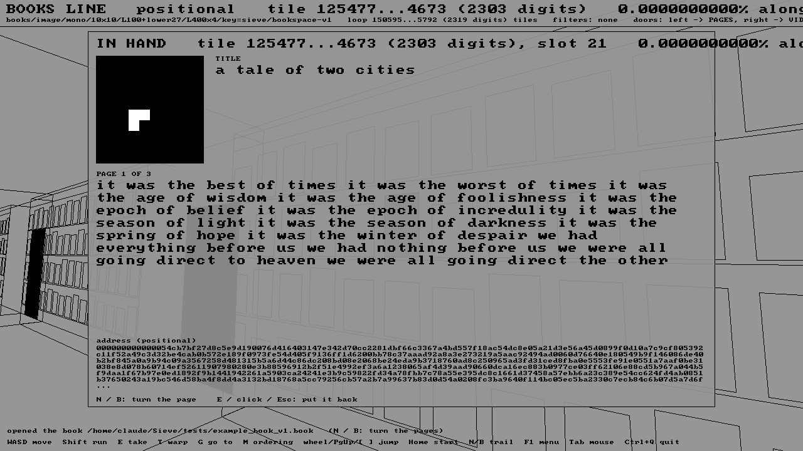

**Tracks and movies.** Beyond audio, a door leads to **TRACKS**, audio's green with black edges; beyond video, **MOVIES**, video's red with black edges. Black edges mark a line made of another's units, as books' are. A track is a cover (a picture of the image line), a title (as every titled line has) and a number of units of audio, set in the menu under TRACKS as "units per track"; a movie is the same with units of video ("units per movie"; 4 each by default, `--track-units` and `--movie-units`). Their addresses are `composition-v1` (SPECIFICATIONS §11):
- **Positional order:** neighbours differ only in their last unit.
- **Scrambled order:** a keyed shuffle of the whole line.
- **In hand** a track or movie is one long unit of its line, its units joined (voice by voice, so a track of two-voice units is still two voices): **P** plays a track, a movie shows all its frames, and **F** saves either as a file, as a unit of audio or video saves.
- **Warping in** (**T**) takes what that line takes, as long as the whole track or movie, and splits it into its units, with a blank cover and title.
- **Records:** **F** can save a track or movie whole as a record (`.track`, `.movie`: a cover, a title and its units, as a book record holds a book), and **J** on a record standing on the binary line opens it onto its shelf. `sieve bind --line tracks --file tune.mid --title "..." --out tune.track` makes one from a melody, `sieve read --line tracks ... ADDRESS --record tune.track` from an address, and `sieve unbind tune.track --units tune.mid` gives its units back as one file. A record whose audio is not `notes104` names its note set (`sieve-book-v2`).
- **Filters:** the magnifying glass beside TRACKS or MOVIES. Each has four stacks: the **cover** (image filters), the **title**, the **units**, each unit judged on its own by its line's filters, and **joined**, the units joined into one and judged as one, so that a melody running on from one unit into the next, or a picture moving on from frame to frame, is judged across the seam. The survivors are counted exactly (the units' survivors to the power of their number, or the joined unit's survivors) and compact works in every ordering. With both the units' and the joined filters ticked, the items are judged but not counted, so compact shows them as hide does.

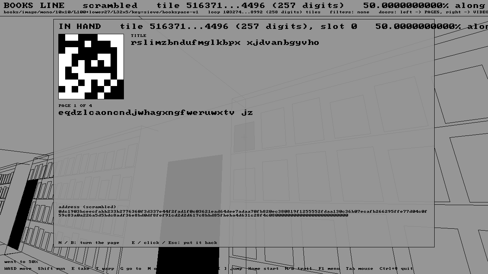

The lines are astronomically long, so to see a whole loop, try a 2-character text line: `hallway --length 2` gives 729 units, which is 6 tiles with 39 empty slots.

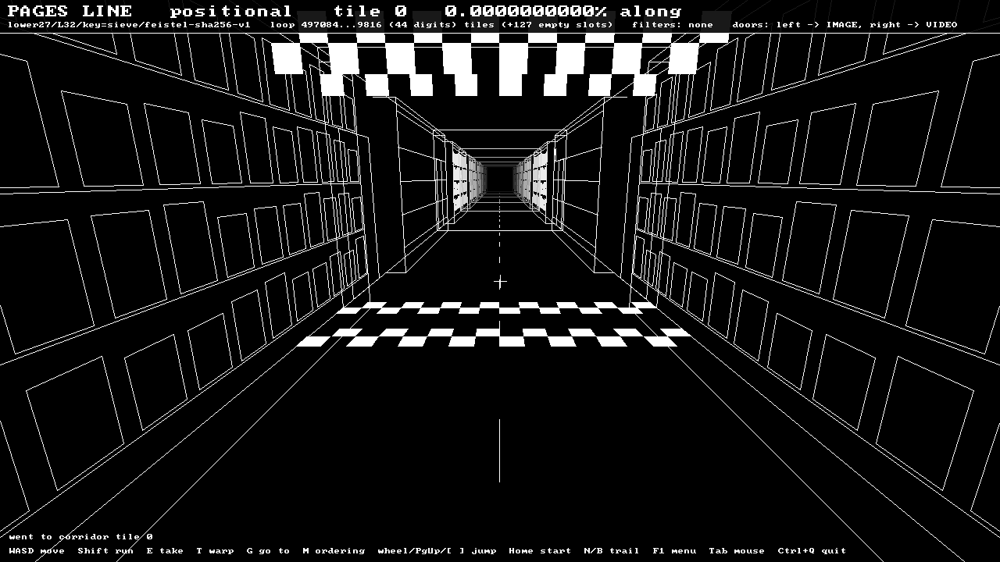

**The main menu.** The hallway opens on the main menu, **Potentia : Sieve : Gallery of Babel Dimensions**, with five choices: **Start Sieve**, **Settings**, **File Locator**, **Filter Designer** and **Exit Sieve**. Use the arrow keys and Enter, or the mouse. Esc goes back one screen. The **File Locator** is the pause menu's (below), weighing files under the lines the setup menu's settings make; with no hallway to walk in, it has no "Go to it", and **Use the tailored filters** saves them for the next hallway built. Settings has three pages:
- **Graphics:** the resolution, as a drop-down list of your display's modes, plus fullscreen. The first time Sieve starts, it picks the largest size with your desktop's shape that leaves room around the window. **VSync** (on by default) waits for the display before showing each frame, so there is no tearing and the frame rate stops at the display's refresh rate; turn it off to see how fast frames can really be drawn. **FPS Counter** shows frames per second in the top right corner of the hallway: the average over the last half second, its slowest frame and, with Real Graphics, the triangles drawn. `hallway --bench N` times N frames and prints the frame rate. There are also two toggles for drawing experiments, **Geometry Edge Glow** and **Real Graphics**. Turning one on turns the other off; both can be off, and both start off, so Sieve stays light. **Geometry Edge Glow** draws a soft band in each edge's colour under every edge of the wireframe, in two layers that fade out to either side. It is thinner and fainter in the distance, brightens light edges on the dark lines, and darkens the black edges on the grey books line (`hallway --edge-glow` for a screenshot). **Real Graphics** draws the corridor with models instead of wireframe: the hallway, the bookcases, the books and the start marker, each chosen per line. For each part it loads `data/meshes/<model>-<line>.obj` (`meshes/` next to the executable once built), such as `book-audio.obj`. If that file is missing it uses `templates/<model>.obj`, and if the template is missing too, that part stays wireframe. The console says which files each line uses. The templates' README gives their measurements and the file names for each line. Only flat colours are read from the `.mtl` (`Kd`); textures are not supported yet. Sieve draws the models itself with a depth buffer, split across the CPU's cores, so every pixel shows its nearest surface: books stay on their shelves, and the shelves never cut through the books. The finished image is shown as one texture, with the wireframe of any missing part and the on-screen text drawn over it. From two tiles away, only the books' spines and tops are drawn. About 10,000 triangles a frame come out of the templates. Models are reloaded each time you walk in from the menu, so an edited file shows on the next visit (`hallway --real-graphics` for a screenshot). On the audio and video lines every book is the same size, because records and tapes come in one size; pages, pictures and books vary in height as before. **Door Portals** fills each doorway with procedural data noise — a joke that means it, since a doorway looks out on the 99.99% of the state space no filter kept. The noise is an integer hash of the noise cell (two screen pixels square) and the frame number, so it streams downwards and reshuffles without a random number generator or a single trigonometric call; it takes the colour of the line the door leads to (white for PAGES, cyan for IMAGE, amber for AUDIO, yellow for VIDEO, grey for BOOKS) and fades to black at the frame, so it reads as a field held inside the door rather than a hole in the wall. With Real Graphics the portals are tested against the models' depth buffer, so a door down the corridor stays behind the bookcases in front of it. A doorway hidden altogether is never uploaded or drawn. The noise itself is too cheap to measure over the wireframe; a doorway filling a quarter of the screen costs about a millisecond with the software renderer, and far less with a real one. Turning Real Graphics on turns it on too, but nothing turns it off: it stands on its own, with the wireframe or with the models (`hallway --door-portals` for a screenshot).
- **Controls:** mouse sensitivity, invert mouse Y, and the list of keys.
- **Language:** a drop-down of the language files in `lang/` (`data/lang` in the source). Each file is plain UTF-8 text with `key = value` lines, for example `item.start = Start Sieve`. Every piece of on-screen text reads from it: the main menu, the setup menu and its map, the filter lists, and the hallway's panels and messages. A filter's description can be translated with `filter.<name> = ...` and a parameter's with `filter.<name>.<parameter> = ...`; left out, the English built into Sieve is shown. To add a language, copy `en.txt` to a new code (`fr.txt`) and translate the right-hand sides. Any key you leave out shows in English, so a half-done translation still works.
- **Fonts:** the first line of a language file names its font, `font = sieve8x8`. A font is a file in `fonts/` (`data/fonts`) in GNU Unifont's `.hex` format. The built-in `sieve8x8` is an 8x8 font made from font8x8 (public domain) by `tools/build_font.py`. It covers ASCII, Latin-1 (French, German, Spanish, Italian, Portuguese, Dutch, the Nordic languages), Greek, box drawing and hiragana. A character the font lacks is drawn as `?`. Scripts beyond that, such as Cyrillic, Polish or Czech letters, or Chinese, need a font that has them. The screens are laid out for 8-pixel-tall text, so a 16-pixel font like Unifont is drawn at half size for now.

Every choice is applied at once and saved to `sieve-hallway.ini` next to the executable (`--settings PATH` for another file). **Start Sieve** opens the setup menu. It shows the settings on the left, beside the map of the lines, with the budget's four bars at the top right, so turning any setting shows at once what it does to the bars. The settings, GLOBAL down to ENTER THE HALLWAY, are a panel that slides in from the left: **Tab** (or the SETTINGS tab at the left edge) slides it out and the map takes the whole width, and Tab again, or moving through the settings, brings it back. While the dimensions are being calculated it slides out by itself, so the bars can be watched changing, and comes back when they are done (unless you closed it). When the settings are taller than the room for them, they scroll: the mouse wheel over the panel moves them, a thin bar at its right edge shows where you are, and moving to a setting brings it into view; FIND MY LIMITS, RESET EVERY SHAPE and ENTER THE HALLWAY stay at the foot. A window narrower than the map's columns (or shorter than the GLOBAL settings) shows the menu scaled down.

**The models line.** A line of the hallway, and `sieve mesh` on the command line: every possible mesh of one shape. A model is V vertices and F triangles, each coordinate one of C steps across [-1, 1], so the line holds C^(3V) × V^(3F) models — 2^204 with the defaults (8 vertices, 12 triangles, a grid of 16), and a cube is one of them. The grid is cell-centred, so a coordinate is exactly `(2d + 1 - C) / C`: symmetric about the origin, and a terminating decimal with `log2(C)` places. That makes each model's canonical `.obj` text exact and of a fixed width — and it has no two spaces in a row anywhere, because `canon-text-v2` collapses runs of spaces and the form is built to survive the text line. So the same model is also one unit of an `ascii96` page of that length: warp the `.obj` onto the pages line, read it back byte for byte, warp that back onto the models line, and the address is the same. One object, an address on two lines. With the default shape the `.obj` is 304 characters, so the cube fits on a single page. `sieve mesh --warp cube.obj` gives a mesh's address, `--read ADDR --out model.obj` gives the model at one, and `--browse N` pulls some off the shelf.

In the hallway the models line is green wireframe on clay. **Pre-rendered display size** in the setup menu's GLOBAL section sets how wide the picture on every item is drawn, from 16 pixels to the renderer's widest texture (64 by default): sharper pictures and more readable pages, and four times the memory each time it doubles, so it trades directly against how many the **display cache** holds. Changing it throws the cache away rather than stretching what is in it.

**Worlds.** The WORLDS line (after MODELS) holds models placed in a world: a cover, a title and N models of the models line (**models per world**, 4), each in a cell of a grid of G cells along each axis (**grid**, 8) and turned by one of the 24 rotations that take a cube onto itself, all one number (`worldspace-v1`, SPECIFICATIONS §12.0). A cell is a model wide, so every coordinate stays exact and a world's `.obj` reads the same everywhere. On the shelf a world is a crate with the whole world drawn on its front under its title; in hand it turns like a model (A, D, the mouse, R to set it upright), with its `.obj` beside it. F saves the `.obj`, and J finds that file on the binary line. Its filters judge the cover, the title and each model (by the models line's own filters); a model's place has none. Worlds have no textures yet: they wait for UVs (IDEAS §14). There is nothing to warp in from yet (T): go to an address (G), or find one with `sieve world --compose "MODEL:x.y.z.turn|..."`, which prints its addresses, and `sieve world --read ADDR --out world.obj` gives its `.obj`.

**AI.** The AI line (after WORLDS) holds every language model of one shape (`aispace-v1`, SPECIFICATIONS §12.0d): a Llama model of a few **layers** (1), a **width** (16) and its attention **heads** (2), whose vocabulary is the 256 bytes, each weight one of 2^B values (**bits a weight**, 4). Its weights, written out as digits, are its address, so walking the line downloads nothing: at the defaults a model is 8,192 weights and its address 8,192 hex digits, and there are 2^32768 of them. On the shelf a model is a crate showing what it says when started from a newline; almost every one babbles. Take one in hand and press Enter to say something to it (`SAY > `): it is run by Sieve's own engine (the one `sieve chat` uses), continues your line byte by byte until it writes a newline of its own (at most 80 bytes), and remembers the conversation until its 512 positions are full, when it starts again. The setup menu's AI rows set the shape (the width steps so that the heads still divide it), and the map draws the line's bar broken when it is far longer than the others. F saves the model as a `.safetensors` file, named by the start of its address, and J finds that file on the binary line; the viewer's WEIGHTS tab lists the tensors and the digits. The line has no filters yet, and a model cannot be warped in from the hallway (T): `sieve ai --warp FOLDER` gives the address of a model of the line's shape, and `sieve ai --out` writes a model's files, which `sieve chat --raw` talks to.

 Every slot holds the same **crate**, because a mesh cannot be read at a hundred and twenty-eight to a tile — so each crate in your room and the rooms either side has its model rendered to a small flat image and printed on its front, nearest you first, for a few milliseconds a frame; rooms further off wear the face of the same slot in your room until you reach them. The pictures are kept in a cache whose size is **display cache** in the setup menu's GLOBAL section (8 MB steps, as far as **Graphics Memory** in Settings > Graphics allows; the row says how much the rooms with pictures need). FIND MY LIMITS sizes it for those rooms: yours and **Picture Distance** either side (Settings > Graphics, 1 at first, so three rooms). **View Distance**, beside it, is how many rooms are drawn and kept either side of you (7 at first). If it is set smaller, the hallway says so and gives the faces to the crates nearest you. Walking keeps the ones still nearby and drops the rest. Take a crate off the shelf (**E**) and the model itself is in your hands: turn it with the mouse, or **A** and **D**, **R** to set it upright, with its `.obj` text beside it — the same text that is a page on the `ascii96` line. The pictures on the crates are always drawn from the same angle, so turning the one in your hands draws nothing again, and a model put back comes to hand upright the next time.

**The binary line.** The last line, and the one the others are bounded by:

    binary | image  pages  books  audio  tracks  video  movies  models | binary

Each line stands before what is made of it, and image, a part of nearly all of them (covers, frames), first. It is listed at both ends because it is met from either end, but it is one line, not two. It wraps around the outside of the others — a single closed loop, in binary, around everything they address — so which end of the corridor you walk out of decides which side of it you see the edge on.

It is the **same space** as any other tile of corridor — the same width, the same height, the same bookcase — and an ordinary line in every respect the engine cares about: its own two colours (black, with green edges), its own place in the door order, its own column on the map. The one difference is that it has **one side**. One wall carries the shelves, which stand empty; in place of the other the floor simply ends, at a short wall no higher than your waist, and past that there is nothing. Green rain falls off that edge for ever, filling the opening from the ceiling down and disappearing behind the wall — characters drawn from every Unicode block Sieve knows, with a bright head and a fading tail, and now and then a column that writes a code point out as the **surrogate pair** it is stored as: the code point, then its high half, then its low half, which is the forward pass down the column and the backward one read up it.

Its one wall carries its one door, so the other lines no longer loop into one another — they **start and finish** at binary. Walking left out of IMAGE runs PAGES, BOOKS, AUDIO, TRACKS, VIDEO, MOVIES, MODELS and then binary, where the corridor ends; walking right out of IMAGE reaches binary directly, from the other side.

Its shelves hold **every file up to N bytes long**, the empty file first (BINARY in the setup menu, `--binary-length`, default 32). Files are numbered shortest first and then by their bytes, so a file's address is its own hex dump plus `0101...01`, one `01` per byte. Each file has a title, and on its front, drawn large, what kind of file it is, read from its own first bytes (ZIP, PNG, EXE, PDF, TXT, EMPTY, or ? when unknown); in hand it is a hex dump. **T** takes a path and warps to that file, with the file's name as its title (or, if it names no file, to the bytes of what you typed); the File Locator's "Go to it" does the same. Its files stand on the one wall. The room is always the same way round: coming in from models you are turned to face the other way along it, and its door leads back to where you came from.

**FIND MY LIMITS focus** (GLOBAL): FIND MY LIMITS grows every line, or only the one chosen here, leaving the others as they are.

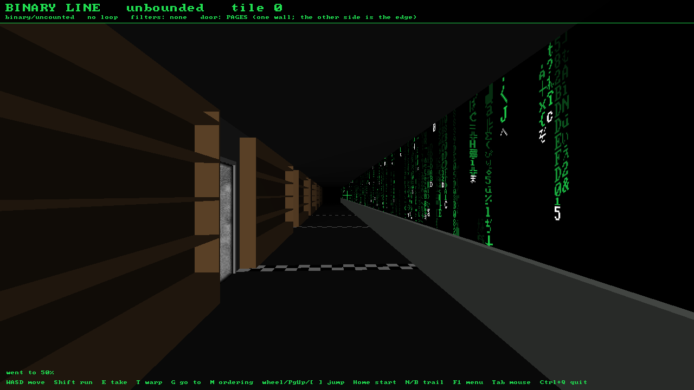

The rain only ever falls as characters the font can actually draw, so it never becomes rows of question marks: with Sieve's own `sieve8x8` it is Latin and Greek, and with **Unifont** it is most of Unicode. Unifont is not stored in this repository — it is GPLv2+ while Sieve's own font is public domain, and a project should pick its own licences — so `python tools/fetch_unifont.py` fetches it into `data/fonts/unifont.hex`, each part checked against a pinned SHA-256, exactly as `fetch_corpus.py` fetches the training corpus. Name it on a language file's first line (`font = unifont`) to use it. The rain is redrawn every third frame into one texture and mapped onto the opening with the same perspective grid the crates use, so it lies in the world rather than facing you; each tile takes two of the texture's four panels, side by side, so the glyphs stay about square and the corridor does not repeat as you walk. It costs about 5 ms a frame with the software renderer, nearly all of it the alpha blend, and far less with a real one.

**The item page, and what a thing costs to name.** Take something off a shelf and the page has three tabs: **ITEM**, the thing itself; **COST**, what it costs to name it; and **SORT**, where it stands in a map (below). **C** moves between them.

**SORT, and maps.** A map (`sieve map FOLDER`, or the node graph's "Make a map from a folder...") links real files and folders, each file named by its SHA-256. It holds no file's bytes, so it is small and can be handed round or bundled with a release. On the SORT tab, a file on the binary line whose bytes a node of the chosen map names is that node, a verified anchor, drawn in its place among the rest; anything else is a lone point. Mouse or A/D turns the graph; [ and ] choose another map (on any tab).

**Verified anchors: V.** Make a map with the node graph's **New map...** (O). Then, holding a file (an item on the binary line), press **V** on any tab to add it to the chosen map as a verified anchor, and V again to take it out; the item page shows which map is chosen and what V will do, and [ and ] change the map. Its bytes are kept inside the map (`sieve-map-v2`), so the map can always walk back to it, and can be sent as one file. The node graph's **Remove from map** (or Delete) takes an anchor out too. When an anchor has metadata in the map, its item page has a fourth tab, **META**. Sealed maps (such as a release's `sieve.map`) and "This installation" (the map chosen at the start, made fresh each time) cannot be changed.

**The vault.** Sieve refuses to show, save or pass on files, pictures, melodies and models whose hash is in its vault (`docs/VAULT.md`), in any form it recognises, including written out as text (as it is, or in hex, base64 and other well-known encodings, decoded); text is never judged by what it says. Pictures are matched by PDQ, Meta's open perceptual hash, so resized, recompressed, recoloured, rotated or flipped copies are caught too, whether drawn in the hallway or found in a file. Files can also be listed by their content-defined chunks (`cdc-v1`), so a piece of one of a couple of kilobytes, cut out anywhere and put anywhere, is caught too. A withheld item keeps its address and place, so every count stays exact, but it is drawn blank, cannot be taken or saved, and never appears in the excluded view; files matching it are not located, installed or mapped. It cannot make an address secret (that is arithmetic); it makes sure Sieve is not what hands it over. It is not a filter and has no setting. `sieve vault` says what it holds (`--pdq` prints a picture's PDQ hash). The built-in entries are harmless tests: the 16 bytes "sieve vault test", a test picture of grey noise (`sieve vault --test-picture`), and a test file listed by its chunks (`sieve vault --test-file`).

**Saving an item: F.** Holding an item, press **F** on any tab to save it as a file, wherever you choose: a page as text, a picture as a PNG, a video's frames side by side in one PNG, notes as a MIDI file, sound (the `pcm` set) as a WAV file, a model as its `.obj`, a book as text (its title, then its pages), and a file on the binary line as exactly its bytes, named as V would name it.

**Between an item and its file: J.** Holding an item on any line, press **J** to go to its file on the binary line: the same file F would save (a picture at one pixel a pixel), with the item's title. Holding a file on the binary line, press **J** to open it on the line that holds its kind: text on the pages line, a PNG, JPG, GIF or BMP on the image line (an animated GIF on the video line), an MP4, AVI, WebP or other video through ffmpeg if you have it, a MIDI file on the audio line, and a book record on the books line, fitted to the line as T fits what you warp in. So J twice takes an item to its file and back.

Every row on the COST tab is the same number written a different way, which is the point:

```
the unit itself      152 bits   39 chars   100.0%   what is on the shelf
positional           152 bits   39 chars   100.0%   the same number, written out
scrambled            152 bits   39 chars   100.0%   the same number, shuffled by the key
guided                58 bits   15 chars    38.1%   shorter: this is likely under the model
variable length ...  152 bits   38 chars    49.9%   no shorter route: the position itself, leading zeros dropped
```

**The balance**, at the top of the tab, weighs the item's address against the item as a file. The file is the one F saves (a page as text, a picture as a PNG, notes as MIDI or WAV, a model as .obj, a file on the binary line as itself); its row, **as a file**, sits under the unit's. The address is the cheapest of the ways the tab lists, under the filters and the line as they stand: the address you hold the item by (its **compact** address among the survivors when the shelf is compact, its guided address when you walk guided), its guided address, and its variable length route. The figure says how the address compares: **Neutral : 0%**, **Negative : X%** when the address is shorter than the file, **Positive : X%** when it is longer. Under it, a bar grows outward from a line at the centre, green for Negative and red for Positive, bordered in white, and reaches full width at 100% (beyond that, only the figure grows). The bar changes as you warp from item to item, and again when the shortest route has been worked out, so it reads as a bearing: where on a line naming things costs less than keeping them as files. Under the bar, which way was cheapest. A titled item's file holds its units only (a book's, its title and pages), so there the address names more than the file holds, and the row says so.

**Tailoring the filters to the item: K.** Holding an item on the pages, image, audio or video line (not in the guided ordering), press **K** and the COST tab searches the line's filters for those that keep it and write its address with the cleanest digits: the item is the anchor, so whatever is chosen, it survives. The address it weighs is the item's **shortest route** among the survivors (its number with leading zeros dropped, or a bearing and a walk), not the width of every compact address, so the search pushes the item's own number towards 0 and takes what it can land on; stacks are grown both by shrinking the count (which bounds every number) and by shortening the route, and the shortest route found wins. The tab also says what the stack costs to write down (one bit a filter offered, each setting at log2 of its values), which a reader without your settings would need. Every filter that can be counted is tried at the settings it has, then each of its settings in turn over the values it allows (an integer over its range, coarsely and then closer in; a text over its choices, or every registered dictionary), and the value kept is the one that leaves the fewest survivors with the item among them. From each filter kept, strongest first, a stack is then grown by adding every other where it can be counted with those there and removes more; the best stack grown wins. While it runs, the tab says how far it has got (K again stops it). Then it shows the item's **compact, tailored** address in bits, against the address you hold it by, and each filter with the settings found. **Return** uses them: the line's filters are replaced by those found, in compact mode, saved to the settings file as the setup menu saves them, and the hallway is built again with the item in hand on its COST tab, where the balance now shows what they do for it. A melody of eight notes, `A4q C5q D5q E5q G5q A4q C5q E5q`, goes from a route of 56 bits to 16 (`b4f7`, survivor 46327 of 204994, under key-data-v2 in C major pentatonic, melody-lengths-v2, melody-range-v1, melody-ending-v2 on E, melody-leap-v1 and melody-rests-v1). It is a search, not a proof: values are sampled and the set grown greedily, but every count it reports is exact. `sieve tailor` does the same from the command line.

**Variable length addressing** is the shortest route found to the unit, by the ways there are to get there: its position without leading zeros (a unit near the start of a line is short to name), or a bearing typed into the navigator (X, Tab) followed by a walk of so many units forward or back from where it lands, with up to 20 decimal places. A unit that sits exactly on a short bearing needs nothing else: the page the navigator lands on at 90.1 degrees is `90.1`, four characters. Shown under it is the route itself (and, if it needs more places than Angle Precision allows, how many). For almost every unit no route is shorter than the address, because a bearing carries only the leading part of the position and the walk carries the rest; across all units no way of writing them can be shorter on the whole. The few that can are found. On a line of long files it is worked out on a worker, which says so until it has the answer.

The first three are the same length because an address in a bijection *is* the content. Only the guided ordering is shorter, and only when the model finds the content likely — so that percentage doubles as an exact measure of how text-like the thing in your hand is. Pick up noise and it reads over 100%, because the guided ordering spends *more* on an unlikely string than positional order spends on any string at all.

Below that: the shape spec that has to travel with an address to mean anything, with its own length in characters — often as long as the address itself — and the address's length written in hex, base32, base64 and base85, which is the measurement behind the question of how a key should travel.

**The compass.** Every line is a loop, so where you stand in one is a bearing as well as a percentage. In the corner of the hallway the corridor is drawn as concentric circles — binary outermost, the lines it bounds, binary again innermost — with a needle at your angle on the line you are on, and a mark on every other ring where you last stood on that line (0° until you have been there). A door takes you to the same angle on the next line, so going through one lines the next ring's mark up with the needle; stepping straight back returns you exactly to where you were, and several doors in a row unwind in turn. The bearing is written out underneath to as many decimal places as **Angle Precision** in the setup menu's GLOBAL section asks for (0–20). It is worked out exactly, so every place shown is right.

Zero is at the top, and zero is the same place for every line: corridor tile 0, where all of them begin a copy together and the start line on the floor is doubled. Walk away from it and the marks fan apart, because the lines loop at different rates — the same corridor tile is a different distance into each line's own loop, and the shorter a line's loop the faster its mark comes back round. So the spread between the marks is how differently sized the state spaces are, read at a glance. The measure is in units, not tiles, so it is exactly the number the percentage shows: three tiles into a six-tile loop of 729 units is 384/729 of the way along, which is 189.6°, not 180°.

**Any file, exactly: `bytes256`.** An alphabet of the 256 code points U+0000–U+00FF, in byte order, so **digit d is byte d**. A file of N bytes is one unit of a `bytes256` line of length N — exactly, reversibly, with nothing folded, dropped or collapsed. Canonicalisation over it is the identity (`canon-bytes-v1`), because on a line where every byte means itself there is nothing to canonicalise and any folding would stop a file coming back the way it went in. Warping reads such a file as raw bytes rather than as UTF-8, and `--out` writes it back as raw bytes.

It is also the only line that packs **perfectly**: 256 symbols is exactly 8 bits each, so the address of a file is its own bytes read as one number, and its hex form is the file's hex dump, character for character. A four-byte file `DE AD BE EF` lives at address `deadbeef`:

```
sieve warp --alphabet bytes256 --length 4 --file four.bin
  positional  deadbeef
sieve read --alphabet bytes256 --length 4 --mode positional deadbeef --out back.bin
```

Which is also the clearest statement of what an address is and is not. A 100 KB file has a 200,000-digit address: the address is the content, not a handle on it. Addresses that long do not fit on a command line, so `read --address-file PATH` takes one from a file.

**Alphabets.** A text line's alphabet is an ordered list of Unicode code point ranges, and those ranges are its digit order: digit 0 is the first code point of the first range. Four are built in — `lower27` (space + a–z), `babel29` (libraryofbabel.info's set, in its order), `ascii95` (printable ASCII) and `ascii96` (printable ASCII with the line feed, so a unit can hold a file whose line breaks are part of what it says). Beyond those, about a hundred named Unicode blocks can be used on their own or **stacked** with `+`: `--alphabet greek+cyrillic`, `--alphabet ascii+all-emojis`, or a raw range, `--alphabet u+0370-u+03ff`. Stacked code points are unioned, sorted and deduplicated, so blocks that overlap never give a symbol twice and the order you write them in does not matter — `greek+cyrillic` and `cyrillic+greek` are the same alphabet with the same name. `sieve alphabets` lists every block with its range and a description of what it is; `sieve alphabets --spec greek+cyrillic` works one out. In the setup menu, **A** opens the same list to tick through. A smaller alphabet is not only a smaller line: every exact ranker steps through B symbols at each position, so the alphabet decides how much work counting and ranking a filter stack costs. Surrogates (U+D800–U+DFFF) can be stacked in like anything else — they are addressable, countable, filterable and drawn as the replacement glyph, but they have no UTF-8 encoding, so a unit holding one has no text form to warp in from or write into a `.book`. An alphabet's ranges are pinned, since every address on a line depends on what its alphabet holds: a correction is a new id, never an edit.

**The setup menu.** Start Sieve opens a menu where you can set every line's shape: text length, alphabet, warp rules and model; image size and palette; audio notes; video size, frames and palette; plus the key, the starting line and the ordering. Enter walks in, and **F1** in the hallway brings the menu back.

**Global settings.** The setup menu opens with **GLOBAL**, for what belongs to the corridor rather than to any one line — and they divide by what they change. **Key** is part of a line's id, so it changes every scrambled address on every line. **Number of items per wall** changes no address at all, only the coordinate that names where a unit stands. **Ordering** and **line** change neither: the first is a view that **M** cycles in-world, the second is only where you start.

**Number of items per wall** is 128 or 256 — how many units stand on one tile, split between its two walls and then between four rows, so 128 is sixteen to a row as it always was and 256 is thirty-two, packed closer along the same shelf.

It **changes no address**. A unit's index is what it always was; what changes is only the `tile` and `slot` that name where it stands in the corridor, because those are that index cut in two (`tile = index >> bits`, `slot = index & mask`). The same book is at the same percentage along the same line under either setting — at 256 the tile number is simply half what it was. So a *tile* written down under one setting means something else under the other, which is why the hallway's readout and `sieve info` both say which is in force. Powers of two from 2 to 4096 work on the command line (`--items-per-wall`); the menu offers the two that use a byte well.

What stands in a slot is **scaled to the slot, uniformly**. Scaling only along the shelf would squash a record or a cassette, and a record is round whatever else changes — so a book, a sheet, a canvas, a tape and a crate all keep their proportions and simply get smaller. A sixteen-column shelf is the shape everything was drawn for, so that is a scale of one; a thirty-two column shelf is half of it, 14 cm books with a 4.8 cm gap where there were 28 cm books with a 9.5 cm gap. Never larger than one: a wider slot is left as air, because an item grown past the row it stands in would burst out of the case. A uniform half-scale takes a *quarter* of the space, so the value where the bookcase looks exactly as it does now, only denser, is 512 to a tile.

**Limits, and the way out of them.** The last three rows of the setup menu are actions rather than settings. **FIND MY LIMITS** sets every line to the largest shape this machine can open, and **RESET EVERY SHAPE** puts them all back; then **ENTER THE HALLWAY**. Two things bound a shape and both are checked: the length of one address, which is a single number held in memory whose arithmetic grows with the square of its length, and the length of one *unit*, because the hallway keeps a few thousand whole units cached and that is usually what runs a machine out of memory first. Both follow in closed form from the shape, so finding the limits generates nothing and takes no time; it runs whenever you ask, so a change of hardware is picked up. The pages and image lines grow in step, because the books line is made of both and has to fit as well. If a line is over what this machine can hold, a red line at the foot of the menu says which. None of this is a limit of the design — a bigger machine finds bigger numbers with the same arithmetic.

**Filter memory.** The FILTER MEMORY row (GLOBAL) sets how much memory one count of the filters' survivors may take for its tables (512 MB at first; Left/Right in steps of 256 MB, PgUp/PgDn double or halve; saved with the application's settings, and `--filter-memory MB` for the `sieve` tool and the hallway). Every filter that counts by a table keeps within it: the plugins' combined automaton, not-written with them, utf8-valid on the binary line, and the built-in word filters. Past it a stack still judges every unit, but cannot count or compact, and the filter list says how much it would need ("the plugins' combined table needs 1.4 GB of memory at this length, over the filter memory (512 MB)"). At the top right, the budget's **filter memory** bar shows the most any line's ticked filters need for a full count against the setting, red when it is over. Changing the setting counts nothing by itself, so it can be stepped freely: a red line under the bars says *Memory Limit Change Detected : Press X to re-optimise all dimensions*, and **X** (on the setup screen or in a filters window) then counts every line again with it and re-ticks them, the clashes weighed anew. While any line is still being counted, *Calculating Dimensions...* is said in red at the top middle of the menu, the line under the bars says which lines, and ENTER THE HALLWAY is greyed until the counting is done. Going into the hallway uses the setting as it stands. Raise it as far as the machine allows: X counts several filters at once, so leave room for more than one.

**Counting memory and merge cache.** The last two GLOBAL rows share out memory among the counts.
- **COUNTING MEMORY** is the share of installed memory the setup menu's counts may take at once (50% at first; 5 to 100, Left/Right in steps of 5, PgUp/PgDn 25). Counts wait in a queue and run on one thread per core but the one that draws, and no more of them at once than this share holds, at the whole filter memory each. The row says how many that is on this machine ("50% of 15.7 GB (3 at once)").
- **MERGE CACHE** is the share of the filter memory that keeps the plugins' merged automata, and their counting tables when they fit, between counts (50% at first; 0 to 100). With it, the pages line and the books' title merge the same plugins only once, and a line counted again doesn't merge them again. 0 keeps none. Whatever this is set to, a table two counts need at the same time is built once and used by both.

Both change no count, only how fast the counts arrive, so they take effect at once without pressing X. **TIME BUDGET**, the last GLOBAL row, is the longest one unit may take to open (50 ms at first; 5 ms a step, PgUp/PgDn double or halve). The budget's time bar and FIND MY LIMITS hold every line to it at once, with how the time grows measured on this machine at start-up. A ranker whose time grows faster than its table's memory follows it too: symbol-entropy on black-and-white pictures ranks units up to about 1,000 symbols at 50 ms. Since that changes what can be counted, the budget is applied like the filter memory: a red line says *Time Budget Change Detected : Press X to re-optimise all dimensions*, and X (or going into the hallway) applies it. `--unit-time MS` sets it for the hallway and the `sieve` tool. Both are saved with the application's settings. `--counting-memory PCT` and `--merge-cache PCT` set them for the hallway, and `--merge-cache` for the `sieve` tool.

Beside the settings, a **map** draws the lines side by side, one copy each, with the binary line at each end because that is where it runs:
- Each bar's length is the line's size in bits (log2 of its number of units). The real sizes differ by factors far too large to draw literally.
- The **longest line always fills the height**, so no bar can leave the screen however large the settings grow.
- Every bar has a minimum length, so even a tiny line stays visible next to a huge one.
- Each line also shows its units, bits, tiles per copy, and padding.

**No limits.** The state spaces are meant to scale without end. Each setting goes up to the largest value it can store (over 4 billion). Left/Right change a setting (Shift ×10, Ctrl ×100), and PgUp/PgDn double or halve it, which is quick for reaching powers of two.

What limits a line in practice is the machine. An address is one number held in memory, and the arithmetic on it grows with the square of its length. The menu marks a line "large: slow to open" beyond 4 million bits per address (about 840,000 lower27 characters). It refuses to open one beyond 8 billion bits, where a single address would need a gigabyte. Both thresholds are single constants in `client/menu.cpp`, there to be raised as machines grow. `--no-menu` skips the menu.

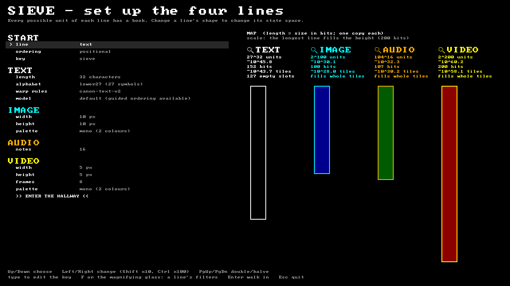

**Filters.** The magnifying glass beside each line's title (or **F** on that line's settings) opens the line's **filter list** over the map: a black box with a white outline, scrolled with the wheel or the arrow keys. Beside its title is a live tally, **amount of content filtered**: the exact share of the line's units the ticked filters remove, as a percentage with as many decimals as it takes to get past the leading 9s or 0s (`99.999999999999...%`, `0.0059%`), and the smaller side as a power of ten (`kept 10^-19.27`, `kept 10^-1.12`, `removed 10^-4.23`). It says "not countable" when the stack cannot count, and starts with `~` when the share is estimated rather than exact (utf8-valid on a binary line longer than its table, about 7.4 KB, where the survivors run to millions of digits). Beside each filter's name is its own tally, **Filtered: X%**: what that filter removes on its own, its settings as they stand, for comparing filters at a glance. Z, X and C tick or untick everything in reach (this tab, every line, both main tabs); where two filters cannot be counted together, ticking keeps the one that filters more on its own (the footer says it is weighing them while it counts). It has three kinds of row:
- **Display mode**, one of six:
  - **off:** every book on the shelves.
  - **mark:** books that fail are drawn faint. Good for record keeping and tests: you see exactly what the stack rejects.
  - **hide:** books that fail are left out and the rest keep their places. Good for walking along and browsing.
  - **compact:** only survivors stand on the shelves, packed together, in **every ordering**, and the loop is exactly as long as the survivor count:
    - **Positional:** slot *k* holds survivor number *k*.
    - **Scrambled:** the survivor numbers are shuffled with the key, so neighbours are unrelated survivors.
    - **Guided:** the guided line is restricted to survivors. Every symbol that could not lead to a survivor is removed from the model's tables as the coder goes, so every point on the line is a survivor, and likely survivors own the long stretches.
  - **full:** compact, with the titles and covers kept: on the pages, image, audio and video lines every survivor stands with every title and cover, as on the bare titled line, so its address names its cover, its title and its number among the survivors. Compact names a thing by its content alone; full by everything it carries. Which to use depends on whether the files need titles or file names. On the books, tracks and movies lines, which keep their titles in compact, full is compact; on the models and binary lines it is compact for now. In the guided ordering the content alone is addressed, as in compact. Tailoring (K, Return) keeps a line that is full in full mode.
  - **excluded:** hide turned round: the books that pass are left out and those that fail keep their places, each with the filter that rejected it, so what the stack sets aside can be walked and checked.
- **Filters**, each with a tickbox and a description. Several measure one line by another. **not-written** (pages) leaves out a page that some reading of it (hex, base64, base32, the letters a to p, two letters as bits, and so on) turns into a file with a signature, a PNG or a ZIP written out, since that file has its own place on the binary line; on 32-letter pages it takes away about one page in 17,000. **binary-kind** (binary) keeps the files of chosen kinds, as their own first bytes say (PNG, ZIP, MID, TXT, ...), so the binary line can be walked through nothing but PNGs. Every line also leaves out the others' content (docs/FILTER-PLUGINS.md §16): **not-a-file** (every line but binary, the models line included, which has its own stack for it and for its own filters: **distinct vertices**, **distinct indices** (no degenerate faces) and **every vertex used**, which between them keep about 10^-2.21 of the default line, exactly) a unit whose own number is a place on the binary line holding a file with a signature; **not-other-line** (pages) melody notation or a model's .obj text; **not-packed** (black-and-white and 4-, 16- or 256-colour pictures and video) pixels whose bits, packed into bytes, are such a file; and **not-an-item** (binary) a file that is exactly another line's item as F saves it. A further hard filter, **not-a-pattern**, leaves out units that repeat a short block or count up by a fixed step (a gradient through every byte, a 16-bit counter), which slip past the noise filters. Each takes away a sliver (about 10^-4 to 10^-6 of a line) and counts exactly on its own; not-an-item with melodies, pictures or models judges file by file, so the binary line falls back from compact to hide and says why.
- **Parameters**, shown under a filter when it is ticked. Numbers step with Left/Right; a dictionary or model cycles through the registered ones.

Space/Right ticks or changes a row and Left steps back; with the mouse, click to tick or change and right-click to step back. Esc, F or a click outside closes the list and saves it to `sieve-filters.ini` next to the executable (or wherever `--filters PATH` points). The file is plain text and may be edited by hand:

```ini
[text]
mode = compact
filters = words-v2
[text.words-v2]
dictionary = scowl-en-35
```

The footer says what the stack can do. Where it can count its survivors exactly, the map fills that part of the line's bar and labels it with the survivors' size in bits.

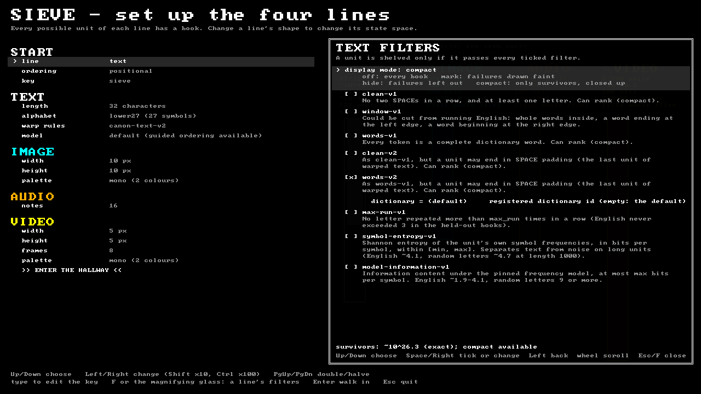

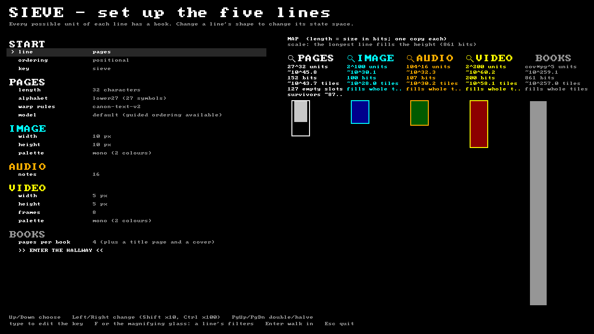

Every filter is a separate, versioned module compiled into the core. Every decision is exact integer arithmetic, so every machine agrees, and the Python oracle checks each one:

| Filter | Lines | Passes when | Compact |
| :--- | :--- | :--- | :--- |
| `clean-v1` | text | no double SPACE, at least one letter | yes |
| `window-v1` | text | could be cut from running English (see `sift` below) | |
| `words-v1` | text | every token is a dictionary word | yes |
| `clean-v2`, `words-v2` | text | as v1, but the unit may end in SPACE padding, as the last unit of warped text does | yes |

The word filters above (`clean`, `window`, `words`, v1 and v2) and `title-v1` are retired for the same rules as plugins (`clean-data`, `window-data`, `words-data`, `title-data`), which merge with the other automata and count long pages too: they stay loadable, so earlier stacks reproduce (docs/FILTERS-CONFLICTS.md).
| `max-run-v1` | text | no letter repeated more than `max_run` times in a row (3) | |
| `symbol-entropy-v1` | all | the unit's own Shannon entropy per symbol lies within [min, max] | in black and white |
| `model-information-v1` | text | information under the pinned frequency model is at most `max` bits per symbol (5) | |
| `neighbour-agreement-v1` | image, video | enough neighbouring pixels (and frames) share a colour | while colours^width is small (video: colours^(width×height)) |
| `key-v1` | audio | every note is in one key (tonic C…B; major, minor, harmonic minor, major or minor pentatonic, blues); rests always pass | yes |
| `palette-size-v1` | image, video | at most so many distinct colours (or in each frame) | yes, on every palette, rgb24 included; on small palettes an automaton that merges with the others |
| `row-runs-v1` | image, video | at most so many colour changes along each row of pixels | yes, at any width; on small palettes an automaton that merges with the others |
| `sound-peak-v1` | audio (`pcm`) | no sample louder than a share of full scale (90%) | yes, at every depth |
| `sound-step-v1` | audio (`pcm`) | neighbouring samples within a share of the range (50%): noise jumps, sound mostly moves a little | an automaton to 11 bits a sample; judged past that |
| `silence-run-v1` | audio (`pcm`) | no run of more than so many silent samples (4000) | an automaton while it fits |
| `canonical-mesh-v1` | models | one encoding of each mesh (vertices and faces in order): 10^-19 of the line is re-orderings | yes |
| `utf8-valid-v1` | binary | the whole file is well-formed UTF-8 (and, by default, text: no control characters) | yes, on its own |

Each built-in filter is labelled **hard** (sets aside only noise or other lines' content) or **soft** (may set aside what a person would keep), shown by `sieve filters`. The custom filters in `data/filters` add melody metre, ambitus and gap-filling; letter pairs and triples, a word-cost model, function-word rules and sentence punctuation for text, generated from the pinned word lists by `tools/build_text_plugins.py`; and `tools/build_anchor_plugins.py` makes filters for the units near a known page or holding known fragments (docs/FILTER-PLUGINS.md §19).

**Compact** needs a filter that can count and rank its survivors (the Compact column), so it works on every line: words on text, neighbour agreement or low entropy on black-and-white pictures, a key on melodies. Neighbour agreement is counted row by row, remembering the row above (a transfer matrix). The work grows as colours^width, which is inherent to counting pictures by their neighbours. A 10×10 black-and-white picture takes 0.1 s, and small video works. Past the memory limit the line falls back to hide. Any other ticked filter must be one that filter *implies*: `words` implies `clean`, so the two together still compact, but `words` with `max-run` does not. When compact is not possible the hallway falls back to hide, and the top bar says why. Warp to text that fails the stack and it opens in hand marked **NOT ON THE SHELVES**, with the filter that rejected it.

A changed filter never replaces the old one. It is registered as the next version (`words-v2` beside `words-v1`), so a result recorded with a stack's id can always be reproduced. To add a filter, write it in `core/src/filters/` and add one line to `core/src/filters/builtin.cpp`. The oracle and the vectors in `tests/vectors_filters_v1.tsv` should grow with it.

| Mode | The text line at length 3, filtered by `words-v1` |
| :--- | :--- |
| mark | 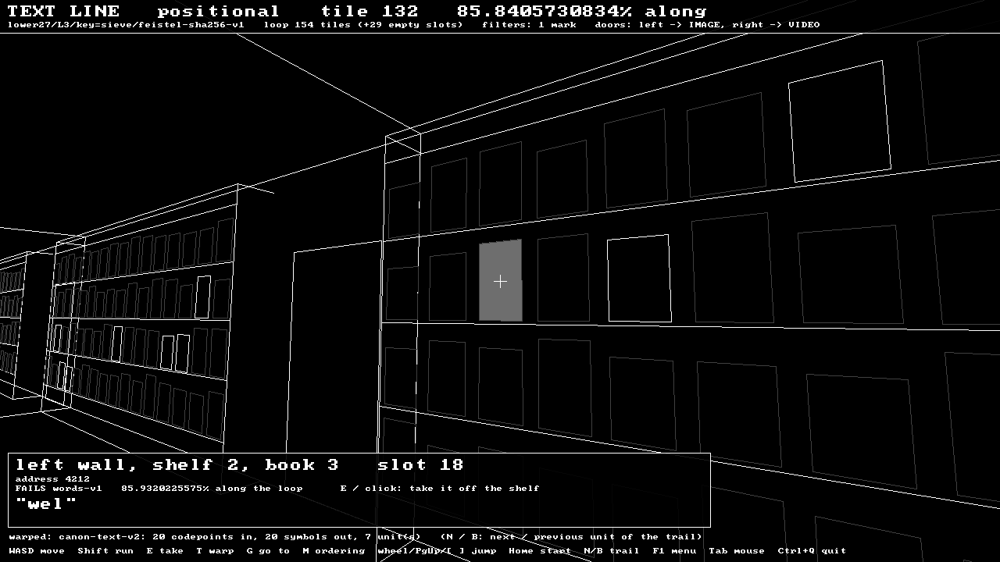 |
| hide | 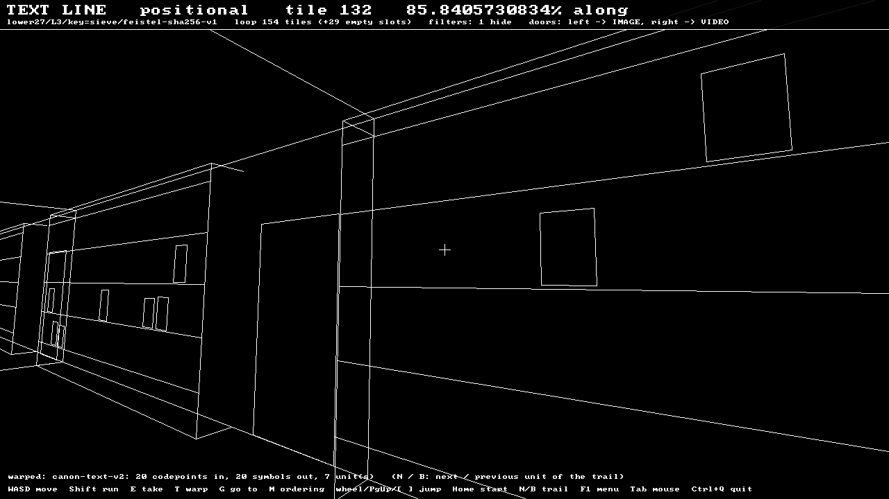 |

**Excluded** is hide turned round: units that pass are left out and units that fail keep their places, each with the filter that rejected it, so what a stack sets aside can be walked and checked. The top bar and `sieve filters` give the exact number excluded wherever the stack can count its survivors.

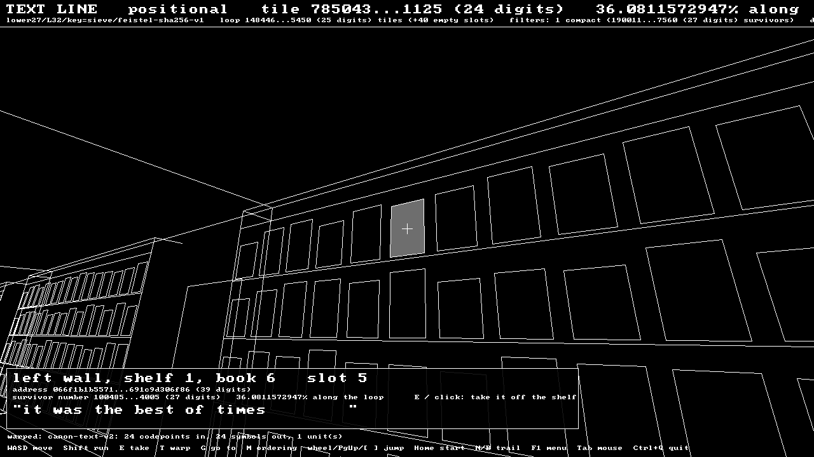

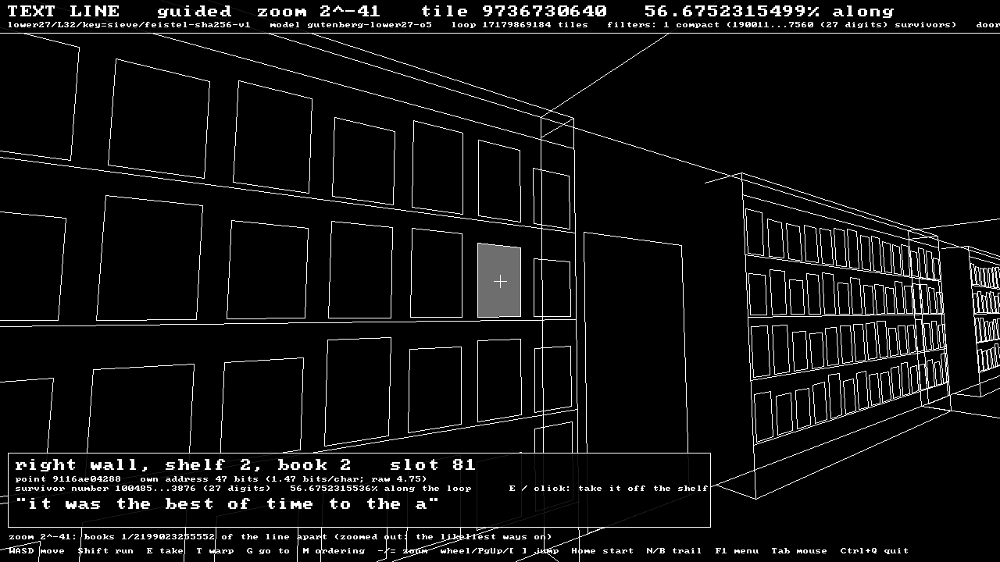

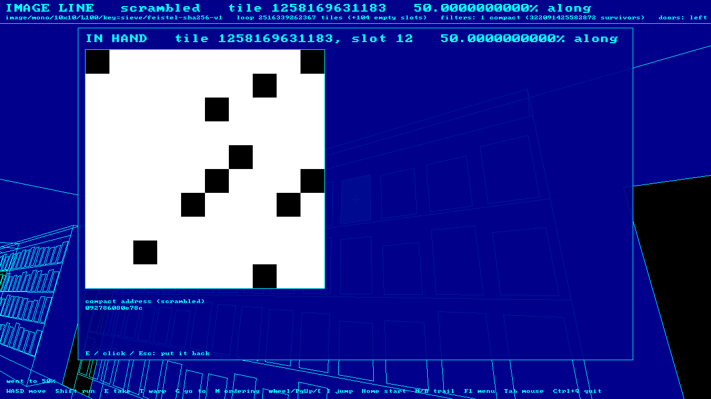

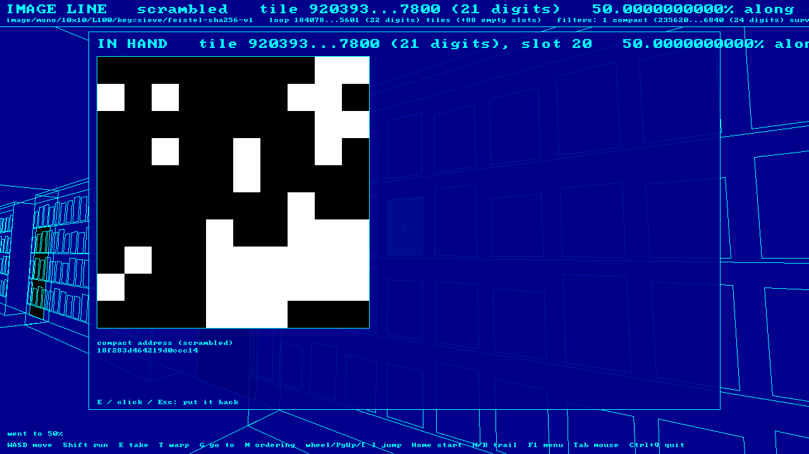

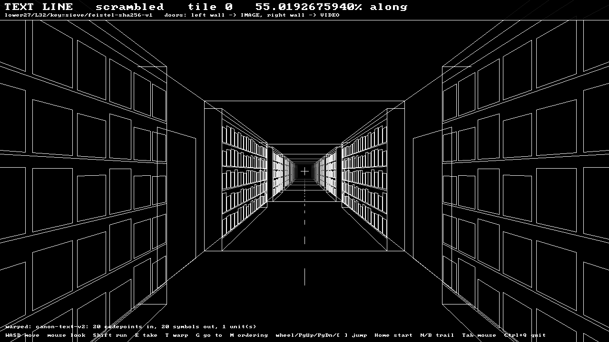

**Colours.** Each line has two colours: a solid background and the colour of every edge. Doors are solid black.

| Line | Background | Edges |
| :--- | :--- | :--- |
| text | black | white |
| image | blue | cyan |
| audio | green | amber |
| video | red | yellow |
| books | grey | black |

The hallway and the setup menu call the text line **PAGES**, since each of its units is a page; `--line pages` works as another name for `--line text`.

**Doors.** The walls repeat shelf, door, shelf. A black door in the **left** wall leads to the **next** line (text → image → audio → video → text). A door in the **right** wall leads to the **previous** line. You come in through the opposite door, in the new line's colours.

A door **keeps your corridor position** and only changes which line reads it:
- Every door lines up with a door in every other line.
- Go through a door, walk *k* tiles, go back through the door there, and you are *k* tiles along from where you left.
- Step straight back through the same door and you are exactly where you were.
- Lines of different sizes simply repeat at different rates. Many places on a big line share one unit of a smaller line, and the reverse.

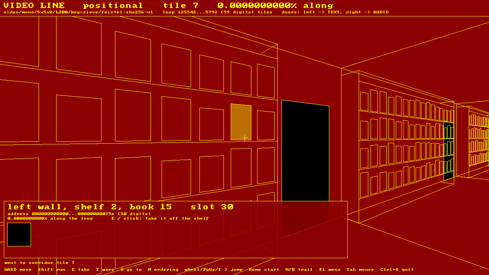

**Books.** Look at a book and a panel shows its position on the shelf, its address, how far along the line it is, and a preview. Press **E** or click to take it off the shelf:
- **Text:** the full text.
- **Image:** the picture, in its palette colours.
- **Video:** the frames, animated.
- **Audio:** the notes; **P** plays them.

**The viewer.** The item page draws the thing at the page's size, so a long page stops at its foot. **Z**, or a click on the thing, opens it over the whole window instead, as large as you like and scrolled both ways:
- **A page:** all of it, a character to a cell, in rows as wide as the picture on the item lays them out, so what opens is that picture, larger. Letters smaller than the **letters on items** size are drawn as bars, as on the item.
- **A picture or a film:** its pixels, one to one or as large as you like. A film plays; **Space** stops it, **N** and **B** step a frame.
- **A book:** the open page (**N** and **B** turn them). **A track:** its notes. **A model:** its `.obj` text. **A file:** all of it, as a hex dump.

That is the thing itself. The buttons along the top (or **Tab**, **Shift+Tab** back) show what else was made of it on the way to the shelf:
- **PICTURE:** the picture on the item, drawn again by the same painter as the shelf's, as wide as its letters or your screen need (while it fits the display cache), on a worker so a long page's does not hold up the window.
- **COVER:** a book's, a track's or a film's cover, at its own pixels.
- **TITLE:** its title, and a book's whole title page, laid out as a page.

**F** (or the button at the right) saves what is shown: the thing itself as **F** on the item page saves it (text, PNG, MIDI, `.obj`, the file's bytes), the picture on the item or a cover as a PNG at its own pixels, a title as text.

The wheel scrolls down, **Shift** and the wheel across, **Ctrl** and the wheel zooms about the pointer, and dragging moves it. Arrows or WASD move it too, PgUp/PgDn by a screen, Home/End to the top and the foot, **+** and **-** zoom (**Shift**: twice as far), **0** fits it to the window and **1** is one to one. **Esc** or **Z** closes it, with the thing still in your hands. Only what is in view is drawn, so a page of any length scrolls as fast as a short one.

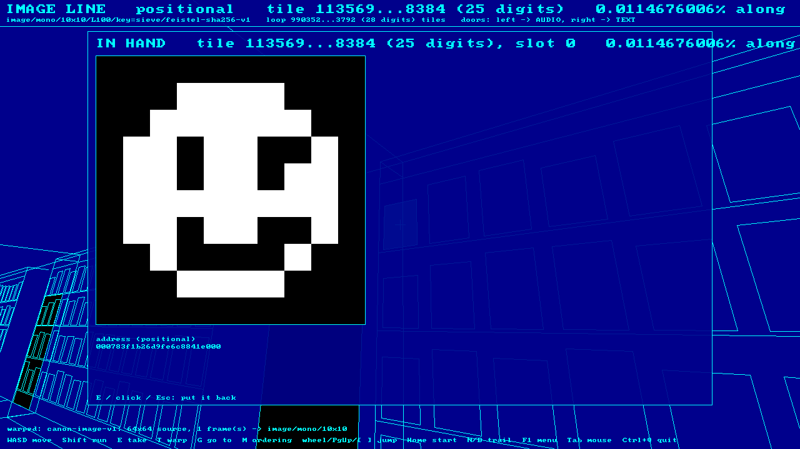

| Key | Action |
| :--- | :--- |
| W A S D / arrows | Walk and turn. **Shift** runs. |
| Mouse | Look around. **Tab** frees or captures the mouse. |
| E / left click | Take the book you are looking at off the shelf, or put it back (with it in hand, a click on the thing itself opens the viewer) |
| Z | Holding something: the **viewer**, the thing over the whole window, zoomed and scrolled both ways (above) |
| T | **Warp:** type text, notes, or a picture file path (for image and video), then Enter. You land facing it, in the first copy of the line (where your position equals its address), and it opens in hand. Ctrl+V pastes. |
| G | **Go to** a hex address or a percentage such as `50%` or `36.25%` (these open the book too), or `@T` for corridor tile T |
| (doors) | Every doorway has a sign over it naming the line it leads to, in that line's colours |
| F1 | The **setup menu**, over the hallway: Esc goes back to the hallway as it was, ENTER THE HALLWAY walks into a new one with the new settings |
| Esc | **Pause**: Resume, Navigation System, **File Locator** (a file's place or a folder's manifest, compared with zip and 7z; go to a file on the binary line; save Sieve instructions (`.sieve`, for anyone with Sieve) or make an installer program (for anyone); install from Sieve instructions), **Media Player** (the background music, below), Settings (the main menu's, over the hallway), Exit Sieve (to the main menu, or out). **Node Graph Viewer** (as O). Every tool opened from the pause menu (Restart's setup menu included) comes back to it with Esc. With something in your hands, Esc puts it down first |
| O | **Node graph**: maps of verified anchors in 3D. Choose a map from the dropdown (**This installation**, the maps in `maps/`, or open or make one from a folder); drag or the arrows turn it, the wheel zooms, click or Tab chooses a node, Enter or a double click walks to a file on the binary line; Export writes GraphML or DOT for other programs |
| X | **Address navigator**: the whole address of the item you are looking at, full screen, one hex digit at a time. Left/Right (Shift: a row) choose a digit, Up/Down, the wheel or the arrows turn it, carrying and wrapping round the line; type 0-9 a-f to set it; ENTER goes there, Esc leaves. **Tab** (or a click) types a **bearing** instead, at the Angle Precision of the setup menu: 180 is halfway round the loop, and ENTER goes to the first item at or past it |
| N / B | Next or previous unit of a warp that made a trail of several units |
| M | Switch ordering: positional → scrambled → guided (text) → positional |
| - / = | Guided ordering: zoom out / in by one bit (**Shift**: 8 bits) |
| Mouse wheel · PgUp/PgDn · [ ] | Jump 1 · 1,000 · 1,000,000 tiles along the line |
| Home | Corridor tile 0: the start line of every line (the double flag) |
| F1 | Back to the setup menu (filters are set there) |
| P | Play an audio book you are holding (the background music fades out under it, and back after) |
| F | Save the item you are holding as a file (asks where) |
| Esc | Close a panel or input, or free the mouse |
| Ctrl+Q | Quit |

**The larger note set.** The audio line is `notes104` by default (C4–C6, four durations, one voice), and the setup menu's note set row switches it to `notes2`: a range anywhere in C2–C7, any of eight durations (sixteenth, eighth, dotted eighth, quarter, dotted quarter, half, dotted half, whole) and 1 to 4 voices that play together (`--note-set notes2 --note-low C3 --note-high C6 --note-durations seEqQhHw --voices 2`; on `sieve`, `--note-set notes2 --low --high --durations --voices`). Notation adds `s` and the dotted `e. q. h.`, with `//` between voices; filters judge each voice on its own and still count and rank exactly; a melody saves as MIDI with a track per voice (SPECIFICATIONS §3.2). The Media Player can draw its melodies from `notes2` too.

**Background music.** Melodies from the audio line play quietly behind everything, one mode for the menus (every menu, the pause menu and its tools included) and one for walking the hallway, crossfading as you move between them. A melody is one unit of the audio line at the mode's own length, drawn at random from the survivors of the mode's own stack of audio filters: the stack counts them, a rank is drawn below the count, and that unit plays, so every melody is a book on a shelf with an address. Each mode can draw from the **tracks line** instead ("Draws from" in the Media Player, with how many units a track): a melody is then a real track, N units of that length with a blank cover and title, as **T** gives a track warped in, and the mode's filters judge the whole track, its units joined, as a track's JOINED filters do, so they judge across the seams. The defaults are starting points to tune by ear, built from the melody filters (below): the menus in A minor, plainer and slower, a little busier; the world in C major, small steps, long notes, few rests, ending home on C, in soft struck tones with more echo. How a melody sounds (tempo, voice, echo, volume) is the player's, not the melody's: the unit and its address are the same whatever they are set to. So is each line's **character** in the world: every line plays in a mode of its own, from brightest to darkest image (Lydian), pages (Ionian), audio (Mixolydian), video (Dorian), books (Aeolian), models (Phrygian) and binary (Locrian); tracks start in audio's mode and movies in video's, and each can be set on its own. Each note is moved to the same step of the line's mode, and the change is heard from the next note after a door. It works from `key-v1` in the world's filters, whose default is now plain C major, since the pentatonic lacks the steps that tell Lydian and Mixolydian from Ionian. Optionally, the key can also follow the line round the circle of fifths (C G D A E B F#). Both are set in the Media Player, and the menus are never moved. A box says "NOW PLAYING" for a few seconds when a melody begins, just below the FPS counter and flush with its right edge, in the colours of the line you are on (white on black in the menus).

The **Media Player** (pause menu) has three columns. On the left are the last ten melodies the player chose, each with where it played (`WORLD [BINARY]`, `MENUS`) and when; melodies you play yourself are not listed. In the middle are the controls: one form, with MODE switching between the menus' settings and the world's. They cover the music on or off, volume, where melodies come from (the audio line or the tracks line, and the units a track), length, tempo, voice, echo, the quiet between melodies, a new melody now, and the mode's filters with their settings (apart from the setup menu's). On the right are the favourites. The actions act on the highlighted melody of the list used last: play it, go to it (on the audio line, or the tracks line for a track, in hand; one of another length, note set or number of units than this hallway's builds the hallway again with it), save it as MIDI, add it to the favourites or take it off. Favourites are kept as Sieve instructions, `sieve-favourites.sieve` (each a MIDI file, and an index of their notes), which `sieve install` unpacks like any other. The settings and the recent list are kept in `sieve-music.ini`, both beside the hallway's settings. `--no-music` keeps the app silent.

**Options.** The hallway takes the same line options as `sieve`, renamed per line because all four lines are open at once:

| Line | Options |
| :--- | :--- |
| text | `--length` (32), `--alphabet`, `--canon`, `--model` |
| image | `--image-width`, `--image-height`, `--image-palette` |
| audio | `--notes` (16) |
| video | `--video-width`, `--video-height`, `--video-frames`, `--video-palette` |

It also takes:
- `--key`, `--mode positional|scrambled|guided` and `--line` for the starting line.
- `--warp INPUT` or `--goto ADDRESS|P%|@T` to set where you start, `--zoom D` for the guided zoom, and `--tile N` to move N tiles along from there.
- `--filters PATH` for the filter settings file.

**Screenshots and scripted walks** (used by the automatic tests too):

```sh
hallway --screenshot shot.png --size 1280x720 --pose X,Z,YAW,PITCH
hallway --line image --warp sprite.png --take --screenshot in-hand.png
hallway --pose 0,7,-90,0 --walk "-2.3,0;2.5,0" --screenshot door.png   # through a door and back
hallway --pose 0,7,-90,0 --walk "-2.3,0;-0.8,0;0,8;1.5,0" --screenshot loop.png   # through, one tile along, back
hallway --length 2 --goto @0 --pose 0,5,180,-14 --screenshot start.png   # the double start line
hallway --menu --screenshot menu.png                                      # the setup menu (--press keys go to the menu)
hallway --main-menu --press "Down,Return,Return" --screenshot gfx.png     # the main menu (here: Settings > Graphics)
hallway --warp "it was the best of times" --press "M,M,-,-" --screenshot g.png   # keys, as if typed
```

On a machine without a display, set `SDL_VIDEO_DRIVER=offscreen` and `SDL_RENDER_DRIVER=software`.

**The guided view.** Press **M** until the top bar says `guided` (or start with `--mode guided`). Now each book is a *point* on the entropy-ordered line, and the books are `2^-zoom` of the line apart. Each book holds the unit whose stretch of the line contains its point. Likely text owns long stretches, so the shelves are readable almost everywhere. Noise is still on the line, but it occupies hairline stretches that the books rarely land on.

- Warping puts the unit on a book and sets the zoom to the length of its address. Neighbouring books then differ only near the end.
- **-** zooms out. At `2^-24`, every book is the likeliest line in its slice, so the wall reads as a list of plausible continuations of where you are.
- **=** zooms back in.
- The panel shows the book's point, and the length of the unit's own address in bits: its information content, to within two bits.

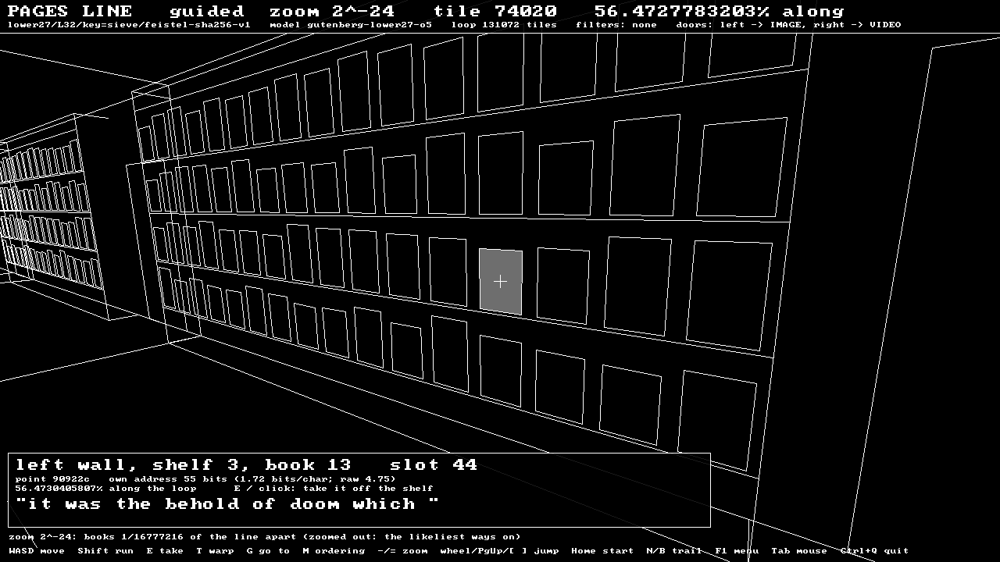

Doors work the same in guided order. At zoom *d* the guided loop is 2^*d* books long, and the lines without a model (image, audio, video) keep their raw ordering.

## The filter survey

`tools/survey/survey.py` counts, for a grid of settings on every line, what each filter keeps on its own and what stacks of them keep together. It runs the `sieve` tool itself, so the figures are the engine's own. Each row gives:
- the share kept, as a power of ten;
- the exact percentage removed;
- whether the count is exact or the stack only judges;
- the time and memory it took.

```
python tools/survey/survey.py                      # the average profile and the default grid
python tools/survey/survey.py --profile low        # a smaller machine
python tools/survey/survey.py --ram-gb 12 --cores 6 --filter-memory 1024 --time-limit 90
python tools/survey/survey.py --only image,audio --dry-run
```

- **The grid** (`tools/survey/grid.tsv`): per line, its settings as lists or ranges (`width=5..10 height==width`, `length=64..1024*4`), and the stacks to count: `each` filter alone, `all` together, or named filters at stepped settings (`row-runs-v1[changes=0..4]`).
- **A hardware profile** (`tools/survey/profiles.tsv`) bounds each count the way the setup menu does on that machine:
  - the memory one count's tables may take (FILTER MEMORY);
  - a time limit for each count;
  - how many counts run at once.

  Override any of them on the command line. A count past the bounds is recorded as such, with what it would have needed, so the tables show where counting ends on that hardware.
- **Results:** `results/survey-<profile>-<date>.tsv` (every row) and `.md` (a table per line).
- **The default grid:** 507 counts, in about two minutes of counting on a 4-core, 16 GB machine.

## Commands

### `info`: how big is a space?

```
sieve info [--line LINE] [line options] [--key K]
```

```sh
sieve info --length 1000                              # paragraph-scale text
sieve info --line image --palette rgb24               # every 10x10 full-colour image
sieve info --line video                               # every 8-frame 5x5 animation
```

### `warp`: give some content, get its address

```
sieve warp [--line LINE] [line options] [--key K] [--mode MODE] [--short] (TEXT... | --file PATH)
```

Fits the input to the line with fixed, versioned rules (see *Canonicalisation* below) and reports every change it made. It then prints each unit's address, how far along the line it sits, and a preview. Images and video are drawn as ASCII art.

| Option | Meaning |
| :--- | :--- |
| `--mode MODE` | `positional`, `scrambled`, `guided` or `all` (default: every ordering the line has; `both` also works). |
| `--model ID\|PATH\|none` | Text: the model for guided addresses. Default: the alphabet's default model (see `models`). |
| `--short` | Abbreviate long addresses as `start...end (N digits)`. |
| `--file PATH` | Read the input from a file. |

```sh
sieve warp --length 32 "It was the best of times"
sieve warp --length 1000 --file chapter1.txt
sieve warp --line image --file sprite.png
sieve warp --line image --palette ega16 --width 16 --height 16 --file sprite.png
sieve warp --line audio "E4q D4q C4q D4q E4q E4q E4h"
sieve warp --line video --file walk.gif --short
```

Example output:

```
line         text
space        lower27/L32/key=sieve/feistel-sha256-v1
canon        canon-text-v2: 24 codepoints in, 24 symbols out, 1 unit(s)
  case folded           1
  padding               8 (spaces on the last unit)

unit 1/1  "it was the best of times        "
  positional  066f1b1b557137f7d30eb550279691c9d306f86
              at 36.0811572947% along the line
  scrambled   007b30165818bf0311497600aa52996f9395e27
              at 2.6985270978% along the line
  guided      90922c700685e28
              58 bits: 1.81 bits/symbol (raw 4.75), at 56.4730431890% along the guided line
```

### `read`: give an address, get the content

```
sieve read [--line LINE] [line options] [--key K] --mode MODE [--out PATH] [--scale S] ADDRESS
```

This is the reverse of `warp`. Every option that shaped the address must match; otherwise you'll read a different unit, because every address in range holds *something*.

| Option | Meaning |
| :--- | :--- |
| `--mode MODE` | **Required.** `positional`, `scrambled` or `guided`. A guided address is any hex fraction (`8` is halfway): it reads the unit whose stretch of the line contains that point. |
| `--out PATH` | Also save the unit: `.png` for images and video (frames side by side), `.mid` for audio, a text file for text. |
| `--scale S` | Enlarge each pixel to S×S in the saved PNG. Default 16. |
| `--around N` | Also show the N units on either side: what the hallway shows around this shelf. The line loops, so the last address is followed by the first. |
| `--zoom D` | Guided `--around` and `--at`: the books are `2^-D` of the line apart. Default (for `--around`): the length of the unit's own address. |
| `--at TILE:SLOT` | Instead of an address: the book at that place on the hallway's shared corridor (the tile number the hallway shows, and slot 0–127). |

```sh
sieve read --length 32 --mode scrambled 007b30165818bf0311497600aa52996f9395e27   # "it was the best of times"
sieve read --line image --mode scrambled <address> --out found.png
sieve read --line audio --mode scrambled <address> --out tune.mid
sieve read --length 12 --mode positional --around 3 <address>
sieve read --length 32 --mode guided 90922c700685e28                    # "it was the best of times"
sieve read --length 32 --mode guided --around 4 --zoom 20 90922         # a zoomed-out guided shelf
sieve read --line image --mode positional --at 4627:0                    # what the hallway shows at tile 4627, slot 0
```

With `--around`, positional order shows that neighbours differ only at the end. Scrambled order shows that they are unrelated:

```
      -1  "hello worlcz"  0a1fe3967f0accb
>     +0  "hello world "  0a1fe3967f0accc
      +1  "hello worlda"  0a1fe3967f0accd
```

### `browse`: pull random units off the shelves

```
sieve browse [--line LINE] [line options] [--key K] [--mode scrambled|guided] [--count N] [--seed S] [--short]
```

```sh
sieve browse --length 32
sieve browse --length 64 --mode guided        # random points on the guided line
sieve browse --line image --count 3
sieve browse --line audio
```

A random scrambled address is a uniformly random unit, so it is noise. A random *guided* point is a sample from the model, so it reads like text: `"great piedro had lifted on that in had made no come are and the "`. That is what the guided line is built to do, and it is why fluency is never evidence that a text is real.

### `sift`: how much of the text space survives each noise filter (M1)

(`sieve sieve` still works as an alias.)

```
sieve sift [--dict ID|PATH] [--lengths SPEC] [--brute-max N] [--pruned-max N] [--threads T] [--csv PATH]
```

For each unit length, counts **exactly** how many `lower27` units pass three filters, each stricter than the last:

| Filter | A unit passes if... |
| :--- | :--- |
| `clean` | it has no double spaces and at least one letter |
| `window` | it could be a snippet cut from English text: whole words inside, a word *ending* at the left edge, a word *beginning* at the right edge |
| `words` | every token is a complete dictionary word |

| Option | Meaning |
| :--- | :--- |
| `--dict ID\|PATH` | A registered dictionary (see `dicts` below): `scowl-en-35`, `scowl-en-60` or `scowl-en-80`, or the same sizes with proper names, `scowl-en-35-names`, `scowl-en-60-names` (default) and `scowl-en-80-names`; `35`, `60` and `80` also work (the lists without names). Its SHA-256 is checked before use. A value containing `/` or `\` or ending in `.txt` is read as a file path instead, unchecked. |
| `--lengths SPEC` | Numbers and ranges, e.g. `1-32,64,100,1000`. Default `1-12`. |
| `--brute-max N` | Also check up to length N by visiting every unit. Default 5. On 2 cores, N=6 takes ~30 s and N=7 ~10–15 min. |
| `--pruned-max N` | Also check up to length N by pruned tree walk. Default 6. On 2 cores, N=7 takes ~15 s and N=8 ~2 min. |
| `--threads T` | Worker threads. Default: all cores. |
| `--csv PATH` | Write results to a file instead of the screen. |

```sh
sieve sift
sieve sift --lengths 1-64,100,1000 --csv results/sieve.csv
sieve sift --dict scowl-en-35 --lengths 1-20
python3 tools/plot_sieve.py results/sieve.csv results/sieve.png "SCOWL size 60"
```

CSV columns:

| Column | Meaning |
| :--- | :--- |
| `length` | Unit length |
| `log10_units` | log10 of 27^L |
| `clean`, `window`, `words` | Exact survivor counts |
| `log10_frac_*` | log10 of the fraction of the space that survives |
| `verified_by` | Which methods agreed |
| `pruned_window_states` | Prefix-tree nodes visited by the pruned walk |
| `log10_frac_prefix_tree_explored` | The fraction of the prefix tree that represents |

### `filters`, `check`: the filtration stack

```
sieve filters [--line LINE] [line options] [--filters PATH]
sieve check   [--line LINE] [line options] [--filters PATH] (TEXT... | --file PATH | --book FILE)
sieve tailor  [--line LINE] [line options] [--filters PATH] [--unit N] [--out PATH] (TEXT... | --file PATH)
```

`sieve tailor` is the item page's K (above): the filters, and their settings, that keep the input's unit (or every unit, `--unit all`, under one stack) and write its address with the cleanest digits. It prints each filter with the settings found and its score alone, ticked where it was used and otherwise why not; the routes unfiltered and under the stack found; what writing the stack down costs (with `--describe` the search pays for that too, as a stack that travels with its addresses must); and each unit's survivor number and route. `--out` writes the settings file with that line's filters replaced, in compact mode. Here the description costs more than the filters save, so with `--describe` it finds nothing worth it: a stack for one melody pays only where it is shared.

```sh
sieve tailor --line audio --length 8 --out tailored.ini "A4q C5q D5q E5q G5q A4q C5q E5q"
#   [x] key-data-v2             44.0 bits alone  scale=major-pentatonic
#   [x] melody-lengths-v2       40.0 bits alone  longest=q  shortest=E
#   ...
#   address      56.0 bits (the shortest route on the line, unfiltered)
#   tailored     16.0 bits of route, 28.6% of the address
#   description  65.5 bits to write the stack down (not counted; --describe)
#   total        81.5 bits with the description, against 56.0 bits
#   compact      17.6 bits wide (every survivor's fixed-width address)
#   survivor     46327 of 204994, route b4f7
```

`sieve filters --line books` lists the books line's three stacks (cover, title and pages) and counts the surviving books, and `sieve check --book FILE` judges a whole book record. `filters` lists every filter a line offers: which are ticked, their descriptions and parameters, and what each implies. It ends with the stack's provenance and id, and either the exact survivor count or why compact is unavailable. `check` fits content to the line as `warp` does. For each unit it shows every filter's verdict, whether the unit passes the ticked stack, and, if the stack can rank, its **survivor number**: its place on compact shelves. `read --survivor K` goes the other way. `--compact` on `warp`, `read` and `browse` works in the compact orderings: `warp --compact` adds a survivor's compact addresses, `read --compact` reads one, and `browse --compact` picks uniformly random survivors, or with `--mode guided` samples the model restricted to survivors:

```sh
sieve filters --filters words2.ini
#   survivors    3037669199976796308182197712 (exact; compact mode available)
sieve check --length 32 --filters words2.ini "It was the best of times"
#   [ ] words-v1                FAIL
#   [x] words-v2                pass
#   stack: passes, survivor number 1533066303779775957571202953 of 3037669199976796308182197712
sieve read --length 32 --mode positional --filters words2.ini --survivor 1533066303779775957571202953
#   it was the best of times
sieve warp --length 32 --filters words2.ini --compact "It was the best of times"
#   compact     survivor number 1533066303779775957571202953 of 3037669199976796308182197712
#     positional  4f41f6adb2a88bdbd07ef89
#     scrambled   2afad38e8cb58c79243f9f6
#     guided      90b25da06c4d36a  (59 bits: 1.84 bits/symbol)
sieve browse --length 32 --filters words2.ini --compact --count 1 --seed 1
#   "most moot nam been fer vats dusk"
```

### `dicts`: the dictionary registry

```
sieve dicts [--hash FILE]
```

Dictionaries are registered in `data/dictionaries/dictionaries.tsv`, one per line, with these fields: id, file, language, default, SHA-256 and description. Every command that takes `--dict ID` looks the id up there. If a file's hash no longer matches, the command refuses to use it, so a result recorded with a dictionary id can always be reproduced with exactly the same words. `sieve dicts` lists every entry, marks the default and checks each file.

To add a dictionary:

1. Put the word list (one word per line) in `data/dictionaries/`.
2. Run `sieve dicts --hash data/dictionaries/FILE`. It prints the word count, the SHA-256 and a ready-made registry line.
3. Paste that line into `dictionaries.tsv` with your own id and description. To make it the default, set its `default` column to `yes` and the old default's to `no`.
4. Rebuild, so the copy next to the executable is updated.

Never edit an existing entry's file or hash. A changed list gets a new id, so older results stay reproducible.

```
registry  data/dictionaries/dictionaries.tsv

  scowl-en-35   en  40201 words, hash ok
    SCOWL 2020.12.07 size 35: common English words, British and American spellings
  scowl-en-60   en  79645 words, hash ok
    SCOWL 2020.12.07 size 60: SCOWL's recommended spell-check size
  scowl-en-80   en  251174 words, hash ok
    SCOWL 2020.12.07 size 80: large, includes rare words
  scowl-en-35-names  en  40326 words, hash ok
    SCOWL 2020.12.07 size 35 with capitalised words and proper names (case kept)
* scowl-en-60-names  en  88986 words, hash ok
    SCOWL 2020.12.07 size 60 with capitalised words and proper names (case kept): England, Dickens
  scowl-en-80-names  en  281180 words, hash ok
    SCOWL 2020.12.07 size 80 with capitalised words and proper names (case kept)
```

The `-names` lists keep SCOWL's capitals (`England`); the lower-case alphabets read them as lower case, so one list serves every alphabet. They are the default because real books name people and places. They also bring in abbreviations and symbols SCOWL lists in capitals (`Zn`, `Pt`, `Gs`), so short gibberish tokens pass a little more often than with the plain lists.

### `models`, `train`, `measure`: the models behind guided addresses (M3)

```
sieve models
sieve train   --out FILE [--corpus MANIFEST] [--texts DIR] [--alphabet A] [--order K] [--min-count M]
sieve measure [--model ID|PATH] [--length L] [FILE... | --corpus MANIFEST --texts DIR [--role test|train|all]]
```

Models are registered in `data/models/models.tsv` and pinned by SHA-256, like dictionaries. Every guided address depends on every count in the model, so a changed file is refused. `sieve models` lists and checks them.

`sieve train` rebuilds a model from a corpus manifest, which lists each file with its encoding, role (`train` or `test`) and SHA-256. The same corpus and options always give the same file, byte for byte:

```sh
python3 tools/fetch_corpus.py                                   # the 18 Project Gutenberg books
sieve train --out /tmp/check.model                              # sha256 dff72d8a... = the pinned model
sieve measure                                                   # bits per character on the held-out books
```

`sieve measure` reports two figures in bits per character:
- `stream`: the model's information content, coding the text as one long history.
- `guided`: the real cost of guided addresses when the text is cut into units.

With no files, it measures the three books held out of training:

```
text                            symbols   stream   guided    vs raw
carroll-alice.txt                134371    1.929    1.934     2.46x
chesterton-thursday.txt          307403    1.944    1.950     2.44x
shakespeare-macbeth.txt           93070    2.478    2.482     1.92x
all                              534844    2.033    2.039     2.33x
```

### `locate`: where a file is, and a folder's manifest

```sh
sieve locate sieve.exe --compare                     # its place on the binary line, and zip / 7z beside it
sieve locate sieve.exe --out sieve.hex               # the whole address, in hex
sieve locate release --manifest release.manifest     # a folder walked and listed (sieve-manifest-v1)
sieve locate release --manifest release.manifest --addresses release.addresses --compare
```

A file's place on the binary line is its hex dump plus `0101...01`, one `01` per byte, whatever the line's length setting: the file's name in the space, with its SHA-256 as a short identity. A folder is walked to the bottom and written as a manifest: every folder and file, each file's size and SHA-256, sorted by path, in one canonical text, so the same tree always gives the same manifest and the manifest's SHA-256 names the whole tree. `--compare` sets the original size beside zip's deflate and 7z's LZMA2 (at their strongest, without the archives' headers) and the address, as shares of the original. The address is always 100% of the file, since addressing is not compression; the compressors' figures are upper bounds on how far the data can be reduced.

**Weighing files: `--weigh`.** Every file found is weighed against its own address (its place on the binary line, as long as the file), under the lines and filters you have:

- its number among the binary line's survivors, where the `[binary]` filters rank and it passes them;
- where it is exactly an item of the pages, image, audio or video line, byte for byte (a page of the line's length, a picture or film as its PNG at one pixel a pixel, a melody as its MIDI file: what F saves), its place on that line, and its number among that line's survivors where its filters rank and it passes them.

Each number is weighed as its **shortest route**: the cleanest digits there are for it, leading zeros dropped or a bearing and a walk. A way other than a file's own address needs whoever reads it to know the line's shape (its symbols and length) and, where filters are used, the stack; each is paid once for all the files that use it, and a line or a stack that costs more to write down than it saves is not used. `--tailored` tailors each line's filters to the files that are its items (as K does for one, the description paid for) and weighs again; `--out-filters` writes the settings file with what it found. The pages line is `--page-length` characters (32), `--length` being the audio line's.

```sh
sieve locate items --weigh --tailored --length 8 --width 8 --height 8 --palette mono
#   weighing (bits)              own address   best way   how
#     note.txt                             200        200   its own address
#     pic.png                              624          4   image 3
#     tune1.mid                            864         36   audio, tailored 1e5230293
#     tune2.mid                            800         32   audio, tailored a4572bc2
#     shared: image, 1 file(s): shape 144 bits
#     shared: audio, 2 file(s): shape 88 bits, filters 26 bits
#     total: own addresses 2488 bits; best ways 272 + shared 258 = 530 bits (21.3% of the own addresses)
```

A file that is not one of Sieve's own items keeps its own address: weighing does not compress, it finds the files a line already names shorter. The installer still holds every file's bytes; the weighing says what a listing that named files these ways would come to (IDEAS §12). The File Locator in the hallway weighs every file it reads the same way, under the hallway's own lines and filters, with **Tailor the filters to these files**, and then **Use the tailored filters**, which builds the hallway again with them and saves them, as Return on COST does. Opened from the main menu, it weighs under the lines the setup menu's settings would build, and **Use the tailored filters** saves them for the next hallway.

### `map`: a node graph of verified anchors

```sh
sieve map release --out maps/release.map          # a map of a folder, for the node graph
sieve map maps/release.map --graphml release.graphml # the same map for Gephi, yEd or Cytoscape
sieve map release --dot release.dot                  # or for Graphviz
```

Every file and folder is a node, each file named by its size and SHA-256; every folder is linked to what is directly in it. Put a map in `maps/` beside the hallway and the node graph (O) lists it.

```sh
sieve map sieve.exe sieve.sieve --name sieve --seal --out sieve.map           # a release's map, beside the downloads
sieve map --new finds --out maps/finds.map                                      # a new, empty map
sieve map maps/finds.map --add found.bin --out maps/finds.map                   # add an anchor (held in the map)
sieve map maps/finds.map --meta "1:source=a folder of old CDs" --out maps/finds.map   # give it metadata (META tab)
sieve map maps/finds.map --remove 1 --out maps/finds.map                        # and take one out
```

### `install`: a folder from one address

```sh
sieve locate release --installer release.sieve --compare   # the installer: one address
sieve install release.sieve --to C:/Programs/Sieve            # the folder put back from it
```

An installer's manifest (`sieve-manifest-v4`) is the folder structure followed by every file **packed**: programs through the x86 filter, a text made of some of another file's lines as a mask of them (each SCOWL list but the largest), all of it LZMA2 at its strongest, so a release-shaped folder comes to 20% of its size, below one LZMA2 stream of it (21%); its own address is the installer. Unpacking gives every file back exactly, checked against its SHA-256. (`--v3` makes the older installer, every file's raw bytes; it is chosen anyway where packing would not be smaller.) (`--with-addresses` writes `sieve-manifest-v2` instead, a listing with every file's address in hex; installers made from v2 before still install.) `install` reads it back, checks every file against its size and SHA-256 before writing any, and will not replace files without `--force`. With `--compare`, `locate` also shows the installer's manifest compressed.

### `sieve-install`: the installer

The full guide, with what the installer's packing does and what it measures to, is [docs/SIEVE-INSTALL-USAGE.md](docs/SIEVE-INSTALL-USAGE.md). A Sieve release itself is made with `tools/make_release.py` (the same guide, "Making a Sieve release").

`sieve locate FOLDER --installer NAME.sieve` makes the installer: one number, stored as raw bytes. `sieve-install` is the program that installs it, a window with the usual steps: what it installs, where (Browse, or type a path), Install, a progress bar, Finish. Put `NAME.sieve` beside `sieve-install` and run it, or drop the file on its window. Every file is checked against its SHA-256 before anything is written, and Cancel removes whatever was written. It needs nothing else: no data files, only the program and the `.sieve` file. When what it carries is one 7z archive (a release's `sieve.7z`), it unpacks it into a folder named after the file (`C:\TEST\sieve\...`), leaving out the archive's one top folder; see `docs/SIEVE-INSTALL-USAGE.md`. Only the installer does this: `sieve install` and the File Locator give back the archive itself.

To hand someone **one file**, make an installer program: `sieve locate FOLDER --program "NAME installer.exe"`, or the File Locator's "Make an installer..." (it makes a program unless you name the file `.sieve`). That is a copy of `sieve-install` with the installer attached to its end; run it and it installs, and `sieve install` reads it too. It is the program plus the installer plus 24 bytes. `sieve-install` is built on a trimmed SDL of its own (static, optimised for size, with no sound, controllers or GPU), which the first build compiles once, so every installer program carries as little as it can: about 1.5 MB on Linux. (`-DSIEVE_SMALL_INSTALLER=OFF` links the hallway's SDL instead; if that is a shared SDL, the program then needs `SDL3.dll` beside it.)

**A demonstration: every dimension at every degree.** `hallway --no-menu --sample-degrees DIR --screenshot x.png` saves, for every dimension and every whole degree from 0 to 359, the item that bearing names (the first unit at or past it, as the navigator's bearing field goes), into `DIR/<dimension>/` as its file named by its title (pictures one pixel a pixel, as J reads them; a binary file as its bytes; a cover is not saved), says which file each degree gave, and makes the folder into Sieve instructions (`DIR.sieve`, or `--sample-out FILE`). At the default shapes, eleven dimensions, that is 3,960 items, 13,321,756 bytes (most of them the AI line's models, 131,072 bytes of weights each), in a `.sieve` of 482,495 bytes. Installing it gives every file back, each checked against its SHA-256, and typing the same bearing in the navigator (X, Tab) lands on the same item again.

### `bind`, `unbind`: books

```
sieve bind --out FILE.book [--title TEXT] [--cover PICTURE] [--pages FILE] [--length N] [--mode positional|scrambled|guided] [--key K]
sieve unbind BOOK [--pages OUT.txt] [--cover OUT.png]
```

A **book** is composed from the lines, the way the project first imagined books of pages:
- **Sections:** the book is an ordered list of labelled sections. The **title** is a page on the text line, the **cover** is a picture on the image line, and the **pages** are the body text cut into pages of `--length` characters.
- **The record:** `sieve-book-v1` is plain text. For each section it gives its line and shape, how its addresses are written, and one address per unit.
- **Identity:** the book's **id** is the SHA-256 of its content alone. The same book written positionally, scrambled or guided, with any key, has the same id.
- **Checking:** `unbind` recomputes every unit from its address and refuses a book whose content no longer matches its id.

```sh
sieve bind --title "A Tale of Two Cities" --cover cover.png --pages tale.txt --length 400 --mode guided --out tale.book
#   book         fc6e6146640e5b02a8779cac3d2eb49d7a8dce02133fd5d9738cf610a0a48268
#     title      1 unit(s) on lower27/L400/key=sieve/feistel-sha256-v1, guided
#     cover      1 unit(s) on image/mono/10x10/L100/key=sieve/feistel-sha256-v1, scrambled
#     pages      3 unit(s) on lower27/L400/key=sieve/feistel-sha256-v1, guided
#   record       1026 bytes -> tale.book
sieve unbind tale.book
#   a tale of two cities
#   it was the best of times it was the worst of times ...
```

In guided order the pages cost about **1.8 bits per character**: the three pages of that example take 416 hex digits, against 1,428 scrambled. So a guided record of real text is smaller than the text itself. The cover has no guided ordering, so a guided book writes it scrambled. The text comes back canonical: lower case, with the punctuation and line breaks gone, which is exactly what the book holds.

`tests/example_book_v1.book` is a committed example. CI unbinds it, rebinds its source to the identical record, and has the Python oracle read it independently to the same id and text.

### `tensors`: a model file taken apart

```
sieve tensors FILE.safetensors [--config config.json] [--stats | --tsv] [--start-out FILE]
sieve tensors --config config.json [--start-out FILE]
sieve tensors FILE.safetensors --pack OUT.sieve-weights
sieve tensors --unpack FILE.sieve-weights --out FILE.safetensors
```

The first step towards the AI dimension (IDEAS §15). A model file in the safetensors format is its **start** (an 8-byte length and a JSON table naming each tensor, its type, shape and place) and its **weights** (the tensors' bytes, end to end); the tokenizer and `config.json` are files of their own. This prints the file's size and SHA-256 and the two parts, and says whether the start is the one `safetensors-layout-v1` writes (SPECIFICATIONS §12.0a): if it is, the start need not be kept, because it is rebuilt from the tensors' names, types and shapes. With a Llama model's `config.json` it checks that the config names exactly the file's tensors, so the start is rebuilt from the config alone.

| Option | Meaning |
| :--- | :--- |
| `--config FILE` | A Llama model's `config.json`. With a model file: check its tensors against the file's. Alone: build the start a model of that shape has. |
| `--stats` | Weigh the weights (BF16 and F16 tensors) by kind of tensor: bits a value when each tensor's values are coded by how often they occur, and of their high and low bytes; and the whole so coded. |
| `--tsv` | The statistics a tensor a line (the oracle's `tensors --tsv` prints the same). |
| `--start-out FILE` | Write the rebuilt start, to compare with the file's first bytes. |
| `--pack OUT` | Code the file under a prior over its weights (`sieve-weights-v1`, SPECIFICATIONS §12.0b): each kind of tensor's values under one table of how often each occurs, losslessly; the packed file is read back and checked. |
| `--unpack FILE --out OUT` | Rebuild the model file from a packed one, refused unless its SHA-256 is the original's. |

```sh
sieve tensors model.safetensors --config config.json   # the parts, and whether config.json rebuilds the start
sieve tensors model.safetensors --stats                # how much the weights carry, by kind of tensor
```

For SmolLM2-360M-Instruct (Hugging Face, `HuggingFaceTB/SmolLM2-360M-Instruct`, commit `a10cc15`, 723,674,912 bytes) the start (32,672 bytes) is rebuilt from `config.json`, and the weights, coded by frequency, come to 475.9 MB of 723.6 MB (65.8%); the whole run takes a few seconds. `--pack` writes the whole file in 476.7 MB (65.9%, against 512.9 MB for xz), and `--unpack` rebuilds it byte for byte. The model is not part of Sieve: download it yourself to try this.

### `chat`: talk to a language model, run by Sieve itself

```
sieve chat --model FOLDER [--prompt TEXT] [--raw] [--system TEXT] [--max-tokens N] [--temperature T] [--top-p P] [--seed S]
sieve chat --model FOLDER --encode TEXT | --logits TEXT
```

The engine of the coming AI dimension (IDEAS §15). FOLDER is a Llama model as it is published (`config.json`, `model.safetensors`, `tokenizer.json`), such as SmolLM2-360M-Instruct from Hugging Face (`HuggingFaceTB/SmolLM2-360M-Instruct`). Sieve reads the tokenizer and runs the model itself, on the processor, with no other runtime: its tokens are those of Hugging Face's own tokenizer, and its predictions agree with the model's official ONNX export to within a few hundred-thousandths (SPECIFICATIONS §12.0c). With `--prompt` it answers once; without, it is a conversation, a message a line, until an empty line. On four cores SmolLM2-360M writes about 9 tokens a second. The model is not part of Sieve: download it to use it.

| Option | Meaning |
| :--- | :--- |
| `--prompt TEXT` | One message: print the reply and stop. |
| `--system TEXT` | The system line (default: the model's own). |
| `--max-tokens N` | The longest reply (512). |
| `--temperature T`, `--top-p P`, `--top-k K`, `--repeat-penalty R` | How it chooses each token (0.2 and 0.9 by default, as SmolLM2's makers suggest; temperature 0: always the likeliest). |
| `--seed S` | The same seed gives the same reply. |
| `--raw` | No chat format: the model continues the text as it is (for the AI line's models, which know no chat). |
| `--threads N` | Threads for the model; the result does not change. |
| `--encode TEXT` | How the tokenizer reads a text: its tokens. |
| `--logits TEXT` | The five likeliest next tokens after a text (`--logits-out FILE` writes them all). |

```sh
sieve chat --model SmolLM2-360M-Instruct --prompt "Write a haiku about libraries"
```

### `ai`: the AI line, every language model of one shape

```
sieve ai [--ai-layers L] [--ai-width H] [--ai-heads A] [--ai-bits B] [--key K] [--mode MODE]
         [--read ADDR | --bearing DEG | --browse N [--seed S]] [--prompt TEXT] [--max-tokens N] [--temperature T] [--out FOLDER]
sieve ai --warp FOLDER|FILE.safetensors [--address-out FILE]
```

The AI line from the command line (SPECIFICATIONS §12.0d). With no address it says how big the line is. With an address, a bearing or `--browse`, it runs each model on Sieve's own engine and prints what it says after `--prompt` (a newline unless given; 64 bytes at temperature 0.8 by default); `--out` writes the model's `config.json`, `model.safetensors` and `tokenizer.json`. `--warp` takes such a file back to its address, if it is a model of the line's shape whose every weight is one of the line's values. The shape options are the hallway's.

| Option | Meaning |
| :--- | :--- |
| `--ai-layers L`, `--ai-width H`, `--ai-heads A`, `--ai-bits B` | The shape: layers (1), width (16, the feed-forward four times it), heads (2, of an even size), bits a weight (4). |
| `--read ADDR` | The model at an address, in `--mode`'s ordering. |
| `--bearing DEG` | The model at a bearing of whole degrees, as the navigator goes. |
| `--browse N` | N models at random (`--seed S` to repeat a run). |
| `--prompt TEXT`, `--max-tokens N`, `--temperature T`, `--seed S` | What it continues, and how. |
| `--out FOLDER` | Write the model's files. |
| `--warp PATH` | A model's file or folder back to its address (`--address-out FILE` writes it). |

```sh
sieve ai --bearing 246                                  # the model at 246 degrees, and what it says
sieve ai --bearing 137 --mode scrambled --out m137      # another, its files kept
sieve chat --model m137 --raw --prompt "Hello"          # and talked to
sieve ai --warp m137 --mode scrambled                   # back to its address
```

### `version`: what produced a result

```
sieve version        (or: sieve --version)
```

Prints the tool version, the scramble construction, every canonicalisation rule version, the alphabets and palettes, the guided coder and model format, and the default dictionary and model with their SHA-256. Record this alongside any result you publish, so it can be reproduced exactly.

## Canonicalisation

These rules are versioned, because they decide which unit a pasted input lands on. Changing a rule means a new version, never a silent edit.

**`canon-text-v2`** (the default) applies these steps in order:
1. Whitespace becomes a space.
2. Typographic punctuation becomes ASCII: curly quotes, dashes, ellipsis.
3. Accented Latin letters fold to plain ones: `é`→`e`, `ß`→`ss`, `æ`→`ae`, `ł`→`l`.
4. Capitals are lower-cased if the alphabet has no capitals.
5. Any character still not in the alphabet is handled as follows: an apostrophe is **removed** (`didn't`→`didnt`), and anything else **becomes a space** (`well-known`→`well known`, `author/editor`→`author editor`).
6. Runs of spaces collapse to one, and the text is trimmed.
7. The text is split into units and the last unit is padded.

**`canon-text-v1`** (select with `--canon v1`) removes every out-of-alphabet character, which glues words together (`wellknown`). It is kept so that earlier results stay reproducible.

**`canon-image-v1`**:
1. Composite onto black.
2. Stretch to W×H by exact integer area-averaging, rounded half up.
3. Set each pixel to the nearest palette colour by squared RGB distance; ties go to the lowest index.

A video takes up to `--frames` frames, adding black frames if the source is short.

**Other formats through ffmpeg.** Sieve reads PNG, JPEG, BMP, GIF and TGA itself. Anything else, such as MP4, WebM, MKV, MOV, AVI, WebP or TIFF, is read by ffmpeg, if you have it:
- **Where it looks:** `--ffmpeg PATH` (in the hallway, `ffmpeg=PATH` in its settings), then the `SIEVE_FFMPEG` environment variable, then `ffmpeg` beside Sieve's own program, then your `PATH`.
- **How:** it runs ffmpeg as a separate program and links none of it. Each frame the file stores is read once, in order, and fitted by `canon-image-v1` as above.
- **Exactly:** a lossless video lands where the same frames as PNGs do.
- **Long videos:** frames are fitted one at a time and reading stops one frame past `--frames`. The whole of a 52 MB 1080p video (3,105 frames) went in at 308 MB peak memory.

**Open-ended notes: the `notes3` set.** `--note-set notes3` (AUDIO SET in the setup menu) is notes with nothing capped but MIDI itself:
- **Pitch:** any MIDI pitches (`--low C-1 --high G9`).
- **Length:** whole ticks (`--tpq` a quarter note, 4; `--longest`, 16).
- **Loudness:** levels (`--levels`, 8).
- **Voices:** 1 to 15.
- **Playing and saving:** a tempo and an instrument a voice (`--tempo`, `--instruments`), which change how it plays and saves, not its addresses.

`C#4:3!5` is C#4 for 3 ticks at level 5, `R:2` a rest of 2 ticks, and notes2's `E4q` works too. It saves as MIDI, and a MIDI file warps onto it. In the hallway the six audio rows become its notes, set, lowest and highest note, lengths and voices; levels, tempo and instruments are `notes3-levels`, `notes3-tempo` and `notes3-instruments` in the settings file.

Its melody filters are its own (`symbols notes3*`, docs/FILTER-PLUGINS.md §14), since its symbols carry lengths in ticks and loudness levels: `key-notes3`, `melody-leap-notes3`, `-range-`, `-ambitus-`, `-rests-`, `-gapfill-`, `-metre-` (bars in ticks; 2/4, 3/4, 4/4, 5/4 and 6/8), `-ending-` and `-lengths-` (lengths as notes2's codes, a quarter being TPQ ticks), each as its notes2 namesake judges, and `melody-loudness-notes3`, which only notes3 can have: notes between the softest and loudest levels, and no jump of more than a step in loudness between neighbours. Each counts and ranks, and a stack of them compacts.

**Sound itself: the `pcm` set.** The audio line holds notes by default (`notes104`, or `notes2`). With `--note-set pcm` (in the hallway, AUDIO SET in the setup menu) it holds sound itself instead:
- **Its settings:** a sample rate (`--rate`, 8000), bits a sample (`--bits`, 1 to 31, 8) and channels (`--channels`, 1). `--length` is samples per channel, a second at the rate unless given.
- **What a unit is:** each sample is one digit, and silence is digit 0, so a unit is a WAV file's samples and its address is the sound read as a number.
- **Files in:** `--file` takes a WAV file, or any sound ffmpeg reads (MP3, FLAC, OGG, a video's sound). It's mixed or split to the channels, resampled by area and rounded to the bits by fixed rules (`canon-pcm-v1`).
- **Files out:** `read --out x.wav` saves it; P in the hallway plays it, and the item page and the viewer's SOUND tab draw its waveform (each channel a band; the viewer a column a sample where it is wide enough).
- **Filters:** each channel is judged on its own, as each voice of a note set is. Its own are `sound-peak-v1`, `sound-step-v1` and `silence-run-v1`.
- **J** opens WAV, MP3 (a tagless one too, by its frame header), OGG, FLAC and an `.m4a` or a video's sound alone on the audio line when it holds sound.

**Saving as other formats.** With ffmpeg, `read --out` and the hallway's F also save:
- **Pictures** as JPEG, WebP, BMP or TIFF.
- **Video** as an animated GIF, MP4 or WebM (`--fps`, 8 unless given; in the hallway the `video-fps` setting).
- **Sound** as FLAC, MP3, Ogg Vorbis, Opus or AAC.

Each is offered only when your ffmpeg has its encoder. Lossless ones (PNG, BMP, GIF of a small palette, WAV, FLAC) read back to the same address.

**`canon-notes-v1`**:
1. Flats are written as sharps.
2. Notes move by whole octaves into C4–C6.
3. A missing duration means a quarter note.
4. The last unit is padded with eighth rests.

## Conformance

The Python oracle shares no code with the C++ core. It uses native big integers, `hashlib`, `unicodedata`, and exact fractions for image resampling. The core must reproduce every vector bit for bit:

| File | Checks |
| :--- | :--- |
| `vectors_v1.tsv` | Text addresses, both orderings, three alphabets |
| `vectors_digits_v1.tsv` | Addresses over 2, 16, 104, 256 and 16,777,216 symbols (the image, audio and video lines) |
| `vectors_canon.tsv` | Text canonicalisation v1 and v2, including every accented letter in the fold table |
| `vectors_image_v1.tsv` | Image resampling and palette quantisation, all four palettes |
| `vectors_guided_v1.tsv` | Guided addresses and point decoding under the pinned model. The oracle derives every frequency table from the model file itself. |
| `vectors_filters_v1.tsv` | Filter verdicts, fixed-point logarithms, and survivor counts and ranks for `clean`, `words` and `window` (v1 and v2) and `title-v1` |
| `vectors_books_v1.tsv` | Books-line addresses: cover, title and pages as one mixed-radix number, and its shuffle |
| `vectors_book_filters_v1.tsv` | Book filters: surviving books counted from each part's survivors, the pages judged as one text, and their compact addresses in both orderings |
| `vectors_compact_v1.tsv` | The survivor shuffle, rankers for black-and-white entropy, `key-v1` and `neighbour-agreement-v1` (pictures and video, 2–4 colours), and survivors' addresses and point decoding on the sieved guided line |

The oracle also rebuilds the default model from the raw corpus (`sieve_ref.py model-build`) and must produce the same SHA-256 as `sieve train`. The core tests check every tiny space exhaustively: at L = 1–3 the arcs of all 27^L units tile the line exactly, every address is the shortest block that fits, and every address decodes back. The same holds for the sieved guided line over the survivors of `clean` and `words`: no non-survivor has an arc. Every ranker is checked against its filter over every unit of small lengths, and the shuffle is checked as a permutation of every size up to 300.

`sieve_tests` runs every check twice: once on the portable SHA-256 and once on the CPU's SHA instructions (SHA-NI, on x86-64 CPUs that have them), so both paths are held to the same vectors. The fast path is picked automatically at start-up; `sieve version` shows which one this machine uses.

### Performance

Measured on a 2-core x86-64 container with SHA-NI (Release build):

| Task | Before | After |
| :--- | ---: | ---: |
| `sieve dicts` (hash and count three dictionaries) | 1.21 s | 0.08 s |
| `warp` a 1.9 MB book at L = 1000, scrambled | 1.99 s | 0.32 s |
| `warp` the same book at L = 32, scrambled | 1.38 s | 0.35 s |
| `read --around 100` at L = 1000, scrambled | 0.30 s | 0.03 s |
| Load and index `scowl-en-80` | 1.10 s | 0.69 s |

Where it came from: hardware SHA-256; hashing the round function's fixed prefix once per round instead of once per output block; computing each address once and deriving its hex and position from it; stepping neighbours on the address digits so each shelf costs one unscramble instead of three; converting big numbers several digits at a time; and deduplicating dictionary suffixes without a hash set. The hallway caches each book's address, hex and position, and skips tiles that are out of view. None of this changes a single address: every conformance vector is identical.

**Filter plugins.** The main menu's **Filter Designer** makes them as nodes: the filters it requires (each with the settings it pins), its header and parameters, and its rule (word sets joined by `follow` arrows, or a table), tested as you go (survivors, samples by rank, text typed in and judged with where it fails, duplicates named) and saved as a version (`docs/FILTER-PLUGINS.md` section 12). Filters can also be written as data by hand: `sieve-filter-v1` files (`.sfilter`) in the `filters` folder, a table of states over the line's symbols, with parameters and loops (`docs/FILTER-PLUGINS.md`). The engine compiles each to a minimal automaton and judges, counts, ranks and compacts its survivors exactly, with no code of the plugin's own; a stack of plugins ranks through their combined automaton. They appear in their own CUSTOM FILTERS tab of the filters window, tick and take settings like the built-in filters, and the stack records each file's SHA-256 and every setting. A plugin can `require` other filters, built-in or custom, at pinned settings: ticking it ticks them. `--relations` finds duplicates exactly (the same rule under another name). `sieve filters --plugin FILE --length L --params k=v` shows one; `sieve filters --plugins` lists what loaded and why anything did not. Two forms: a table of states, and a token form (word sets from dictionaries or word lists, and which may follow which), for words, word pairs and grammar. The reference plugins port `clean-v1`, `max-run-v1` (which, as a plugin, also counts), `key-v1`, `words-v1` and `window-v1`, and match them exactly. Plugins written as `sieve-filter-v2` add comparisons, `if`/`else`/`fi`, choice parameters and the line's constants (`docs/FILTER-PLUGINS.md` section 14); the melody filters use them (`key-data-v2`, and `melody-leap`, `-lengths`, `-rests`, `-ending` and `-range`: how far a melody may jump, how long its notes are, how much silence, how it ends, what register), and the `notes3` set has its own versions of them (`symbols notes3*`, with `NOTE()` and `REST()` to name its symbols). Word sets can also come from tagged lists (`word<TAB>tags`), which is how the first grammar filters are made: `moby-grammar-v1` and `moby-grammar-strict-v1` judge English word order by part of speech over the public-domain Moby list. On unseen books, 83.5% and 58.8% of real sentences pass, against 42.8% and 18.4% of the same words shuffled (`docs/FILTER-PLUGINS.md` section 13). The filters window has three tabs: **built-in**, **custom** (plugins) and **retired** (filters that judge only and would stop a line compacting: `symbol-entropy` and `model-information`, kept so earlier stacks still reproduce, and ticked only by hand). Z toggles every filter on the current tab, C every filter on the two main tabs, and X the two main tabs of every line at once (all but the joined part of tracks and movies, which is ticked by hand, since with the units' filters as well nothing would count): if anything in reach is ticked they untick it all, otherwise they tick it all, keeping the more useful of any two that cannot be counted together (newer versions first, `not-a-file` and `not-a-pattern` last; `title` only on a book's title). The survivor counts are worked out in the background ("counting..."), so the menu never stalls, and a custom grammar is compiled once and then kept on disk, shared by every build (Debug, Release and packaged copies): `%LOCALAPPDATA%\Sieve\cache` on Windows, `~/.cache/sieve` elsewhere, or the folder named by `SIEVE_CACHE`. Each file is checked by its SHA-256 on every load, and the folder can be deleted at any time.

**Measuring it yourself.** `--timings`, on any command and on the hallway, times each phase and writes a table at exit: how many runs, the total, the mean and the slowest, in milliseconds. It covers building the hallway (`hallway.build`), each item worked out (`hallway.item`, and within it `.filters` and `.vault`), each face painted (`hallway.face`, on the worker threads), each frame's update, render and present, the menus' frames, the budget test and the survivor counts, and the vault's own checks (`vault.bytes`, `vault.decoders`, `vault.pdq`). The hallway writes it to `sieve-timings.txt` beside its settings as well as to standard error, since it is usually started without a console. Phases nest, so their totals overlap. A heavy program in the background shows up here as slow phases everywhere at once; one slow phase is the thing to look at.

After an intentional, versioned change, regenerate them:

```sh
cd reference
python3 sieve_ref.py vectors       > ../tests/vectors_v1.tsv
python3 sieve_ref.py book-filter-vectors > ../tests/vectors_book_filters_v1.tsv
python3 sieve_ref.py digit-vectors > ../tests/vectors_digits_v1.tsv
python3 sieve_ref.py canon-vectors > ../tests/vectors_canon.tsv
python3 sieve_ref.py image-vectors > ../tests/vectors_image_v1.tsv
python3 sieve_ref.py guided-vectors > ../tests/vectors_guided_v1.tsv
python3 sieve_ref.py chunk-vectors > ../tests/vectors_chunks_v1.tsv
```

## M1 results

These use SCOWL size 60 without names (`scowl-en-60`, 79,645 words; the default before 0.12). Survivor counts are exact and agree with brute force up to L = 6 and with the pruned walk up to L = 7.

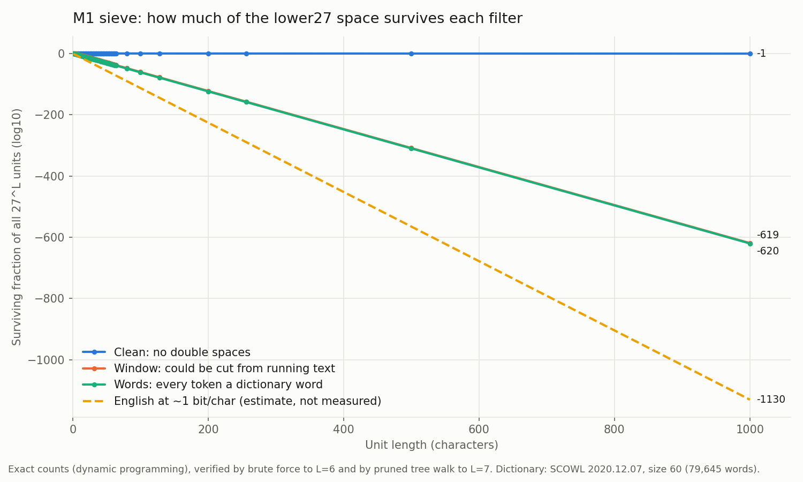

| Length | Units | Survive `words` | Surviving fraction |
| ---: | ---: | ---: | ---: |
| 8 | 10^11.5 | 6.9 × 10^6 | 10^-4.6 |
| 32 | 10^45.8 | 10^26.3 | 10^-19.5 |
| 100 | 10^143.1 | 10^81.4 | 10^-61.7 |
| 1,000 | 10^1,431.4 | 10^811.1 | 10^-620.3 |

Dictionary size changes the numbers but not the picture. At L = 1,000:

| Dictionary | Surviving fraction (`words`) | Bits per character left |
| :--- | ---: | ---: |
| SCOWL 35 (40,201 words) | 10^-659.8 | 2.56 |
| SCOWL 60 (79,645 words) | 10^-620.3 | 2.69 |
| SCOWL 80 (251,174 words) | 10^-556.9 | 2.90 |

What the results show:

- **Dictionary filtering removes about 0.62 orders of magnitude per character**, about 620 orders at paragraph length. The decline is a straight line.
- **What survives is word salad, not English.** It carries about 2.7 bits per character, where English carries about 1. Closing that gap at paragraph scale is roughly another 510 orders of magnitude, which is the job of the language-model stage (M3).
- **Pruning blocks off noise without visiting it.** At L = 7 the pruned walk explores 10^-2.8 (0.17%) of the prefix tree to find every surviving unit exactly, and that fraction falls as L grows.

## M3 results

Guided addresses under the default model (`gutenberg-lower27-o5`: order 5, 101,294 contexts, 10.5 million training characters).

| | Bits per character | 1,000-character paragraph |
| :--- | ---: | ---: |
| Raw (every unit equally likely) | 4.75 | 4,755 bits, one of 10^1,431 |
| After the M1 dictionary sieve (`words`, SCOWL 60) | 2.69 | one of 10^811 |
| Guided, held-out Alice in Wonderland | 1.93 | ~1,930 bits, one of ~10^581 |
| Shannon's estimate for English | 0.6–1.3 | one of 10^181–10^391 |

What the results show:

- **The model does the job the dictionary could not.** Word salad that passes the M1 sieve still carries 2.69 bits per character. The model gets real English to 1.93, which removes another ~230 orders of magnitude at paragraph scale.
- **Address length is information.** A guided address is never shorter than the unit's information content and never more than 2 bits longer, so short addresses always mean probable text.
- **Most of the rest is model quality, not addressing.** The coder is exact, and a better model plugs into the same format. The remaining gap to Shannon's estimate is what a larger (for example neural) model would close.

## Next

- **Models for the other lines:** a melody model for the audio line, and small-image statistics for the image line. The model format already takes any alphabet size.
- **Rankers for more filters,** so more stacks can compact: products of two ranking filters (neighbour agreement *and* low entropy, say), and cheaper counts for wide or colourful pictures.
- **More filters:** bigram and trigram checks, rhythm and melody checks for audio, and S2 coherence tests, each as a new versioned module.
- **M1 (images):** noise filters for tiny images, counted over every 5×5 and 6×6 1-bit picture.
- **A larger text model** (for example ascii95 with case and punctuation, or a longer context), measured with `sieve measure` against the same held-out books.
